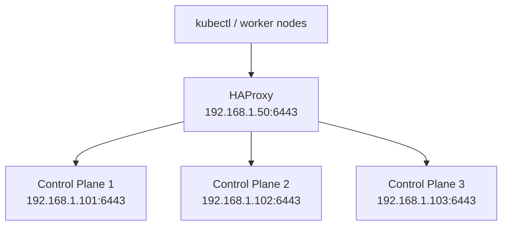

# How to Use HAProxy as a Load Balancer for Talos Linux

Author: [nawazdhandala](https://github.com/nawazdhandala)

Tags: Talos Linux, HAProxy, Load Balancer, Kubernetes, High Availability, Networking

Description: Set up HAProxy as a production-grade TCP load balancer for your Talos Linux Kubernetes cluster API endpoint.

---

HAProxy is one of the most widely used load balancers in the industry, and it pairs well with Talos Linux clusters. It sits in front of your control plane nodes and distributes Kubernetes API traffic, providing health checking, automatic failover, and connection management. This guide walks through setting up HAProxy specifically for a Talos Linux cluster.

## Why HAProxy for Talos

HAProxy brings several features that matter for Kubernetes API load balancing:

- TCP mode (Layer 4) support, which is what the Kubernetes API needs
- Health checking that detects and removes unhealthy nodes
- Connection queuing and limits to prevent overload
- Detailed statistics and metrics
- Zero-downtime configuration reloads
- Proven reliability in production environments

## Architecture

HAProxy runs on a separate machine (or two, for HA) and forwards TCP connections to your control plane nodes:



## Prerequisites

- A machine to run HAProxy (Ubuntu, Debian, CentOS, or any Linux distribution)
- Network access from the HAProxy machine to all control plane nodes
- The HAProxy machine should have a static IP address

## Installing HAProxy

### On Ubuntu/Debian

```bash
# Install HAProxy
sudo apt update
sudo apt install haproxy -y

# Check the version
haproxy -v
```

### On CentOS/RHEL

```bash
# Install HAProxy
sudo yum install haproxy -y

# Or on newer versions with dnf
sudo dnf install haproxy -y
```

### On Rocky Linux / AlmaLinux

```bash
# Install HAProxy
sudo dnf install haproxy -y
```

## Configuring HAProxy for Talos

Back up the default configuration and create a new one:

```bash
# Back up the original config
sudo cp /etc/haproxy/haproxy.cfg /etc/haproxy/haproxy.cfg.bak
```

Create the configuration for your Talos cluster:

```bash
# /etc/haproxy/haproxy.cfg

#---------------------------------------------------------------------
# Global settings
#---------------------------------------------------------------------
global
    log /dev/log local0
    log /dev/log local1 notice
    daemon
    maxconn 4096

    # Security settings
    stats socket /run/haproxy/admin.sock mode 660 level admin
    stats timeout 30s

    # SSL/TLS settings (HAProxy itself does not terminate TLS for k8s API)
    ssl-default-bind-options ssl-min-ver TLSv1.2

#---------------------------------------------------------------------
# Default settings
#---------------------------------------------------------------------
defaults
    log     global
    mode    tcp
    option  tcplog
    option  dontlognull
    retries 3
    timeout connect 10s
    timeout client  600s
    timeout server  600s

#---------------------------------------------------------------------
# Kubernetes API Server - Frontend
#---------------------------------------------------------------------
frontend k8s_api_frontend
    bind *:6443
    mode tcp
    option tcplog
    default_backend k8s_api_backend

#---------------------------------------------------------------------
# Kubernetes API Server - Backend
#---------------------------------------------------------------------
backend k8s_api_backend
    mode tcp
    balance roundrobin
    option tcp-check

    # Health check settings
    # fall: number of failed checks before marking server as down
    # rise: number of successful checks before marking server as up
    # inter: interval between health checks
    server cp1 192.168.1.101:6443 check fall 3 rise 2 inter 10s
    server cp2 192.168.1.102:6443 check fall 3 rise 2 inter 10s
    server cp3 192.168.1.103:6443 check fall 3 rise 2 inter 10s

#---------------------------------------------------------------------
# Talos API - Frontend (optional but recommended)
#---------------------------------------------------------------------
frontend talos_api_frontend
    bind *:50000
    mode tcp
    option tcplog
    default_backend talos_api_backend

#---------------------------------------------------------------------
# Talos API - Backend (optional but recommended)
#---------------------------------------------------------------------
backend talos_api_backend
    mode tcp
    balance roundrobin
    option tcp-check

    server cp1 192.168.1.101:50000 check fall 3 rise 2 inter 10s
    server cp2 192.168.1.102:50000 check fall 3 rise 2 inter 10s
    server cp3 192.168.1.103:50000 check fall 3 rise 2 inter 10s

#---------------------------------------------------------------------
# HAProxy Stats Dashboard
#---------------------------------------------------------------------
listen stats
    bind *:8404
    mode http
    stats enable
    stats uri /stats
    stats refresh 10s
    stats show-node
    stats show-legends
```

## Understanding the Configuration

### Timeouts

The timeouts are set high (600 seconds / 10 minutes) intentionally. Kubernetes operations like `kubectl exec`, `kubectl logs -f`, and watch operations create long-lived connections. Short timeouts would kill these connections prematurely.

```
timeout connect 10s     # Time to establish a connection to the backend
timeout client  600s    # Time to wait for data from the client
timeout server  600s    # Time to wait for data from the server
```

### Balance Algorithm

`roundrobin` distributes connections evenly across all healthy servers. Other useful options:

```
balance roundrobin    # Even distribution (default)
balance leastconn     # Send to server with fewest active connections
balance source        # Stick client to same server based on source IP
```

For Kubernetes API traffic, `roundrobin` is the best general choice. `leastconn` can be useful if some operations are significantly heavier than others.

### Health Checks

The `check` keyword enables health checking. The parameters control behavior:

```
server cp1 192.168.1.101:6443 check fall 3 rise 2 inter 10s
#                                     |       |        |
#                     Fail after 3 bad checks  |        |
#                          Mark up after 2 good checks  |
#                                   Check every 10 seconds
```

With these settings, a failed node is removed from rotation within 30 seconds (3 checks at 10-second intervals) and brought back within 20 seconds (2 checks at 10-second intervals) after recovery.

## Starting HAProxy

```bash
# Validate the configuration first
sudo haproxy -c -f /etc/haproxy/haproxy.cfg

# If validation passes, start the service
sudo systemctl start haproxy
sudo systemctl enable haproxy

# Verify it is running
sudo systemctl status haproxy

# Check that it is listening on the expected ports
ss -tlnp | grep haproxy
```

## Generating Talos Config with HAProxy Endpoint

Point your Talos cluster at the HAProxy address:

```bash
# Use the HAProxy address as the Kubernetes endpoint
talosctl gen config my-cluster https://192.168.1.50:6443 \
  --config-patch-control-plane '[{"op": "add", "path": "/cluster/apiServer/certSANs", "value": ["192.168.1.50", "k8s-api.example.com"]}]'
```

Adding the HAProxy IP (and optionally a DNS name) to the certSANs ensures the API server's TLS certificate is valid for these addresses.

## Using the Stats Dashboard

Navigate to `http://192.168.1.50:8404/stats` in your browser. The dashboard shows:

- **Frontend stats** - Total connections, current sessions, bandwidth
- **Backend stats** - Per-server status (UP/DOWN), connection counts, health check results
- **Queue stats** - Queued connections (if backends are at capacity)

The color coding is intuitive: green means healthy, red means down, yellow means transitioning.

## Adding HTTPS Health Checks

The basic TCP check verifies that a connection can be established. For a more thorough check, verify the API server responds correctly:

```
backend k8s_api_backend
    mode tcp
    balance roundrobin

    # Use an HTTP health check on the /healthz endpoint
    option httpchk GET /healthz
    http-check expect status 200

    server cp1 192.168.1.101:6443 check check-ssl verify none fall 3 rise 2 inter 10s
    server cp2 192.168.1.102:6443 check check-ssl verify none fall 3 rise 2 inter 10s
    server cp3 192.168.1.103:6443 check check-ssl verify none fall 3 rise 2 inter 10s
```

This sends an HTTPS request to `/healthz` on each server and expects a 200 response. A control plane node that is running but not healthy (for example, etcd is down but the port is open) will be correctly removed from rotation.

## Making HAProxy Highly Available

A single HAProxy instance is a single point of failure. For production, run two HAProxy instances with keepalived:

### Install keepalived on Both HAProxy Hosts

```bash
sudo apt install keepalived -y
```

### Primary HAProxy Host

```bash
# /etc/keepalived/keepalived.conf (on primary)
vrrp_script check_haproxy {
    script "/usr/bin/killall -0 haproxy"
    interval 2
    weight 2
}

vrrp_instance K8S_LB {
    state MASTER
    interface eth0
    virtual_router_id 51
    priority 101
    advert_int 1

    authentication {
        auth_type PASS
        auth_pass your_secret_password
    }

    virtual_ipaddress {
        192.168.1.50/24
    }

    track_script {
        check_haproxy
    }
}
```

### Backup HAProxy Host

```bash
# /etc/keepalived/keepalived.conf (on backup)
vrrp_script check_haproxy {
    script "/usr/bin/killall -0 haproxy"
    interval 2
    weight 2
}

vrrp_instance K8S_LB {
    state BACKUP
    interface eth0
    virtual_router_id 51
    priority 100
    advert_int 1

    authentication {
        auth_type PASS
        auth_pass your_secret_password
    }

    virtual_ipaddress {
        192.168.1.50/24
    }

    track_script {
        check_haproxy
    }
}
```

Start keepalived on both hosts:

```bash
sudo systemctl start keepalived
sudo systemctl enable keepalived
```

Now 192.168.1.50 is a floating VIP between your two HAProxy hosts. If the primary goes down, the backup takes over.

## Testing the Setup

```bash
# Verify HAProxy is working
curl -k https://192.168.1.50:6443/healthz

# Check kubectl works through HAProxy
kubectl get nodes

# Simulate a control plane failure
talosctl reboot --nodes 192.168.1.101

# Verify API access continues working
kubectl get nodes

# Check the stats page to see the server marked as down
# http://192.168.1.50:8404/stats
```

## Reloading Configuration Without Downtime

When you need to change the HAProxy configuration (add or remove backend servers, adjust timeouts, etc.):

```bash
# Edit the config
sudo vim /etc/haproxy/haproxy.cfg

# Validate
sudo haproxy -c -f /etc/haproxy/haproxy.cfg

# Reload without dropping connections
sudo systemctl reload haproxy
```

The reload process starts a new HAProxy process and gracefully migrates connections from the old one. Active connections are not interrupted.

HAProxy is a battle-tested load balancer that provides enterprise-grade reliability for your Talos Linux Kubernetes API. Combined with keepalived for load balancer HA, it gives you a robust, self-healing infrastructure layer that keeps your cluster accessible even during node failures and maintenance windows.
