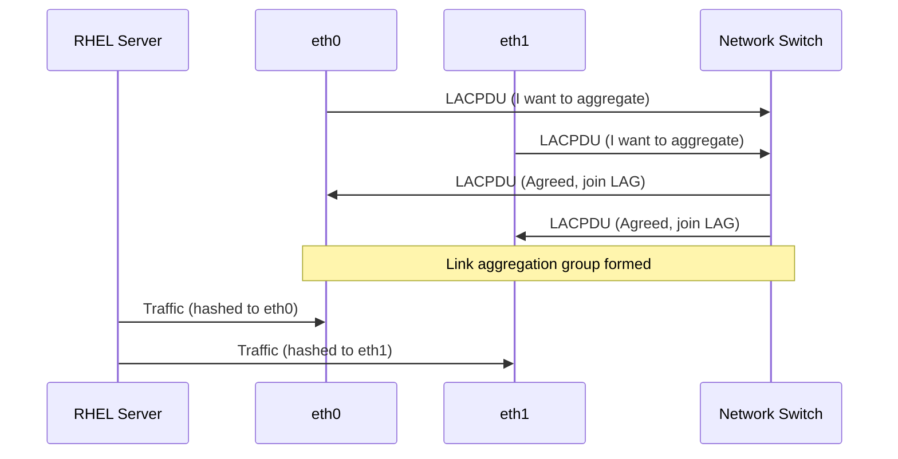

# How to Set Up 802.3ad LACP Link Aggregation on RHEL

Author: [nawazdhandala](https://www.github.com/nawazdhandala)

Tags: RHEL, LACP, Link Aggregation, 802.3ad, Linux

Description: Step-by-step guide to configuring 802.3ad LACP link aggregation on RHEL, including switch-side requirements, hash policies, and performance optimization.

---

802.3ad, also known as LACP (Link Aggregation Control Protocol), is the industry-standard way to aggregate multiple network links into one logical channel. Both the server and switch negotiate the aggregation dynamically, which means if one side has a misconfiguration, the link aggregation simply will not form. That built-in safety is one of the biggest advantages over static bonding modes.

## Prerequisites

- RHEL with at least two NICs connected to the same switch
- Switch ports configured for LACP (this is mandatory)
- Root or sudo access

## How 802.3ad LACP Works



LACP PDUs (Protocol Data Units) are exchanged between the server and switch to establish and maintain the aggregation group. If PDUs stop arriving, the link is removed from the group.

## Step 1: Create the LACP Bond

```bash
# Create an 802.3ad bond with fast LACP rate and layer3+4 hashing
nmcli connection add type bond con-name bond0 ifname bond0 \
  bond.options "mode=802.3ad,miimon=100,lacp_rate=fast,xmit_hash_policy=layer3+4"
```

Key options explained:

- **mode=802.3ad**: Enables LACP
- **miimon=100**: Check link every 100ms
- **lacp_rate=fast**: Send LACP PDUs every second instead of every 30 seconds. Use this for faster failover detection.
- **xmit_hash_policy=layer3+4**: Hash on source/destination IP and port for better traffic distribution

## Step 2: Add Slaves

```bash
# Add first slave
nmcli connection add type ethernet con-name bond0-slave1 ifname eth0 master bond0

# Add second slave
nmcli connection add type ethernet con-name bond0-slave2 ifname eth1 master bond0
```

## Step 3: Configure IP

```bash
# Static IP configuration
nmcli connection modify bond0 ipv4.addresses 10.0.0.50/24
nmcli connection modify bond0 ipv4.gateway 10.0.0.1
nmcli connection modify bond0 ipv4.dns "10.0.0.1"
nmcli connection modify bond0 ipv4.method manual
```

## Step 4: Activate

```bash
# Bring up the bond
nmcli connection up bond0
```

## Step 5: Verify LACP Negotiation

This is the critical step. Check that LACP actually negotiated:

```bash
# Check the bond status, look for "LACP rate" and "Aggregator ID"
cat /proc/net/bonding/bond0
```

Look for these indicators in the output:

- **Partner MAC address** should not be all zeros (00:00:00:00:00:00 means the switch is not responding with LACP)
- **Aggregator ID** should be the same for all slaves
- **MII Status** should be "up" for all slaves

If the partner MAC is all zeros, the switch side is not configured for LACP on those ports.

## Switch Configuration (Concepts)

The exact switch commands vary by vendor, but here is what you need on the switch side:

1. Create a port-channel or LAG group
2. Add the ports connected to your server NICs
3. Set the port-channel mode to LACP (active or passive)
4. Make sure the LACP rate matches (fast or slow)

For reference, on a Cisco-style switch it looks something like:

```
interface Port-channel1
  switchport mode trunk

interface GigabitEthernet0/1
  channel-group 1 mode active

interface GigabitEthernet0/2
  channel-group 1 mode active
```

## Hash Policy Deep Dive

The hash policy determines how outgoing traffic is distributed across slaves. Getting this right is important for actual load balancing:

**layer2** (default): Hashes source and destination MAC addresses. If all your traffic goes to one router (one MAC), all traffic hits one slave. Not great.

**layer2+3**: Adds IP addresses to the hash. Better when traffic goes through a router to many destinations.

**layer3+4**: Adds TCP/UDP ports to the hash. Best distribution for most workloads since even connections to the same IP get spread across slaves if they use different ports.

```bash
# Check current hash policy
cat /proc/net/bonding/bond0 | grep "Transmit Hash Policy"

# Change hash policy
nmcli connection modify bond0 bond.options "mode=802.3ad,miimon=100,lacp_rate=fast,xmit_hash_policy=layer3+4"
nmcli connection down bond0 && nmcli connection up bond0
```

## Performance Considerations

LACP aggregation increases available bandwidth, but a single TCP connection still uses only one slave (determined by the hash). You see the throughput benefit when:

- Multiple clients connect to the server simultaneously
- The server handles many concurrent connections (web servers, databases)
- You use the layer3+4 hash policy to spread traffic effectively

To verify traffic distribution:

```bash
# Watch per-slave traffic counters
watch -n 1 cat /proc/net/bonding/bond0

# Check individual slave interface stats
ip -s link show eth0
ip -s link show eth1
```

## Troubleshooting

**LACP not negotiating**: Verify the switch config. Check that both sides use the same LACP rate. Try setting the bond to `lacp_rate=slow` temporarily.

**All traffic on one slave**: This is usually a hash policy issue. If all traffic goes to one gateway, the layer2 hash sends everything to the same slave. Switch to layer3+4.

```bash
# Check if LACP PDUs are being exchanged
tcpdump -i eth0 ether proto 0x8809 -c 5
tcpdump -i eth1 ether proto 0x8809 -c 5
```

**Bond forms but traffic does not flow**: Verify the switch trunk or access VLAN configuration on the port-channel matches what you expect.

```bash
# Quick connectivity test
ping -c 4 10.0.0.1

# Verify ARP is resolving through the bond
ip neigh show dev bond0
```

## Adding More Slaves

You can add more slaves to an existing LACP bond (assuming the switch is configured for additional ports):

```bash
# Add a third slave
nmcli connection add type ethernet con-name bond0-slave3 ifname eth2 master bond0

# The bond picks it up automatically
cat /proc/net/bonding/bond0
```

## Summary

802.3ad LACP is the right choice when you need both throughput and redundancy, and your switch supports it. Use `lacp_rate=fast` for quicker failover detection and `xmit_hash_policy=layer3+4` for the best traffic distribution. Always verify that LACP actually negotiated by checking the partner MAC address in the bond status. If it is all zeros, go check your switch config.
