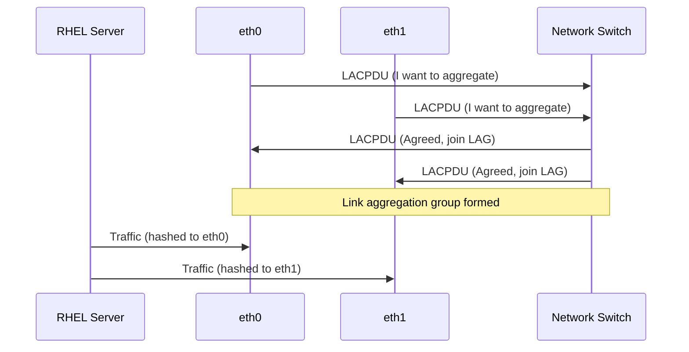

# How to Set Up 802.3ad LACP Link Aggregation on RHEL

Author: [nawazdhandala](https://www.github.com/nawazdhandala)

Tags: RHEL, LACP, Link Aggregation, 802.3ad, Linux

Description: Step-by-step guide to configuring 802.3ad LACP link aggregation on RHEL, including switch-side requirements, hash policies, and performance optimization.

---

802.3ad mode uses LACP (Link Aggregation Control Protocol) to aggregate multiple network links into one logical channel. Both the server and switch negotiate the aggregation dynamically, which means if one side has a misconfiguration, the link aggregation simply will not form. That built-in safety is one of the biggest advantages over static bonding modes.

## Prerequisites

- RHEL with at least two NICs connected to the same switch
- Switch ports configured for LACP (this is mandatory)
- Root or sudo access

## How 802.3ad LACP Works


```mermaid
sequenceDiagram
    participant Server as RHEL Server
    participant NIC1 as eth0
    participant NIC2 as eth1
    participant Switch as Network Switch

    NIC1->>Switch: LACPDU (I want to aggregate)
    NIC2->>Switch: LACPDU (I want to aggregate)
    Switch->>NIC1: LACPDU (Agreed, join LAG)
    Switch->>NIC2: LACPDU (Agreed, join LAG)
    Note over NIC1,Switch: Link aggregation group formed
    Server->>NIC1: Traffic (hashed to eth0)
    Server->>NIC2: Traffic (hashed to eth1)
```

LACP PDUs (Protocol Data Units) are exchanged between the server and switch to establish and maintain the aggregation group. If PDUs stop arriving, the link is removed from the group.

## Step 1: Create the LACP Bond

```bash
# Create an 802.3ad bond with fast LACP rate and layer3+4 hashing

nmcli connection add type bond con-name bond0 ifname bond0 \
  bond.options "mode=802.3ad,miimon=100,lacp_rate=fast,xmit_hash_policy=layer3+4"
```

Key options explained:

- **mode=802.3ad**: Enables LACP
- **miimon=100**: Check link every 100ms
- **lacp_rate=fast**: Request that the link partner send LACP PDUs every second instead of every 30 seconds. Use this for faster LACP timeout detection.
- **xmit_hash_policy=layer3+4**: Hash on source/destination IP and port for better traffic distribution. This policy is not fully 802.3ad compliant, so verify that your switch tolerates it before using it in production.

## Step 2: Add Ports

```bash
# Add first port
nmcli connection add type ethernet port-type bond con-name bond0-port1 ifname eth0 controller bond0

# Add second port
nmcli connection add type ethernet port-type bond con-name bond0-port2 ifname eth1 controller bond0

# Automatically activate ports when bond0 is activated
nmcli connection modify bond0 connection.autoconnect-ports 1
```

## Step 3: Configure IP

```bash
# Static IP configuration
nmcli connection modify bond0 ipv4.addresses 10.0.0.50/24
nmcli connection modify bond0 ipv4.gateway 10.0.0.1
nmcli connection modify bond0 ipv4.dns "10.0.0.1"
nmcli connection modify bond0 ipv4.method manual
```

## Step 4: Activate

```bash
# Bring up the bond
nmcli connection up bond0
```

## Step 5: Verify LACP Negotiation

This is the critical step. Check that LACP actually negotiated:

```bash
# Check the bond status, look for "LACP rate" and "Aggregator ID"
cat /proc/net/bonding/bond0
```

Look for these indicators in the output:

- **Partner MAC address** should not be all zeros (00:00:00:00:00:00 means the switch is not responding with LACP)
- **Aggregator ID** should be the same for all ports
- **MII Status** should be "up" for all ports

If the partner MAC is all zeros, the switch side is not configured for LACP on those ports.

## Switch Configuration (Concepts)

The exact switch commands vary by vendor, but here is what you need on the switch side:

1. Create a port-channel or LAG group
2. Add the ports connected to your server NICs
3. Set the port-channel mode to LACP (active or passive)
4. Optionally use a fast LACP rate if you want shorter LACP timeout detection

For reference, on a Cisco-style switch it looks something like:

```bash
interface Port-channel1
  switchport mode trunk

interface GigabitEthernet0/1
  channel-group 1 mode active

interface GigabitEthernet0/2
  channel-group 1 mode active
```

## Hash Policy Deep Dive

The hash policy determines how outgoing traffic is distributed across ports. Getting this right is important for actual load balancing:

**layer2** (default): Hashes source and destination MAC addresses. If all your traffic goes to one router (one MAC), all traffic hits one port. Not great.

**layer2+3**: Adds IP addresses to the hash. Better when traffic goes through a router to many destinations.

**layer3+4**: Adds TCP/UDP ports to the hash. Best distribution for many workloads since even connections to the same IP get spread across ports if they use different ports, but it is not fully 802.3ad compliant.

```bash
# Check current hash policy
cat /proc/net/bonding/bond0 | grep "Transmit Hash Policy"

# Change hash policy
nmcli connection modify bond0 bond.options "mode=802.3ad,miimon=100,lacp_rate=fast,xmit_hash_policy=layer3+4"
nmcli connection down bond0 && nmcli connection up bond0
```

## Performance Considerations

LACP aggregation increases available bandwidth, but a single TCP connection still uses only one port (determined by the hash). You see the throughput benefit when:

- Multiple clients connect to the server simultaneously
- The server handles many concurrent connections (web servers, databases)
- You choose a hash policy that matches the traffic pattern

To verify traffic distribution:

```bash
# Watch per-port traffic counters
watch -n 1 cat /proc/net/bonding/bond0

# Check individual port interface stats
ip -s link show eth0
ip -s link show eth1
```

## Troubleshooting

**LACP not negotiating**: Verify the switch config. Check that the switch ports are in an LACP port-channel. Try setting the bond to `lacp_rate=slow` temporarily if the switch has trouble with fast LACP.

**All traffic on one port**: This is usually a hash policy issue. If all traffic goes to one gateway, the layer2 hash sends everything to the same port. Try `layer2+3` first, or `layer3+4` if you need port-based distribution and your switch tolerates it.

```bash
# Check if LACP PDUs are being exchanged
tcpdump -i eth0 ether proto 0x8809 -c 5
tcpdump -i eth1 ether proto 0x8809 -c 5
```

**Bond forms but traffic does not flow**: Verify the switch trunk or access VLAN configuration on the port-channel matches what you expect.

```bash
# Quick connectivity test
ping -c 4 10.0.0.1

# Verify ARP is resolving through the bond
ip neigh show dev bond0
```

## Adding More Ports

You can add more ports to an existing LACP bond (assuming the switch is configured for additional ports):

```bash
# Add a third port
nmcli connection add type ethernet port-type bond con-name bond0-port3 ifname eth2 controller bond0

# Bring up the new port and check the bond
nmcli connection up bond0-port3
cat /proc/net/bonding/bond0
```

## Summary

802.3ad LACP is the right choice when you need both throughput and redundancy, and your switch supports it. Use `lacp_rate=fast` for quicker LACP timeout detection and `xmit_hash_policy=layer3+4` when you need better traffic distribution and your switch tolerates it. Always verify that LACP actually negotiated by checking the partner MAC address in the bond status. If it is all zeros, go check your switch config.
