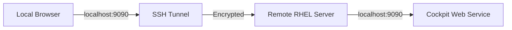

# How to Access the RHEL Web Console Remotely via SSH

Author: [nawazdhandala](https://www.github.com/nawazdhandala)

Tags: RHEL, Cockpit, SSH, Remote Access, Linux

Description: Learn how to securely access the Cockpit web console on a remote RHEL server using SSH tunneling and port forwarding.

---

You've got Cockpit running on a RHEL box, but the server is behind a firewall or on a private network where port 9090 isn't exposed. No problem. SSH tunneling lets you access the web console securely without opening any additional ports to the outside world.

I use this approach regularly for servers in locked-down environments. It's simple, secure, and doesn't require any changes to the server's firewall configuration.

## Why SSH Tunneling?

Opening port 9090 directly to the internet is a bad idea, even with TLS. SSH tunneling encrypts the connection and uses your existing SSH authentication. You don't need to punch holes in your firewall, and you get the benefit of SSH's key-based authentication.



## Prerequisites

- Cockpit installed and running on the remote RHEL server
- SSH access to the server with key-based or password authentication
- An SSH client on your local machine (OpenSSH, PuTTY, etc.)

## Basic SSH Port Forwarding

The simplest approach is a local port forward. This maps a port on your local machine to port 9090 on the remote server.

Set up the SSH tunnel from your local machine:

```bash
# Forward local port 9090 to the remote server's port 9090
ssh -L 9090:localhost:9090 user@remote-server.example.com
```

Once connected, open your browser and go to:

```
https://localhost:9090
```

Cockpit should load as if you were sitting in front of the server. The `-L` flag tells SSH to listen on local port 9090 and forward traffic through the encrypted tunnel to `localhost:9090` on the remote side.

## Running the Tunnel in the Background

If you don't need an interactive shell session and just want the tunnel, use the `-N` and `-f` flags.

Start a background tunnel without opening a shell:

```bash
# -N means don't execute a remote command
# -f sends SSH to the background after authentication
ssh -N -f -L 9090:localhost:9090 user@remote-server.example.com
```

To stop the tunnel later, find and kill the SSH process:

```bash
# Find the tunnel process
ps aux | grep "ssh -N -f -L 9090"

# Kill it by PID
kill <pid>
```

## Using a Different Local Port

If port 9090 is already in use on your local machine, just map to a different one.

Forward a different local port to the remote Cockpit service:

```bash
# Use local port 9091 instead
ssh -L 9091:localhost:9090 user@remote-server.example.com
```

Then access Cockpit at `https://localhost:9091`.

## SSH Config for Convenience

If you tunnel into this server frequently, save the configuration in your SSH config file so you don't have to type the full command every time.

Add a host entry to your SSH config:

```bash
# Edit ~/.ssh/config and add this block
Host rhel-cockpit
    HostName remote-server.example.com
    User admin
    LocalForward 9090 localhost:9090
    IdentityFile ~/.ssh/id_ed25519
```

Now you can just run:

```bash
ssh rhel-cockpit
```

And the tunnel is automatically set up.

## Accessing Cockpit Through a Jump Host

In many enterprise setups, you can't reach the target server directly. You go through a bastion or jump host first. SSH handles this with the `-J` flag.

Tunnel through a jump host:

```bash
# Connect through bastion.example.com to reach the internal server
ssh -J user@bastion.example.com -L 9090:localhost:9090 user@internal-rhel-server
```

Or set it up in your SSH config:

```bash
Host rhel-internal-cockpit
    HostName 10.0.1.50
    User admin
    ProxyJump user@bastion.example.com
    LocalForward 9090 localhost:9090
```

## Dynamic SOCKS Proxy Approach

If you need to access Cockpit on multiple servers, a SOCKS proxy might be more practical than individual tunnels.

Set up a SOCKS proxy through the remote network:

```bash
# Create a SOCKS5 proxy on local port 1080
ssh -D 1080 -N -f user@bastion.example.com
```

Then configure your browser to use `localhost:1080` as a SOCKS5 proxy. You can now access any Cockpit instance on the remote network by its internal IP address directly in the browser.

For Firefox, go to Settings, search for "proxy", click Settings, select "Manual proxy configuration", set SOCKS Host to `localhost`, port `1080`, and select SOCKS v5.

## Handling Certificate Warnings

When you access Cockpit through a tunnel at `localhost:9090`, the certificate won't match the hostname. You'll see a warning in your browser. For internal use, this is fine. If you want to avoid the warning, you can add the Cockpit server's self-signed cert to your browser's trust store.

Export and inspect the certificate:

```bash
# On the RHEL server, check the certificate
openssl x509 -in /etc/cockpit/ws-certs.d/0-self-signed.cert -noout -text | head -20
```

## Verifying the Tunnel Is Working

Check that the tunnel is active and traffic is flowing:

```bash
# Verify the local port is listening
ss -tlnp | grep 9090

# Test connectivity with curl (expect a redirect or HTML response)
curl -k https://localhost:9090/
```

If curl returns HTML content or a redirect, the tunnel is working. The `-k` flag tells curl to accept self-signed certificates.

## Restricting Cockpit to Localhost Only

If you always plan to access Cockpit through SSH tunnels, you can lock it down so it only listens on the loopback interface.

Configure Cockpit to listen only on localhost:

```bash
sudo tee /etc/cockpit/cockpit.conf << 'EOF'
[WebService]
AllowUnencrypted = false

[Session]
IdleTimeout = 15
EOF
```

Then restrict the socket to localhost:

```bash
sudo mkdir -p /etc/systemd/system/cockpit.socket.d/
sudo tee /etc/systemd/system/cockpit.socket.d/listen.conf << 'EOF'
[Socket]
ListenStream=
ListenStream=127.0.0.1:9090
EOF

# Reload and restart
sudo systemctl daemon-reload
sudo systemctl restart cockpit.socket
```

The first `ListenStream=` with no value clears the default, and the second sets the new listen address.

## Automating Tunnel Startup with autossh

The `autossh` utility automatically restarts SSH tunnels when they drop. Handy for persistent access.

Install and use autossh for a resilient tunnel:

```bash
# Install autossh
sudo dnf install autossh -y

# Start a self-healing tunnel
autossh -M 0 -N -f -L 9090:localhost:9090 \
    -o "ServerAliveInterval 30" \
    -o "ServerAliveCountMax 3" \
    user@remote-server.example.com
```

The `-M 0` disables autossh's monitoring port and relies on SSH's own keepalive mechanism instead. `ServerAliveInterval 30` sends a keepalive every 30 seconds, and `ServerAliveCountMax 3` drops the connection after three missed responses.

## Wrapping Up

SSH tunneling is the cleanest way to access Cockpit on remote servers without exposing the web interface to the network. It takes advantage of authentication you already have in place, and it works through bastion hosts and restrictive firewalls. For persistent access, autossh keeps the tunnel alive automatically. Once you set up the SSH config entries, accessing Cockpit on any server is just one command away.
