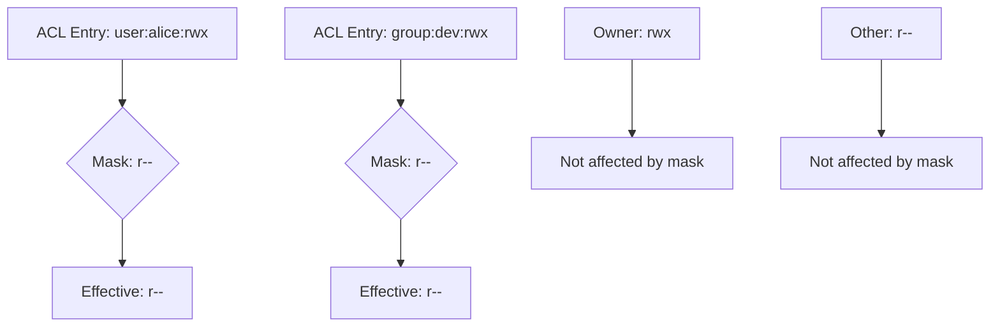

# How to Use the ACL Mask to Limit Effective Permissions on RHEL

Author: [nawazdhandala](https://www.github.com/nawazdhandala)

Tags: RHEL, ACL Mask, Permissions, Linux

Description: Understand and use the POSIX ACL mask on RHEL to control the maximum effective permissions for named users and groups without modifying individual ACL entries.

---

The ACL mask is one of the most misunderstood parts of POSIX ACLs. It acts as an upper limit on the permissions that named users, named groups, and the owning group can actually exercise. Even if an ACL entry grants full rwx, the mask can reduce the effective permissions to read-only. Understanding the mask is critical for managing ACLs correctly.

## What the Mask Does

The mask entry defines the maximum permissions for:
- Named user ACL entries
- Named group ACL entries
- The owning group entry

It does NOT affect:
- The file owner's permissions
- The "other" permissions



## Viewing the Mask

```bash
# View ACLs including the mask
getfacl /opt/shared/file.txt
```

Output with mask:

```
# file: opt/shared/file.txt
# owner: root
# group: root
user::rwx
user:alice:rwx         #effective:r--
group::r-x             #effective:r--
group:developers:rwx   #effective:r--
mask::r--
other::r--
```

Notice the `#effective:` comments. Even though alice has `rwx` in her ACL entry, the mask of `r--` limits her actual permissions to read-only.

## Setting the Mask

```bash
# Set the mask to read-only
setfacl -m m::r /opt/shared/file.txt

# Set the mask to read-write
setfacl -m m::rw /opt/shared/file.txt

# Set the mask to full permissions
setfacl -m m::rwx /opt/shared/file.txt
```

## How the Mask Gets Set Automatically

The mask is automatically recalculated when you add or modify ACL entries. It is set to the union of all named user, named group, and owning group permissions:

```bash
# Start with a file
touch /tmp/test-mask
chmod 644 /tmp/test-mask

# Add a user ACL with rwx
setfacl -m u:alice:rwx /tmp/test-mask

# The mask is automatically set to rwx
getfacl /tmp/test-mask
```

This automatic recalculation means the mask usually does not restrict anything by default. You need to explicitly set it to use it as a limiter.

## Using chmod and Its Effect on the Mask

Here is where things get tricky. Running `chmod` on a file with ACLs changes the mask, not the owning group permissions:

```bash
# File has ACL with mask rwx
getfacl /tmp/test-mask
# mask::rwx

# Run chmod to set group permissions to r--
chmod g=r /tmp/test-mask

# The mask is now r--, not the group entry
getfacl /tmp/test-mask
# mask::r--
```

This is a common source of confusion. When you see `chmod` changing "group" permissions on a file with ACLs, it is actually changing the mask.

## Practical Example: Temporary Permission Restriction

The mask is useful for temporarily restricting all non-owner access:

```bash
# Restrict all named users and groups to read-only
setfacl -m m::r /opt/shared/file.txt

# Later, restore full permissions
setfacl -m m::rwx /opt/shared/file.txt
```

This is much faster than modifying each individual ACL entry.

## Practical Example: Controlled Write Access

Set up a directory where multiple groups can read but only one can write:

```bash
# Create the directory
sudo mkdir /opt/docs
sudo chmod 750 /opt/docs

# Both teams get rwx in their ACL entries
sudo setfacl -m g:writers:rwx /opt/docs
sudo setfacl -m g:readers:rwx /opt/docs

# But set the mask to r-x, limiting everyone to read-execute
sudo setfacl -m m::rx /opt/docs

# Now explicitly grant writers write permission by adjusting their entry
# and then set the mask to accommodate them
sudo setfacl -m g:writers:rwx /opt/docs
sudo setfacl -m m::rwx /opt/docs
```

Actually, a better approach for this use case is simply setting the ACL entries correctly:

```bash
# Writers get full access
sudo setfacl -m g:writers:rwx /opt/docs

# Readers get read and execute only
sudo setfacl -m g:readers:rx /opt/docs

# Mask auto-calculates to rwx (union of all entries)
getfacl /opt/docs
```

## Mask Interaction Table

| ACL Entry | Mask | Effective Permission |
|-----------|------|---------------------|
| rwx | rwx | rwx |
| rwx | r-- | r-- |
| rw- | r-x | r-- |
| r-x | rw- | r-- |
| rwx | --- | --- |

The effective permission is the bitwise AND of the ACL entry and the mask.

## Keeping the Mask Stable

If you set the mask and then add a new ACL entry, the mask gets recalculated:

```bash
# Set mask to r--
setfacl -m m::r /tmp/test-mask

# Add a new user with rwx - mask changes to rwx automatically
setfacl -m u:bob:rwx /tmp/test-mask
getfacl /tmp/test-mask
# mask::rwx  (recalculated!)
```

To prevent this, set the mask after all other ACL entries:

```bash
# Add all entries first
setfacl -m u:alice:rwx /tmp/test-mask
setfacl -m u:bob:rw /tmp/test-mask
setfacl -m g:team:rx /tmp/test-mask

# Then set the mask last
setfacl -m m::rx /tmp/test-mask
```

Or use the `-n` flag to prevent mask recalculation when adding entries:

```bash
# Add entry without recalculating the mask
setfacl -n -m u:charlie:rwx /tmp/test-mask
```

## Diagnosing Permission Issues

When a user reports they cannot write to a file even though their ACL says `rwx`:

```bash
# Check the effective permissions
getfacl /path/to/file

# Look for #effective: comments showing reduced permissions
# If effective differs from the entry, the mask is the cause
```

The fix is either to widen the mask or accept that the mask-imposed restriction is intentional.

The ACL mask is a powerful tool for broad permission control, but its automatic recalculation behavior can surprise you. Understand when it changes and plan your ACL operations accordingly.
