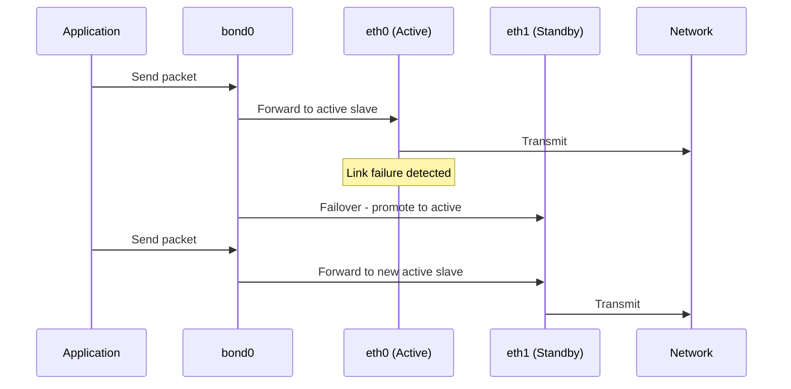
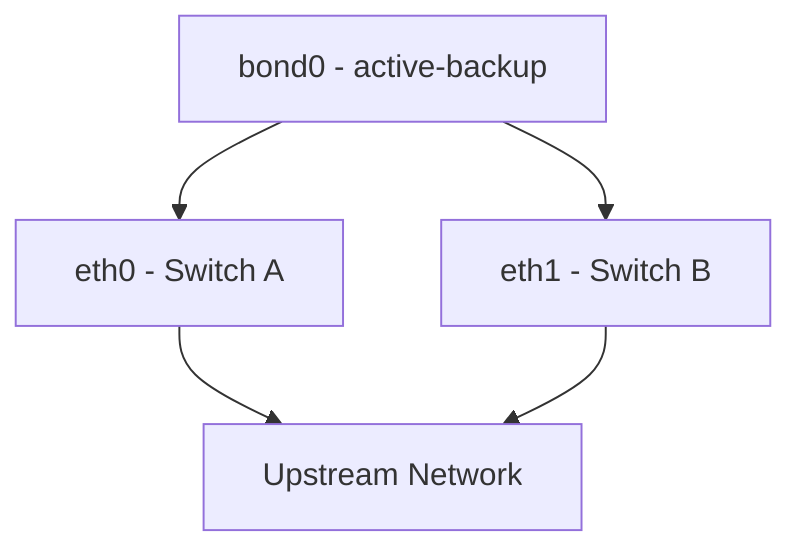

# How to Configure Active-Backup Bonding for High Availability on RHEL 9

Author: [nawazdhandala](https://www.github.com/nawazdhandala)

Tags: RHEL, Active-Backup, Bonding, High Availability, Linux

Description: A detailed walkthrough of setting up active-backup bonding on RHEL 9, including primary slave selection, failover tuning, and monitoring for production HA environments.

---

Active-backup (mode 1) is the most commonly deployed bonding mode, and for good reason. It works with any switch without special configuration, provides clean failover, and keeps things simple. One interface handles all traffic while the others wait on standby. When the active interface goes down, a backup takes over within milliseconds.

Here is how to set it up properly for a production high-availability deployment.

## How Active-Backup Works



## Step 1: Create the Active-Backup Bond

```bash
# Create the bond with active-backup mode and 100ms link monitoring
nmcli connection add type bond con-name bond0 ifname bond0 \
  bond.options "mode=active-backup,miimon=100,primary=eth0"
```

The `primary=eth0` option tells the bond to prefer eth0 as the active slave whenever it is available. Without this, the bond picks the first slave that comes up.

## Step 2: Add Slave Interfaces

```bash
# Add the primary slave
nmcli connection add type ethernet con-name bond0-slave1 ifname eth0 master bond0

# Add the backup slave
nmcli connection add type ethernet con-name bond0-slave2 ifname eth1 master bond0
```

## Step 3: Configure IP and Bring Up

```bash
# Assign a static IP to the bond
nmcli connection modify bond0 ipv4.addresses 10.0.1.50/24
nmcli connection modify bond0 ipv4.gateway 10.0.1.1
nmcli connection modify bond0 ipv4.dns "10.0.1.1"
nmcli connection modify bond0 ipv4.method manual

# Activate the bond
nmcli connection up bond0
```

## Tuning Failover Behavior

### Primary Reselection

By default, when the primary slave recovers after a failure, the bond switches back to it. You can control this behavior:

```bash
# Always switch back to primary when it recovers (default)
nmcli connection modify bond0 bond.options "mode=active-backup,miimon=100,primary=eth0,primary_reselect=always"

# Only use primary on initial setup, never switch back
nmcli connection modify bond0 bond.options "mode=active-backup,miimon=100,primary=eth0,primary_reselect=better"

# Never switch back to primary once failover happens
nmcli connection modify bond0 bond.options "mode=active-backup,miimon=100,primary=eth0,primary_reselect=failure"
```

For production, I recommend `primary_reselect=failure`. This avoids unnecessary failover flapping when a NIC has intermittent link issues. You do not want the bond toggling back and forth between interfaces during a marginal link problem.

### MII Monitoring Interval

The `miimon` value determines how quickly the bond detects a link failure:

- **100ms**: Good default, detects failures within 100-200ms
- **50ms**: Faster detection, slightly more CPU overhead
- **10ms**: Very aggressive, useful for latency-sensitive workloads

```bash
# Set aggressive link monitoring for low-latency requirements
nmcli connection modify bond0 bond.options "mode=active-backup,miimon=50,primary=eth0"
```

### ARP Monitoring as an Alternative

MII monitoring only checks the physical link. If you want to detect upstream network issues (like a switch failure that keeps the link up), use ARP monitoring instead:

```bash
# Use ARP monitoring to verify end-to-end connectivity
nmcli connection modify bond0 bond.options "mode=active-backup,arp_interval=1000,arp_ip_target=10.0.1.1"
```

The bond sends ARP requests to the target IP every second. If no reply comes back on a slave, it is considered down. This catches scenarios where the physical link is up but traffic is not flowing.

**Important**: You cannot use both `miimon` and `arp_interval` at the same time. Pick one or the other.

## Step 4: Verify the Configuration

```bash
# Check bond status
cat /proc/net/bonding/bond0
```

The output shows you:

- Bonding mode: active-backup
- Primary slave: eth0
- Currently active slave: eth0
- MII status for each slave

```bash
# Verify with nmcli
nmcli device show bond0

# Check that the bond has the right IP
ip addr show bond0
```

## Step 5: Test Failover

Simulate a failure by bringing down the active interface:

```bash
# Simulate failure on the primary slave
nmcli device disconnect eth0

# Watch the bond status update
cat /proc/net/bonding/bond0

# Verify connectivity still works through the backup
ping -c 4 10.0.1.1
```

You should see that eth1 is now the active slave and traffic continues without interruption.

Bring the primary back:

```bash
# Restore the primary slave
nmcli device connect eth0

# Check if the bond switched back (depends on primary_reselect setting)
cat /proc/net/bonding/bond0
```

## Connecting to Different Switches

For true high availability, connect each slave to a different physical switch. This protects against a switch failure, not just a cable or NIC failure.



Active-backup is the only standard bonding mode that works reliably with interfaces connected to different switches without special switch configuration (no MLAG needed).

## Monitoring the Bond

Set up periodic checks in your monitoring system:

```bash
# Script to check bond health
#!/bin/bash
BOND="bond0"
STATUS=$(cat /proc/net/bonding/$BOND | grep "MII Status" | head -1 | awk '{print $3}')

if [ "$STATUS" != "up" ]; then
    echo "CRITICAL: $BOND is down"
    exit 2
fi

# Count active slaves
SLAVES_UP=$(cat /proc/net/bonding/$BOND | grep "MII Status: up" | wc -l)
# Subtract 1 because the first "MII Status: up" is the bond itself
SLAVES_UP=$((SLAVES_UP - 1))

if [ "$SLAVES_UP" -lt 2 ]; then
    echo "WARNING: $BOND has only $SLAVES_UP slave(s) up"
    exit 1
fi

echo "OK: $BOND has $SLAVES_UP slaves up"
exit 0
```

## Summary

Active-backup bonding is the workhorse of network HA on Linux. It requires zero switch configuration, fails over quickly, and is dead simple to troubleshoot. Set a primary slave, tune your monitoring interval, decide on a primary reselection policy, and test failover before going live. For maximum resilience, connect your slaves to separate switches.
