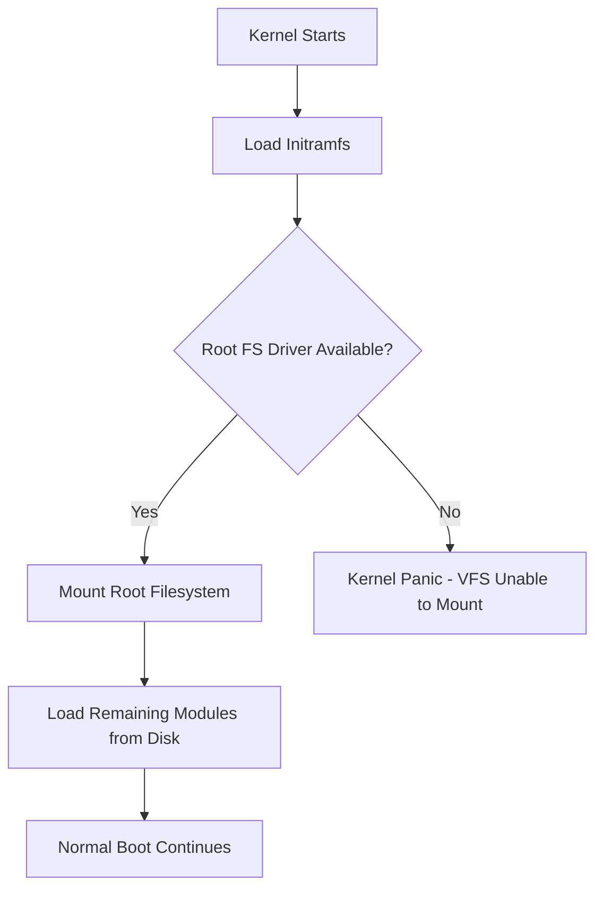

# How to Add Custom Kernel Modules to the Initramfs with dracut on RHEL

Author: [nawazdhandala](https://www.github.com/nawazdhandala)

Tags: RHEL, dracut, Kernel Modules, initramfs, Boot, Linux

Description: Step-by-step instructions for adding custom or third-party kernel modules to the RHEL initramfs using dracut so they load during early boot.

---

Some hardware requires specific kernel modules to be available during the earliest stages of boot, before the root filesystem is mounted. Storage controllers, RAID adapters, and encryption hardware are common examples. If the module is not in the initramfs, the kernel cannot access the root filesystem, and the system will not boot. On RHEL, dracut handles this, and adding custom modules is straightforward once you know the process.

## When You Need Modules in the Initramfs



You need a module in the initramfs when:
- It provides the storage driver for your root filesystem (NVMe, SCSI, hardware RAID)
- It provides the filesystem driver (XFS, ext4, Btrfs)
- It handles disk encryption (dm-crypt, LUKS)
- It provides network access for network-boot (NFS root, iSCSI)

## Adding Standard Kernel Modules

For modules that ship with the RHEL kernel but are not automatically included:

```bash
# Check which modules are currently in the initramfs
lsinitrd /boot/initramfs-$(uname -r).img | grep "\.ko"

# Create a dracut config to add specific modules
cat <<'EOF' | sudo tee /etc/dracut.conf.d/extra-modules.conf
# Add the vfio modules for PCI passthrough during boot
add_drivers+=" vfio vfio-pci vfio_iommu_type1 "

# Add a specific storage driver
add_drivers+=" mpt3sas "

# Force-add modules even if dracut thinks they are not needed
# (useful in hostonly mode where dracut only includes detected hardware)
force_drivers+=" nvme nvme-core "
EOF

# Rebuild the initramfs
sudo dracut --force

# Verify the modules are included
lsinitrd /boot/initramfs-$(uname -r).img | grep -E "vfio|mpt3sas|nvme"
```

## Adding Third-Party / Out-of-Tree Modules

When you have a module compiled from source or from a third-party vendor:

```bash
# First, compile and install the module to the proper location
# Example: a custom storage driver
cd /path/to/module-source
make
sudo make install
# This should place the .ko file in /lib/modules/$(uname -r)/extra/

# Update the module dependency database
sudo depmod -a

# Verify the module is recognized
modinfo custom_storage_driver

# Add it to the dracut configuration
echo 'add_drivers+=" custom_storage_driver "' | \
    sudo tee /etc/dracut.conf.d/custom-driver.conf

# Rebuild the initramfs
sudo dracut --force --verbose 2>&1 | grep custom_storage

# Verify it is included
lsinitrd /boot/initramfs-$(uname -r).img | grep custom_storage
```

## Handling Module Dependencies

Kernel modules often depend on other modules. dracut resolves dependencies automatically, but you should verify:

```bash
# Check a module's dependencies
modprobe --show-depends custom_storage_driver

# Example output:
# insmod /lib/modules/5.14.0-362.el9.x86_64/kernel/drivers/scsi/scsi_mod.ko.xz
# insmod /lib/modules/5.14.0-362.el9.x86_64/extra/custom_storage_driver.ko

# dracut uses depmod data, so always run depmod after installing modules
sudo depmod -a $(uname -r)

# Then rebuild the initramfs - dependencies are pulled in automatically
sudo dracut --force
```

## Adding Modules with Firmware

Some modules require firmware files to function. dracut can include those too:

```bash
# Check if a module needs firmware
modinfo -F firmware custom_network_driver
# Output might show: custom_network_driver/firmware.bin

# Make sure the firmware is installed
ls /lib/firmware/custom_network_driver/

# dracut includes firmware for added drivers by default
# But you can explicitly add firmware files
cat <<'EOF' | sudo tee /etc/dracut.conf.d/firmware.conf
# Include all firmware for the custom driver
install_items+=" /lib/firmware/custom_network_driver/firmware.bin "

# Or include an entire firmware directory
install_items+=" /lib/firmware/custom_network_driver/ "
EOF

sudo dracut --force
```

## Using DKMS for Persistent Module Management

For modules that need to survive kernel updates, use DKMS (Dynamic Kernel Module Support):

```bash
# Install DKMS
sudo dnf install -y dkms

# Set up DKMS for your custom module
sudo mkdir -p /usr/src/custom_driver-1.0/

# Create a dkms.conf file
cat <<'EOF' | sudo tee /usr/src/custom_driver-1.0/dkms.conf
PACKAGE_NAME="custom_driver"
PACKAGE_VERSION="1.0"
BUILT_MODULE_NAME[0]="custom_driver"
DEST_MODULE_LOCATION[0]="/extra"
AUTOINSTALL="yes"
REMAKE_INITRD="yes"
EOF

# Copy your module source files
sudo cp /path/to/source/* /usr/src/custom_driver-1.0/

# Register with DKMS
sudo dkms add -m custom_driver -v 1.0

# Build and install for the current kernel
sudo dkms build -m custom_driver -v 1.0
sudo dkms install -m custom_driver -v 1.0

# The REMAKE_INITRD=yes flag tells DKMS to rebuild initramfs automatically
# Verify it worked
lsinitrd /boot/initramfs-$(uname -r).img | grep custom_driver
```

## Troubleshooting Module Inclusion Issues

```bash
# If a module is not being included, check dracut's verbose output
sudo dracut --force --verbose 2>&1 | grep -i "module\|driver\|skip"

# Check if hostonly mode is filtering it out
# In hostonly mode, dracut only includes modules for detected hardware
grep hostonly /etc/dracut.conf.d/*.conf

# Force inclusion regardless of hostonly detection
echo 'force_drivers+=" problematic_module "' | \
    sudo tee /etc/dracut.conf.d/force-module.conf

# Rebuild and check
sudo dracut --force
lsinitrd /boot/initramfs-$(uname -r).img | grep problematic_module

# If the module is still missing, check depmod can find it
depmod -n $(uname -r) | grep problematic_module
```

## Safely Testing New Modules

```bash
# Build a test initramfs with the new module
sudo dracut --force /boot/initramfs-$(uname -r)-test.img $(uname -r)

# Create a GRUB entry that uses the test initramfs
# This way you can fall back to the original if boot fails
sudo grubby --add-kernel=/boot/vmlinuz-$(uname -r) \
    --initrd=/boot/initramfs-$(uname -r)-test.img \
    --title="RHEL Test Initramfs" \
    --copy-default

# Reboot and select the test entry from GRUB menu
# If it works, make it the default
# If it fails, select the original entry
```

## Conclusion

Adding custom kernel modules to the RHEL initramfs is a common task when dealing with specialized hardware or third-party storage controllers. The key steps are: install the module properly, run depmod, configure dracut to include it, and rebuild the initramfs. Always keep a known-good initramfs as a fallback, and use DKMS for modules that need to persist across kernel updates. Testing with a separate GRUB entry before committing to the change prevents situations where a bad initramfs leaves you unable to boot.
