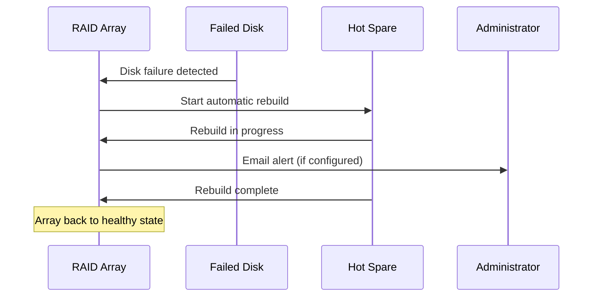

# How to Add a Hot Spare Disk to an mdadm RAID Array on RHEL 9

Author: [nawazdhandala](https://www.github.com/nawazdhandala)

Tags: RHEL, RAID, Hot Spare, mdadm, Linux

Description: Learn how to add hot spare disks to mdadm RAID arrays on RHEL 9 so that automatic rebuilds start the moment a disk fails.

---

## What a Hot Spare Does

A hot spare is a disk that sits idle in a RAID array, waiting for a member disk to fail. The moment mdadm detects a failure, it automatically starts rebuilding onto the spare. This reduces your exposure window, the time you spend running in a degraded state, from hours (waiting for someone to notice and physically replace a disk) to the rebuild time itself.

For any production RAID array, having at least one hot spare is a cheap insurance policy.

## Prerequisites

- A working mdadm RAID array on RHEL 9 (RAID 1, 5, 6, or 10)
- An additional unused disk of equal or greater size than the existing members

## Step 1 - Identify the Spare Disk

```bash
# List block devices to find the unused disk
lsblk -o NAME,SIZE,TYPE,FSTYPE,MOUNTPOINT

# Wipe any existing signatures
sudo wipefs -a /dev/sde
```

## Step 2 - Add the Spare to an Existing Array

If the array was created with a fixed number of RAID devices and you add an extra disk, mdadm automatically treats it as a spare.

```bash
# Add /dev/sde as a hot spare to /dev/md5
sudo mdadm --manage /dev/md5 --add /dev/sde
```

Verify the spare is recognized:

```bash
# Check array details
sudo mdadm --detail /dev/md5
```

In the output, you should see the new disk listed with a role of "spare" or "spare rebuilding" if a rebuild is already needed.

## Step 3 - Verify with /proc/mdstat

```bash
# Quick status check
cat /proc/mdstat
```

You will see something like:

```
md5 : active raid5 sde[3](S) sdd[2] sdc[1] sdb[0]
```

The `(S)` indicates the disk is a spare.

## Adding Multiple Spares

For larger arrays, you might want more than one spare.

```bash
# Add two spare disks
sudo mdadm --manage /dev/md5 --add /dev/sde
sudo mdadm --manage /dev/md5 --add /dev/sdf
```

## How Automatic Rebuild Works



When mdadm detects a failed disk:
1. The failed disk is marked as faulty
2. The spare is activated and rebuild begins immediately
3. Once the rebuild finishes, the array returns to a healthy state
4. The failed disk remains in the array as a failed device until you physically replace it

## Dedicated vs. Global Hot Spares

By default, a spare added to an array is dedicated to that array. If you run multiple arrays and want a spare that any of them can use, you need to configure a spare group.

```bash
# Create arrays with a shared spare group
sudo mdadm --create /dev/md1 --level=1 --raid-devices=2 --spare-devices=0 \
    --spare-group=shared /dev/sdb /dev/sdc

sudo mdadm --create /dev/md5 --level=5 --raid-devices=3 --spare-devices=0 \
    --spare-group=shared /dev/sdd /dev/sde /dev/sdf

# Add a global spare associated with the spare group
sudo mdadm --manage /dev/md1 --add /dev/sdg
```

The mdadm monitor daemon handles spare group assignments when running with the `--scan` option.

## Removing a Hot Spare

If you need to reclaim a spare disk:

```bash
# Remove the spare from the array
sudo mdadm --manage /dev/md5 --remove /dev/sde
```

This only works if the spare is not currently being used for a rebuild.

## Saving the Updated Configuration

After adding a spare, update the saved configuration:

```bash
# Remove old config and write new scan results
sudo sed -i '/^ARRAY/d' /etc/mdadm.conf
sudo mdadm --detail --scan | sudo tee -a /etc/mdadm.conf

# Update initramfs
sudo dracut --regenerate-all --force
```

## Testing the Hot Spare

Test it before you actually need it. Simulate a failure and watch the spare kick in.

```bash
# Fail one of the active disks
sudo mdadm --manage /dev/md5 --fail /dev/sdc

# Watch the spare activate and rebuild begin
watch cat /proc/mdstat

# After rebuild, the spare becomes an active member
sudo mdadm --detail /dev/md5
```

After the test, you can remove the "failed" disk and re-add it as a new spare:

```bash
# Remove the test-failed disk
sudo mdadm --manage /dev/md5 --remove /dev/sdc

# Re-add it (it becomes a spare since the array is full)
sudo mdadm --manage /dev/md5 --add /dev/sdc
```

## Sizing Hot Spares

The spare disk must be at least as large as the smallest member of the array. If your array uses 2 TB disks, a 1 TB spare will not work. mdadm will refuse to rebuild onto a disk that is too small.

## Wrap-Up

Hot spares are one of the simplest ways to improve RAID reliability on RHEL 9. Adding one takes a single command, and the automatic rebuild behavior means your array self-heals without manual intervention. For production systems, always budget for at least one spare per array, and test the failover before you need it.
