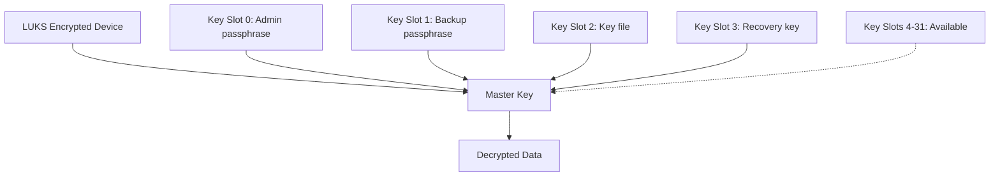

# How to Add and Manage LUKS Key Slots on RHEL

Author: [nawazdhandala](https://www.github.com/nawazdhandala)

Tags: RHEL, LUKS, Key Slots, Encryption, Key Management, Linux

Description: Manage LUKS key slots on RHEL to add backup passphrases, use key files, rotate encryption credentials, and recover from forgotten passphrases.

---

LUKS supports multiple key slots, allowing you to have several passphrases or key files that can unlock the same encrypted device. This is useful for backup recovery, shared administration, and key rotation. LUKS2 on RHEL supports up to 32 key slots. This guide covers how to manage them effectively.

## Understanding Key Slots



Each key slot independently encrypts the same master key. Any single key slot can unlock the device. The master key is what actually encrypts the data.

## Viewing Current Key Slots

```bash
# View all key slot information
sudo cryptsetup luksDump /dev/sdb

# Look for the "Keyslots:" section in the output
# Active slots show their details
# Unused slots are not listed
```

For a quick summary:

```bash
# Show just the key slot status
sudo cryptsetup luksDump /dev/sdb | grep -A2 "Keyslots:"
```

## Adding a New Passphrase

```bash
# Add a passphrase to the next available key slot
sudo cryptsetup luksAddKey /dev/sdb

# You will be prompted for:
# 1. An existing passphrase (to authorize the operation)
# 2. The new passphrase (twice, for confirmation)
```

To add a passphrase to a specific key slot:

```bash
# Add to a specific slot (e.g., slot 3)
sudo cryptsetup luksAddKey --key-slot 3 /dev/sdb
```

## Adding a Key File

Key files allow unlocking without typing a passphrase, which is useful for automated systems:

### Create a Key File

```bash
# Generate a random key file
sudo dd if=/dev/urandom of=/root/luks-keyfile bs=4096 count=1

# Set strict permissions
sudo chmod 400 /root/luks-keyfile
sudo chown root:root /root/luks-keyfile
```

### Add the Key File to LUKS

```bash
# Add the key file to the next available slot
sudo cryptsetup luksAddKey /dev/sdb /root/luks-keyfile

# Enter an existing passphrase when prompted
```

### Test Unlocking with the Key File

```bash
# Close the device first if it is open
sudo cryptsetup luksClose data_encrypted

# Open using the key file
sudo cryptsetup luksOpen /dev/sdb data_encrypted --key-file /root/luks-keyfile
```

## Changing a Passphrase

```bash
# Change the passphrase in a specific key slot
sudo cryptsetup luksChangeKey /dev/sdb

# You will be prompted for the old passphrase and then the new one

# Change a specific key slot
sudo cryptsetup luksChangeKey --key-slot 0 /dev/sdb
```

## Removing a Key Slot

### Remove by Passphrase

```bash
# Remove a key slot by providing its passphrase
sudo cryptsetup luksRemoveKey /dev/sdb

# Enter the passphrase of the slot you want to remove
```

### Remove by Slot Number

```bash
# Kill a specific key slot (requires a different valid passphrase)
sudo cryptsetup luksKillSlot /dev/sdb 1

# Enter a passphrase from a DIFFERENT slot to authorize the removal
```

**Warning:** Never remove the last key slot. If you remove all key slots, the encrypted data becomes permanently inaccessible.

## Checking Which Slot a Passphrase Uses

```bash
# Test which slot a passphrase opens
# The --test-passphrase flag checks without actually opening
sudo cryptsetup luksOpen --test-passphrase --verbose /dev/sdb

# Enter the passphrase and it will show which key slot was used
```

## Key Slot Management Best Practices

Here is a recommended key slot layout:

| Slot | Purpose | Type |
|------|---------|------|
| 0 | Primary admin passphrase | Passphrase |
| 1 | Backup admin passphrase | Passphrase |
| 2 | Automated unlock key file | Key file |
| 3 | Emergency recovery key | Passphrase (stored offline) |
| 4-31 | Reserved for future use | - |

## Practical Scenarios

### Setting Up for Team Administration

```bash
# Slot 0: Team lead passphrase (already exists from initial setup)

# Slot 1: Second admin passphrase
sudo cryptsetup luksAddKey --key-slot 1 /dev/sdb

# Slot 2: Third admin passphrase
sudo cryptsetup luksAddKey --key-slot 2 /dev/sdb
```

### Rotating Passphrases

```bash
# Step 1: Add the new passphrase to a free slot
sudo cryptsetup luksAddKey --key-slot 5 /dev/sdb
# Enter old passphrase, then new passphrase

# Step 2: Verify the new passphrase works
sudo cryptsetup luksOpen --test-passphrase --key-slot 5 --verbose /dev/sdb

# Step 3: Remove the old passphrase slot
sudo cryptsetup luksKillSlot /dev/sdb 0
# Enter the new passphrase to authorize

# Step 4: Optionally, move the new passphrase to slot 0
sudo cryptsetup luksAddKey --key-slot 0 /dev/sdb
# Use the slot 5 passphrase for both prompts (or set a new one)

sudo cryptsetup luksKillSlot /dev/sdb 5
```

### Creating an Emergency Recovery Key

```bash
# Generate a strong random recovery key
RECOVERY_KEY=$(openssl rand -base64 32)
echo "Recovery Key: $RECOVERY_KEY"
echo "SAVE THIS KEY IN A SECURE LOCATION"

# Add it to a key slot
echo -n "$RECOVERY_KEY" | sudo cryptsetup luksAddKey --key-slot 7 /dev/sdb --key-file=-

# Print the key for secure storage, then clear the variable
echo "Recovery key for /dev/sdb: $RECOVERY_KEY"
unset RECOVERY_KEY
```

## Auditing Key Slots

Create a script to check key slot status:

```bash
#!/bin/bash
# /usr/local/bin/luks-slot-audit.sh
# Audit LUKS key slot usage

echo "=== LUKS Key Slot Audit ==="
echo "Date: $(date)"
echo ""

for dev in $(blkid -t TYPE=crypto_LUKS -o device); do
    echo "Device: $dev"
    echo "UUID: $(cryptsetup luksDump "$dev" | grep "^UUID:" | awk '{print $2}')"
    echo "Key Slots:"
    cryptsetup luksDump "$dev" | grep -E "^\s+[0-9]+:" | while read line; do
        slot=$(echo "$line" | awk '{print $1}')
        echo "  Slot $slot active"
    done
    echo ""
done
```

## Summary

LUKS key slot management on RHEL provides flexibility for encryption credential management. Use `cryptsetup luksAddKey` to add passphrases or key files, `luksChangeKey` to rotate passphrases, and `luksKillSlot` to remove unused slots. Maintain at least two active key slots as a safety measure, and store a recovery key in a secure offline location. Regular auditing of key slot usage helps ensure your encryption credentials are properly managed.
