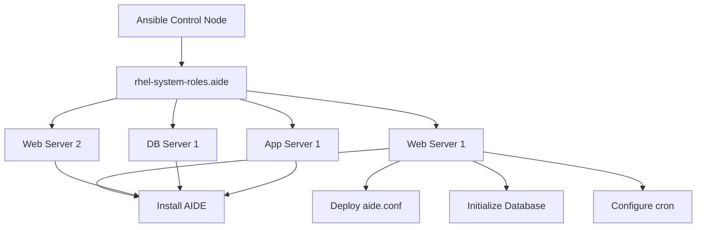

# How to Set Up the AIDE RHEL System Role for Automated Intrusion Detection

Author: [nawazdhandala](https://www.github.com/nawazdhandala)

Tags: RHEL, AIDE, System Roles, Ansible, Linux

Description: Use the AIDE RHEL System Role to deploy and manage file integrity monitoring across your entire RHEL 9 fleet with Ansible automation.

---

Managing AIDE on one server is straightforward. Managing it across dozens or hundreds of RHEL 9 systems gets tedious fast. The RHEL System Roles provide an Ansible-based way to deploy and configure AIDE consistently across your entire infrastructure. This guide covers using the AIDE system role to automate intrusion detection deployment.

## What Are RHEL System Roles

RHEL System Roles are a collection of Ansible roles officially supported by Red Hat. They provide a standardized interface for configuring common system services. The AIDE role handles installation, configuration, database initialization, and scheduled checks.

## Prerequisites

You need an Ansible control node with access to your RHEL 9 managed hosts. Install the system roles package:

```bash
# Install RHEL System Roles on the control node
sudo dnf install rhel-system-roles -y
```

This installs the roles to `/usr/share/ansible/roles/`. The AIDE role is at `/usr/share/ansible/roles/rhel-system-roles.aide/`.

Verify the role is available:

```bash
# List installed system roles
ls /usr/share/ansible/roles/ | grep aide
```

## Setting Up the Inventory

Create an inventory file for your managed hosts:

```bash
# Create an inventory file
cat > /home/ansible/inventory << 'EOF'
[servers]
web01.example.com
web02.example.com
db01.example.com
app01.example.com

[servers:vars]
ansible_user=admin
ansible_become=true
EOF
```

## Basic AIDE Playbook

The simplest playbook installs AIDE and initializes the database with default settings:

```yaml
# aide-basic.yml - Basic AIDE deployment
- name: Deploy AIDE file integrity monitoring
  hosts: servers
  roles:
    - role: rhel-system-roles.aide
```

Run it:

```bash
# Deploy AIDE to all servers
ansible-playbook -i inventory aide-basic.yml
```

## Customized AIDE Playbook

For production use, you will want to customize the configuration. The role accepts several variables:

```yaml
# aide-custom.yml - Customized AIDE deployment
- name: Deploy AIDE with custom configuration
  hosts: servers
  vars:
    aide_conf_d_files:
      - name: custom-monitoring
        content: |
          # Monitor application directories
          /opt/webapp CONTENT_EX
          /etc/nginx CONTENT_EX
          !/opt/webapp/logs
          !/opt/webapp/tmp
    aide_init_database: true
    aide_cron_check:
      hour: 3
      minute: 0
  roles:
    - role: rhel-system-roles.aide
```

## Role Variables Reference

Key variables the AIDE system role accepts:

| Variable | Description | Default |
|----------|-------------|---------|
| `aide_init_database` | Initialize the AIDE database after configuration | `true` |
| `aide_conf_d_files` | List of additional config file snippets | `[]` |
| `aide_cron_check` | Cron schedule for AIDE checks | Varies |
| `aide_email_notification` | Email address for alerts | None |

## Deploying with Custom Rules Per Host Group

Different servers need different monitoring rules. Use group variables:

```yaml
# aide-groups.yml - Per-group AIDE configuration
- name: Deploy AIDE to web servers
  hosts: webservers
  vars:
    aide_conf_d_files:
      - name: web-rules
        content: |
          /var/www/html CONTENT_EX
          /etc/nginx CONTENT_EX
          /etc/httpd CONTENT_EX
          !/var/www/html/cache
  roles:
    - role: rhel-system-roles.aide

- name: Deploy AIDE to database servers
  hosts: dbservers
  vars:
    aide_conf_d_files:
      - name: db-rules
        content: |
          /var/lib/pgsql/data/pg_hba.conf CONTENT_EX
          /var/lib/pgsql/data/postgresql.conf CONTENT_EX
          /etc/my.cnf.d CONTENT_EX
  roles:
    - role: rhel-system-roles.aide
```

## Deployment Architecture



## Managing Database Updates with Ansible

After patching, you can update AIDE databases fleet-wide:

```yaml
# aide-update-db.yml - Update AIDE databases after patching
- name: Update AIDE database on all servers
  hosts: servers
  tasks:
    - name: Archive current AIDE database
      copy:
        src: /var/lib/aide/aide.db.gz
        dest: "/var/lib/aide/archive/aide.db.gz.{{ ansible_date_time.iso8601_basic }}"
        remote_src: true

    - name: Run AIDE update
      command: /usr/sbin/aide --update
      register: aide_update
      failed_when: aide_update.rc >= 14

    - name: Activate new database
      copy:
        src: /var/lib/aide/aide.db.new.gz
        dest: /var/lib/aide/aide.db.gz
        remote_src: true
```

Run after patching:

```bash
# Update AIDE databases across the fleet
ansible-playbook -i inventory aide-update-db.yml
```

## Running Fleet-Wide Checks

Trigger AIDE checks across all systems and collect results:

```yaml
# aide-fleet-check.yml - Run AIDE check across all hosts
- name: Run AIDE checks fleet-wide
  hosts: servers
  tasks:
    - name: Run AIDE check
      command: /usr/sbin/aide --check
      register: aide_result
      failed_when: false
      changed_when: false

    - name: Report systems with changes
      debug:
        msg: "AIDE detected changes (exit code {{ aide_result.rc }})"
      when: aide_result.rc != 0

    - name: Save report locally
      copy:
        content: "{{ aide_result.stdout }}"
        dest: "/var/log/aide/fleet-check-{{ ansible_date_time.iso8601_basic }}.log"
```

## Handling Role Errors

Common issues and fixes:

```bash
# If the role fails on database initialization, check disk space
ansible servers -m shell -a "df -h /var/lib/aide"

# If AIDE is already installed with a different config, force re-init
ansible-playbook -i inventory aide-custom.yml --extra-vars "aide_init_database=true"
```

## Verifying Deployment

After running the playbook, verify everything is in place:

```bash
# Check AIDE is installed on all hosts
ansible servers -m command -a "aide --version"

# Verify the database exists
ansible servers -m stat -a "path=/var/lib/aide/aide.db.gz"

# Check cron jobs are configured
ansible servers -m command -a "crontab -l"
```

## Best Practices for Fleet Management

1. Store your AIDE playbooks in version control alongside your other infrastructure code.
2. Run AIDE database updates as part of your patching pipeline, not as a separate manual step.
3. Use separate Ansible plays for web servers, database servers, and application servers with appropriate rules for each.
4. Collect AIDE reports centrally using a log aggregation system.
5. Test playbook changes on a staging group before rolling out to production.

The AIDE system role takes the manual work out of fleet-wide file integrity monitoring, making it practical to maintain consistent security monitoring across large RHEL 9 environments.
