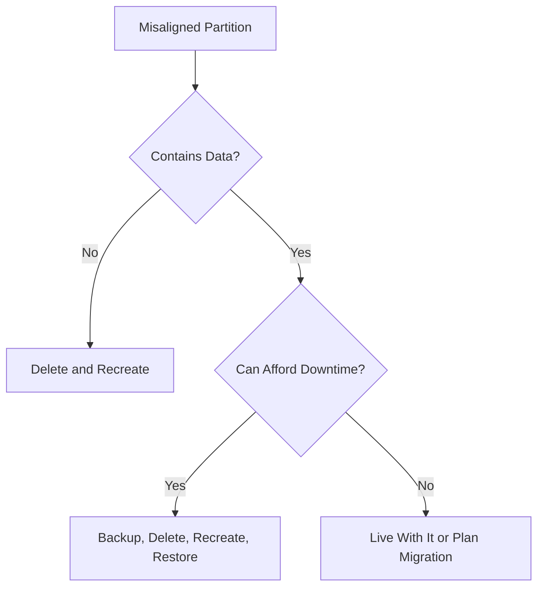

# How to Align Disk Partitions for Optimal Performance on RHEL 9

Author: [nawazdhandala](https://www.github.com/nawazdhandala)

Tags: RHEL, Partition Alignment, Performance, Linux

Description: Understand why partition alignment matters and how to ensure your partitions are optimally aligned on RHEL 9 for best disk performance.

---

## Why Alignment Matters

Modern storage devices, both SSDs and HDDs with Advanced Format (4K sectors), perform best when I/O operations align with their physical block boundaries. A misaligned partition forces the drive to read or write two physical blocks for every operation that crosses a boundary, effectively doubling the I/O for those operations.

On SSDs, misalignment can also increase write amplification and reduce the life of the drive. The performance penalty can be anywhere from 10% to 50% depending on the workload.

## What Is Proper Alignment?

The standard alignment target is 1 MiB (1,048,576 bytes). Starting your first partition at the 1 MiB offset ensures alignment with:

- 512-byte sectors (traditional)
- 4096-byte sectors (Advanced Format / 4Kn drives)
- SSD erase blocks (typically 256 KB to 4 MB)
- RAID stripe sizes (commonly 64K to 1M)

## Checking Current Alignment

```bash
# Check partition alignment with parted
sudo parted /dev/sdb align-check optimal 1

# Check the start sector of each partition
sudo parted /dev/sdb unit s print
```

If parted reports "aligned," you are good. If it says "not aligned," you have a problem.

```bash
# Alternative: check with fdisk
sudo fdisk -l /dev/sdb
```

Look at the "Start" column. For 512-byte sector disks, the first partition should start at sector 2048 (2048 x 512 = 1,048,576 = 1 MiB).

## Creating Aligned Partitions

### With parted

parted aligns to optimal boundaries by default when you use the `-a optimal` flag (which is the default on RHEL 9):

```bash
# Create a GPT label
sudo parted /dev/sdb mklabel gpt

# Create an aligned partition (starts at 1 MiB by default)
sudo parted -a optimal /dev/sdb mkpart primary xfs 0% 100%
```

Using percentages or MiB units ensures proper alignment:

```bash
# These all produce aligned partitions
sudo parted /dev/sdb mkpart primary xfs 1MiB 50GiB
sudo parted /dev/sdb mkpart primary xfs 50GiB 100%
```

### With fdisk

fdisk on RHEL 9 also aligns to 2048-sector boundaries by default:

```bash
# Start fdisk
sudo fdisk /dev/sdb

# Create new partition - defaults are aligned
# n, p, 1, Enter (default start), +50G
```

The default first sector will be 2048, which is properly aligned.

## Checking Physical vs. Logical Sector Sizes

```bash
# Show sector sizes for a disk
sudo fdisk -l /dev/sdb | grep "Sector size"

# Or use hdparm
sudo hdparm -I /dev/sdb | grep -i "sector size"

# Or check sysfs
cat /sys/block/sdb/queue/physical_block_size
cat /sys/block/sdb/queue/logical_block_size
```

If the physical block size is 4096 but the logical block size is 512, you have a 512e (512-byte emulation) drive. Alignment is especially important for these.

## Alignment for RAID Arrays

When partitioning disks for RAID, align to the RAID stripe size for best performance:

```bash
# For a RAID 5 with 64K chunks and 3 data disks
# Stripe size = 64K x 3 = 192K
# Start at 1 MiB to cover all common stripe sizes
sudo parted -a optimal /dev/sdb mkpart primary xfs 1MiB 100%
```

The 1 MiB default alignment is a multiple of all common stripe sizes, so it works well without needing to calculate specific values.

## Fixing Misaligned Partitions

If you discover a misaligned partition, you have a few options:



For empty partitions:

```bash
# Delete the misaligned partition
sudo parted /dev/sdb rm 1

# Recreate with proper alignment
sudo parted -a optimal /dev/sdb mkpart primary xfs 1MiB 50GiB
```

For partitions with data, you must back up, recreate the partition aligned, format, and restore.

## Verifying Alignment in Bulk

Check all partitions on all disks:

```bash
# Check alignment for all partitions on a disk
for part in $(seq 1 $(sudo parted -s /dev/sdb print | grep -c "^ ")); do
    echo -n "Partition $part: "
    sudo parted /dev/sdb align-check optimal $part
done
```

## Filesystem Block Size

While partition alignment handles the physical layer, matching your filesystem block size to the storage is also important:

```bash
# Create XFS with 4K block size (default on RHEL 9)
sudo mkfs.xfs -b size=4096 /dev/sdb1

# Create ext4 with 4K blocks
sudo mkfs.ext4 -b 4096 /dev/sdb1
```

The default 4096-byte block size on RHEL 9 is correct for virtually all modern drives.

## Wrap-Up

On RHEL 9, both parted and fdisk default to optimal alignment, so if you use default settings, your partitions will be properly aligned. The key is to avoid manually specifying sector offsets unless you know what you are doing. When in doubt, start partitions at 1 MiB boundaries, use the `-a optimal` flag in parted, and verify with `align-check`. Proper alignment is a one-time setup that pays performance dividends for the life of the disk.
