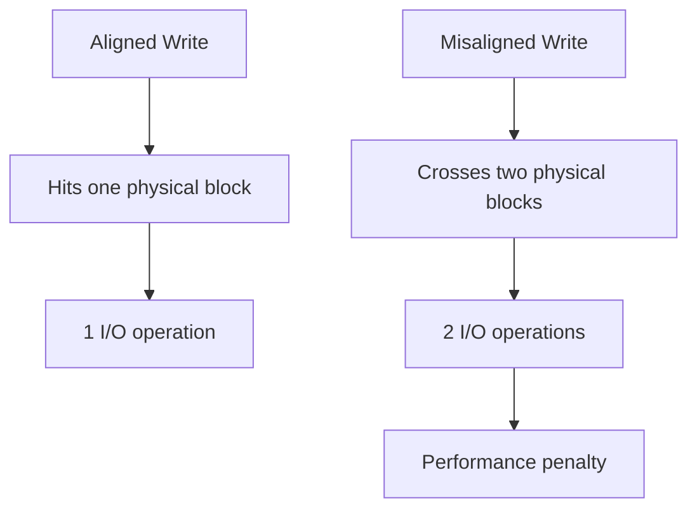

# How to Align File Systems to Underlying Storage Geometry on RHEL

Author: [nawazdhandala](https://www.github.com/nawazdhandala)

Tags: RHEL, Filesystem, Alignment, Performance, Linux

Description: Learn how to properly align partitions and filesystems to underlying storage geometry on RHEL to avoid performance penalties on SSDs and RAID arrays.

---

Partition and filesystem alignment is one of those things that, when done right, nobody notices. When done wrong, you get a consistent 10-40% I/O performance penalty on every single operation. Modern tools on RHEL usually handle alignment automatically, but understanding it helps you verify setups and troubleshoot performance issues.

## Why Alignment Matters

Storage devices work in fixed-size units:

- SSDs use erase blocks (typically 512 KB to 4 MB)
- RAID arrays use stripe widths (stripe size times number of data disks)
- Advanced Format drives use 4096-byte physical sectors

When a partition or filesystem is misaligned, a single logical I/O can cross the boundary between two physical units. This means one write becomes two writes at the hardware level.



## Checking Current Alignment

### Partition Alignment

```bash
# Check partition start sectors
parted /dev/sda unit s print
```

Partitions should start at sector numbers that are multiples of 2048 (1 MiB alignment). This is the standard default that works well for SSDs, 4K drives, and most RAID arrays.

```bash
# Quick alignment check with parted
parted /dev/sda align-check optimal 1
```

### Filesystem Alignment for RAID

```bash
# Check XFS alignment parameters
xfs_info /data
```

Look for `sunit` and `swidth` values. If these are 0, the filesystem was not aligned to RAID geometry.

### LVM Alignment

```bash
# Check if LVM physical extents are aligned
pvs -o pv_name,pe_start
```

The PE start should be at 1 MiB (the default for LVM on RHEL).

## Aligning Partitions

### Using parted (Recommended)

parted on RHEL aligns to optimal boundaries by default:

```bash
# Create an aligned partition with parted
parted /dev/sdb mklabel gpt
parted /dev/sdb mkpart primary xfs 0% 100%
```

Using percentages (`0%` to `100%`) ensures parted uses optimal alignment automatically.

### Using fdisk

fdisk on RHEL also aligns to 2048-sector (1 MiB) boundaries by default:

```bash
# Create a partition with fdisk (alignment is automatic)
fdisk /dev/sdb
# n, accept defaults, w
```

Verify the alignment:

```bash
# The start sector should be a multiple of 2048
fdisk -l /dev/sdb
```

## Aligning XFS for RAID

When creating XFS on a RAID array, tell mkfs about the geometry:

```bash
# Create XFS aligned to a RAID array
# sunit = stripe unit size in 512-byte sectors
# swidth = stripe width in 512-byte sectors
# Example: 64K stripe size, 4 data disks
# sunit = 64K / 512 = 128 sectors
# swidth = 128 * 4 = 512 sectors
mkfs.xfs -d su=64k,sw=4 /dev/md0
```

For an existing XFS filesystem, check the alignment:

```bash
# View current XFS geometry
xfs_info /mountpoint
```

If `sunit=0` and `swidth=0`, the filesystem is not aligned to RAID. You would need to recreate it to fix this.

## Aligning ext4 for RAID

ext4 uses `stride` and `stripe-width` parameters:

```bash
# Create ext4 aligned to RAID geometry
# stride = chunk_size / block_size
# stripe-width = stride * number_of_data_disks
# Example: 64K chunk, 4K block, 4 data disks
# stride = 64K / 4K = 16
# stripe-width = 16 * 4 = 64
mkfs.ext4 -E stride=16,stripe-width=64 /dev/md0
```

Check an existing ext4 filesystem:

```bash
# Show ext4 filesystem parameters
tune2fs -l /dev/md0 | grep -i stride
dumpe2fs -h /dev/md0 | grep -i stride
```

## Aligning for SSDs

SSDs perform best when aligned to their erase block size. The 1 MiB partition alignment that RHEL uses by default is sufficient for virtually all SSDs.

To verify:

```bash
# Check that partition starts at a 1 MiB boundary
parted /dev/nvme0n1 unit MiB print
```

Also check that TRIM/discard support is configured:

```bash
# Verify TRIM support
lsblk -D /dev/nvme0n1
```

## Aligning for 4K Sector Drives

Advanced Format (AF) drives use 4096-byte physical sectors but may report 512-byte logical sectors for compatibility. Check your drive:

```bash
# Check physical and logical sector sizes
cat /sys/block/sda/queue/physical_block_size
cat /sys/block/sda/queue/logical_block_size
```

If the physical sector size is 4096, partitions must start on 4096-byte boundaries (at minimum). The standard 1 MiB alignment handles this correctly.

## LVM and Device-Mapper Alignment

LVM on RHEL starts physical extents at 1 MiB by default, which provides good alignment:

```bash
# Create a physical volume (alignment is automatic)
pvcreate /dev/sdb1
```

To verify:

```bash
# Check PE alignment
pvs -o pv_name,pe_start /dev/sdb1
```

For RAID-aware LVM:

```bash
# Create a striped logical volume aligned to RAID
lvcreate -i 4 -I 64K -L 100G -n lv_data vg_data
```

The `-i 4` sets 4 stripes and `-I 64K` sets the stripe size, which also aligns the filesystem properly when you format it.

## Diagnosing Alignment Problems

Symptoms of misalignment:

- I/O performance significantly below expected levels
- High I/O wait times
- RAID rebuild times much longer than expected

To investigate:

```bash
# Check for write amplification on the device
iostat -x 1 5
```

If `w/s` (writes per second) is much higher than expected for your workload, misalignment could be the cause.

```bash
# Check partition alignment
for part in /dev/sda*; do
    START=$(cat /sys/class/block/$(basename $part)/start 2>/dev/null)
    if [ -n "$START" ]; then
        ALIGNED=$((START % 2048))
        echo "$part: start=$START, aligned=$([[ $ALIGNED -eq 0 ]] && echo 'yes' || echo 'NO')"
    fi
done
```

## Summary

Filesystem alignment on RHEL is usually handled automatically by modern partitioning tools, but it is worth verifying, especially on RAID arrays and SSDs. Use 1 MiB partition alignment (the default), specify RAID geometry when formatting with mkfs, and check alignment with `parted align-check`. Getting alignment right from the start prevents a persistent performance penalty that is difficult to fix without reformatting.
