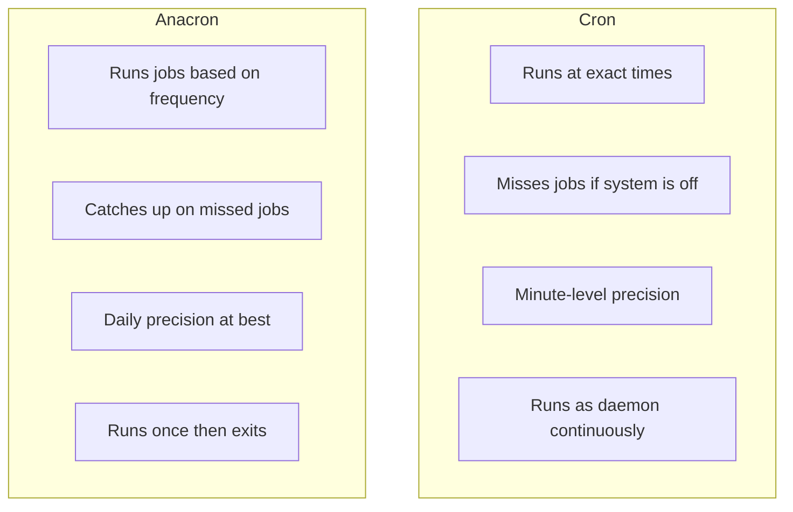

# How to Use Anacron for Running Missed Scheduled Tasks on RHEL

Author: [nawazdhandala](https://www.github.com/nawazdhandala)

Tags: RHEL, Anacron, Scheduling, Linux, System Administration

Description: Learn how anacron handles missed scheduled tasks on RHEL, how it differs from cron, and how to configure /etc/anacrontab for reliable periodic job execution on systems that are not always running.

---

## The Gap Cron Cannot Fill

Cron is excellent at running jobs at precise times, but it has a fundamental limitation: if the system is powered off when a job is scheduled, that job simply does not run. There is no catch-up mechanism. For desktop systems, laptops, virtual machines that get shut down at night, or cloud instances that scale down during off-hours, this means critical maintenance tasks can be missed for days.

That is exactly the problem anacron solves. It tracks when jobs were last run and executes any that are overdue when the system comes back up.

## How Anacron Differs from Cron

The differences are fundamental to understanding when to use each tool.



| Feature | Cron | Anacron |
|---------|------|---------|
| Precision | Minute-level | Daily |
| Handles downtime | No | Yes |
| Runs as daemon | Yes | No, runs and exits |
| Suitable for | Always-on servers | Systems with downtime |
| User crontabs | Yes | No, system-wide only |

On RHEL, anacron and cron work together. The hourly cron job at `/etc/cron.d/0hourly` triggers anacron, which then handles the daily, weekly, and monthly jobs.

## How Anacron Works on RHEL

Here is the chain of events:

1. crond runs `/etc/cron.d/0hourly` every hour
2. That file runs `run-parts /etc/cron.hourly`
3. One of the scripts in `/etc/cron.hourly/` is `0anacron`
4. This script runs `/usr/sbin/anacron -s`
5. Anacron checks `/etc/anacrontab` and runs any overdue jobs

```bash
# See the trigger script
cat /etc/cron.hourly/0anacron
```

You will see something like:

```bash
#!/bin/sh
# Check whether 0anacron was run today already
if test -r /var/spool/anacron/cron.daily; then
    day=`cat /var/spool/anacron/cron.daily`
fi
if [ `date +%Y%m%d` = "$day" ]; then
    exit 0;
fi
# Do not run jobs when on battery power
if test -x /usr/bin/on_ac_power; then
    /usr/bin/on_ac_power >/dev/null 2>&1
    if test $? -eq 1; then
    exit 0
    fi
fi
/usr/sbin/anacron -s
```

## The /etc/anacrontab File

This is where you configure anacron jobs. Let us look at the default configuration and break it down.

```bash
# View the current anacrontab
cat /etc/anacrontab
```

Default content:

```bash
# /etc/anacrontab: configuration file for anacron

# See anacron(8) and anacrontab(5) for details.

SHELL=/bin/sh
PATH=/sbin:/bin:/usr/sbin:/usr/bin
MAILTO=root
# the maximal random delay added to the base delay of the jobs
RANDOM_DELAY=45
# the jobs will be started during the following hours only
START_HOURS_RANGE=3-22

#period in days   delay in minutes   job-identifier   command
1       5       cron.daily              nice run-parts /etc/cron.daily
7       25      cron.weekly             nice run-parts /etc/cron.weekly
@monthly 45     cron.monthly            nice run-parts /etc/cron.monthly
```

Each job line has four fields:

- **Period** - how often the job should run (in days, or @monthly)
- **Delay** - minutes to wait after anacron starts before running this job
- **Identifier** - a unique name used for tracking (stored in /var/spool/anacron/)
- **Command** - what to execute

## Understanding the Timing Controls

### RANDOM_DELAY

This adds a random number of minutes (between 0 and the specified value) to the base delay. It prevents all anacron jobs from running at exactly the same time, which would cause a load spike.

```bash
# With RANDOM_DELAY=45 and a job delay of 5:
# Actual delay = 5 + random(0-45) = somewhere between 5 and 50 minutes
```

### START_HOURS_RANGE

This controls the window during which anacron will start jobs. Jobs will not start outside this window.

```bash
# Only run anacron jobs between 3 AM and 10 PM
START_HOURS_RANGE=3-22

# For a server that should only run maintenance at night
START_HOURS_RANGE=1-6
```

If the system boots up at 11 PM with `START_HOURS_RANGE=3-22`, anacron will not run any jobs until 3 AM.

## Adding Custom Anacron Jobs

You can add your own jobs to `/etc/anacrontab`. Here are some practical examples.

```bash
# Edit the anacrontab file
sudo vi /etc/anacrontab
```

Add entries like these:

```bash
# Run a security scan every 3 days
3       10      security-scan           /usr/local/bin/security-scan.sh

# Database optimization every 2 weeks (14 days)
14      30      db-optimize             /usr/local/bin/db-optimize.sh

# Monthly report generation
@monthly 60     monthly-report          /usr/local/bin/generate-report.sh
```

### Example: A Custom Backup Job

```bash
# Create the backup script
sudo tee /usr/local/bin/anacron-backup.sh > /dev/null <<'SCRIPT'
#!/bin/bash
# Daily backup script managed by anacron
# Runs even if the system was down when originally scheduled

BACKUP_DIR="/mnt/backup/$(hostname)"
DATE=$(date +%Y%m%d)
LOGFILE="/var/log/anacron-backup.log"

echo "$(date): Starting backup" >> "$LOGFILE"

mkdir -p "$BACKUP_DIR"

# Backup important configuration files
tar czf "$BACKUP_DIR/etc-backup-$DATE.tar.gz" /etc/ 2>> "$LOGFILE"

# Backup application data
tar czf "$BACKUP_DIR/appdata-$DATE.tar.gz" /opt/myapp/data/ 2>> "$LOGFILE"

# Clean up backups older than 30 days
find "$BACKUP_DIR" -name "*.tar.gz" -mtime +30 -delete

echo "$(date): Backup completed" >> "$LOGFILE"
SCRIPT

sudo chmod 755 /usr/local/bin/anacron-backup.sh
```

Add it to anacrontab:

```bash
# Daily backup with 15-minute delay
1       15      daily-backup            /usr/local/bin/anacron-backup.sh
```

## Checking Anacron Timestamps

Anacron tracks when each job was last run using timestamp files in `/var/spool/anacron/`.

```bash
# See when jobs were last run
ls -la /var/spool/anacron/

# Check the timestamp for a specific job
cat /var/spool/anacron/cron.daily
```

The file contains a date in YYYYMMDD format. Anacron compares this with today's date to determine if the job is overdue.

```bash
# Example: if cron.daily contains 20260302 and today is 20260304,
# anacron knows the daily job is 2 days overdue and will run it
```

You can force a job to re-run by modifying or removing its timestamp file.

```bash
# Force cron.daily to run again on next anacron invocation
sudo rm /var/spool/anacron/cron.daily

# Or set it to an old date
echo "20260101" | sudo tee /var/spool/anacron/cron.daily
```

## Testing Anacron

You can test anacron manually without waiting for the hourly trigger.

```bash
# Test run - show what would be done without actually doing it
sudo anacron -T

# Force run all jobs now, ignoring timestamps
sudo anacron -f -n

# Run in foreground with verbose output (great for debugging)
sudo anacron -f -n -d
```

The flags:
- `-T` - test configuration syntax only
- `-f` - force execution, ignore timestamps
- `-n` - run now, do not wait for delays
- `-d` - run in foreground with debug output

## Combining Cron and Anacron

On RHEL, the recommended approach is:

- Use **cron** for jobs that must run at exact times (database snapshots at midnight, report generation at 6 AM)
- Use **anacron** for periodic maintenance that just needs to happen regularly (log cleanup, backup verification, security scans)

For jobs that go into the periodic directories (`/etc/cron.daily/`, `/etc/cron.weekly/`, `/etc/cron.monthly/`), anacron already handles them. You get the reliability of anacron automatically.

For custom schedules that need anacron's catch-up behavior, add entries directly to `/etc/anacrontab`.

## Adjusting Anacron for Servers

On a server that runs 24/7, you might want tighter control over when anacron jobs run.

```bash
# Configure anacron for a production server
sudo vi /etc/anacrontab
```

```bash
SHELL=/bin/sh
PATH=/sbin:/bin:/usr/sbin:/usr/bin
MAILTO=ops-team@example.com

# Reduce random delay on servers - we want predictability
RANDOM_DELAY=5

# Only run during the maintenance window
START_HOURS_RANGE=2-5

1       5       cron.daily              nice run-parts /etc/cron.daily
7       25      cron.weekly             nice run-parts /etc/cron.weekly
@monthly 45     cron.monthly            nice run-parts /etc/cron.monthly
```

This configuration ensures all anacron jobs run between 2 AM and 5 AM with minimal random delay.

## Troubleshooting Anacron

If anacron jobs are not running, check these common issues.

```bash
# Verify anacron is installed
rpm -q cronie-anacron

# Check that the hourly trigger exists
ls -la /etc/cron.hourly/0anacron

# Make sure it is executable
file /etc/cron.hourly/0anacron

# Validate anacrontab syntax
sudo anacron -T

# Check for errors in the cron log
sudo grep anacron /var/log/cron | tail -20

# Check if timestamps are current (they should be today's date)
cat /var/spool/anacron/cron.daily
```

## Summary

Anacron fills an important gap in task scheduling on RHEL. While cron handles precise, time-based scheduling, anacron ensures that periodic tasks actually run even if the system was not available at the originally scheduled time. On RHEL, the two work together seamlessly through the hourly trigger mechanism. For any system that experiences downtime, whether planned or not, anacron is essential for reliable maintenance task execution.
