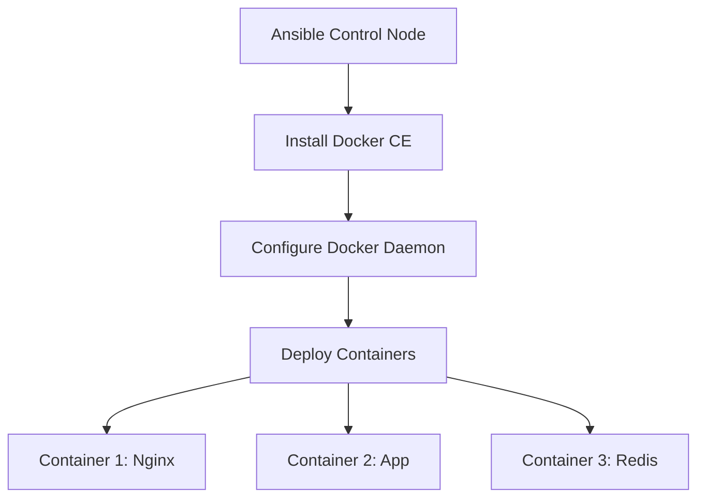

# How to Use Ansible to Deploy Docker Containers on RHEL

Author: [nawazdhandala](https://www.github.com/nawazdhandala)

Tags: RHEL, Ansible, Docker, Containers, Automation, Linux

Description: Automate Docker installation and container deployment on RHEL using Ansible playbooks for reproducible container infrastructure.

---

While Podman is the default container runtime on RHEL, some teams still need Docker for compatibility reasons. This guide shows how to use Ansible to install Docker CE on RHEL and deploy containers in an automated, repeatable way.

## Architecture Overview



## Prerequisites

The `community.docker` Ansible collection is needed for Docker modules:

```bash
# Install the Docker collection on the control node
ansible-galaxy collection install community.docker
```

## Step 1: Install Docker CE on RHEL

```yaml
# playbook-docker-install.yml
# Install Docker CE on RHEL servers
---
- name: Install Docker CE on RHEL
  hosts: docker_hosts
  become: true

  tasks:
    - name: Remove conflicting packages
      ansible.builtin.dnf:
        name:
          - podman
          - buildah
          - containers-common
        state: absent

    - name: Install required dependencies
      ansible.builtin.dnf:
        name:
          - dnf-plugins-core
          - device-mapper-persistent-data
          - lvm2
        state: present

    - name: Add Docker CE repository
      ansible.builtin.yum_repository:
        name: docker-ce
        description: Docker CE Repository
        baseurl: https://download.docker.com/linux/rhel/9/$basearch/stable
        gpgcheck: true
        gpgkey: https://download.docker.com/linux/rhel/gpg
        enabled: true

    - name: Install Docker CE packages
      ansible.builtin.dnf:
        name:
          - docker-ce
          - docker-ce-cli
          - containerd.io
          - docker-compose-plugin
        state: present

    - name: Create Docker daemon configuration
      ansible.builtin.copy:
        content: |
          {
            "log-driver": "json-file",
            "log-opts": {
              "max-size": "10m",
              "max-file": "3"
            },
            "storage-driver": "overlay2",
            "default-address-pools": [
              {"base": "172.17.0.0/16", "size": 24}
            ]
          }
        dest: /etc/docker/daemon.json
        mode: "0644"
      notify: Restart Docker

    - name: Enable and start Docker
      ansible.builtin.systemd:
        name: docker
        enabled: true
        state: started

    - name: Add users to docker group
      ansible.builtin.user:
        name: "{{ item }}"
        groups: docker
        append: true
      loop:
        - deployer

  handlers:
    - name: Restart Docker
      ansible.builtin.systemd:
        name: docker
        state: restarted
```

## Step 2: Deploy Containers

```yaml
# playbook-docker-deploy.yml
# Deploy application containers with Docker
---
- name: Deploy containers
  hosts: docker_hosts
  become: true

  tasks:
    - name: Pull application images
      community.docker.docker_image:
        name: "{{ item }}"
        source: pull
      loop:
        - nginx:1.25
        - redis:7-alpine
        - myregistry.example.com/myapp:latest

    - name: Create a Docker network for the application
      community.docker.docker_network:
        name: app-network
        driver: bridge
        ipam_config:
          - subnet: 172.20.0.0/24

    - name: Deploy Redis container
      community.docker.docker_container:
        name: redis
        image: redis:7-alpine
        state: started
        restart_policy: unless-stopped
        networks:
          - name: app-network
        volumes:
          - redis-data:/data
        command: redis-server --maxmemory 256mb --maxmemory-policy allkeys-lru

    - name: Deploy application container
      community.docker.docker_container:
        name: myapp
        image: myregistry.example.com/myapp:latest
        state: started
        restart_policy: unless-stopped
        networks:
          - name: app-network
        env:
          REDIS_HOST: redis
          APP_ENV: production
        ports:
          - "8080:8080"

    - name: Deploy Nginx reverse proxy
      community.docker.docker_container:
        name: nginx
        image: nginx:1.25
        state: started
        restart_policy: unless-stopped
        networks:
          - name: app-network
        ports:
          - "80:80"
          - "443:443"
        volumes:
          - /etc/nginx/conf.d:/etc/nginx/conf.d:ro
          - /etc/pki/tls:/etc/pki/tls:ro
```

## Step 3: Deploy with Docker Compose

For more complex applications, use Docker Compose through Ansible:

```yaml
# playbook-docker-compose.yml
# Deploy application stack using Docker Compose
---
- name: Deploy with Docker Compose
  hosts: docker_hosts
  become: true

  tasks:
    - name: Create application directory
      ansible.builtin.file:
        path: /opt/myapp
        state: directory
        mode: "0755"

    - name: Copy docker-compose file
      ansible.builtin.copy:
        dest: /opt/myapp/docker-compose.yml
        mode: "0644"
        content: |
          version: "3.8"
          services:
            web:
              image: nginx:1.25
              ports:
                - "80:80"
                - "443:443"
              volumes:
                - ./nginx.conf:/etc/nginx/conf.d/default.conf:ro
              depends_on:
                - app
              restart: unless-stopped

            app:
              image: myregistry.example.com/myapp:latest
              environment:
                - DB_HOST=db
                - REDIS_HOST=cache
              depends_on:
                - db
                - cache
              restart: unless-stopped

            db:
              image: postgres:15
              volumes:
                - pgdata:/var/lib/postgresql/data
              environment:
                - POSTGRES_DB=myapp
                - POSTGRES_USER=myapp
                - POSTGRES_PASSWORD_FILE=/run/secrets/db_password
              restart: unless-stopped

            cache:
              image: redis:7-alpine
              restart: unless-stopped

          volumes:
            pgdata:

    - name: Start the application stack
      community.docker.docker_compose_v2:
        project_src: /opt/myapp
        state: present
      register: compose_output

    - name: Show deployment status
      ansible.builtin.debug:
        msg: "{{ compose_output }}"
```

## Container Health Checks

```yaml
# tasks/healthcheck.yml
# Verify containers are running and healthy
---
- name: Check container status
  community.docker.docker_container_info:
    name: "{{ item }}"
  register: container_info
  loop:
    - nginx
    - myapp
    - redis

- name: Verify all containers are running
  ansible.builtin.assert:
    that:
      - item.container.State.Running == true
    fail_msg: "Container {{ item.item }} is not running"
  loop: "{{ container_info.results }}"
```

## Opening Firewall Ports

```bash
# Open ports for the containers
sudo firewall-cmd --permanent --add-service=http
sudo firewall-cmd --permanent --add-service=https
sudo firewall-cmd --reload
```

## Wrapping Up

Using Ansible to deploy Docker containers on RHEL gives you a repeatable deployment process. The `community.docker` collection provides modules for every Docker operation. For new projects on RHEL, consider Podman instead since it is the native container runtime, but if you need Docker for compatibility, this approach gets you there cleanly.
