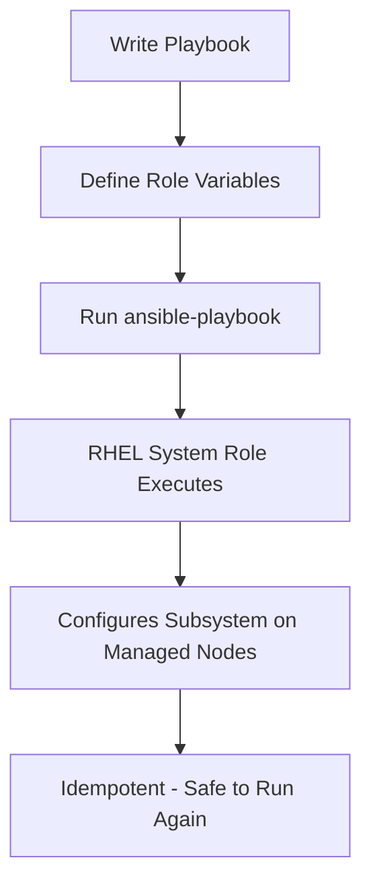

# How to Use Ansible and RHEL System Roles to Automate System Administration

Author: [nawazdhandala](https://www.github.com/nawazdhandala)

Tags: RHEL, Ansible, System Roles, Automation, Linux

Description: Learn how to use the rhel-system-roles package to automate common RHEL 9 configuration tasks like networking, time synchronization, SELinux, and storage using Red Hat's officially supported Ansible roles.

---

## What Are RHEL System Roles

RHEL System Roles are a collection of Ansible roles developed and maintained by Red Hat. They provide a consistent, supported way to automate the configuration of common RHEL subsystems. Instead of writing your own playbooks to configure networking, time sync, SELinux, or logging from scratch, you use these roles and pass in variables that describe your desired state.

The key advantage over writing custom playbooks is that Red Hat tests these roles across RHEL versions and provides support for them. When RHEL internals change between releases, Red Hat updates the roles so your playbooks keep working.

This post focuses specifically on the `rhel-system-roles` package and how to use its individual roles. If you are looking for general Ansible setup and configuration on RHEL, that is covered in a separate guide.

## Installing RHEL System Roles

The roles are distributed as an RPM package. Install them on your Ansible control node.

```bash
# Install the RHEL system roles package
sudo dnf install rhel-system-roles
```

After installation, the roles are available at `/usr/share/ansible/roles/`. Each role has a name prefixed with `rhel-system-roles.`:

```bash
# List all installed RHEL system roles
ls /usr/share/ansible/roles/
```

You will see roles like:

- `rhel-system-roles.timesync` - Time synchronization (chrony/NTP)
- `rhel-system-roles.network` - Network configuration
- `rhel-system-roles.selinux` - SELinux configuration
- `rhel-system-roles.storage` - Disk and volume management
- `rhel-system-roles.logging` - System logging configuration
- `rhel-system-roles.kdump` - Kernel crash dump configuration
- `rhel-system-roles.firewall` - Firewall management
- `rhel-system-roles.certificate` - Certificate management
- `rhel-system-roles.crypto_policies` - System-wide cryptographic policies
- `rhel-system-roles.metrics` - Performance metrics collection (PCP)
- `rhel-system-roles.postfix` - Mail transfer agent configuration
- `rhel-system-roles.tlog` - Terminal session recording

Each role ships with documentation at `/usr/share/doc/rhel-system-roles/` and example playbooks.

```bash
# View documentation for a specific role
ls /usr/share/doc/rhel-system-roles/timesync/
```

## How RHEL System Roles Work



Each role works by accepting variables that describe your desired configuration. The role handles all the underlying tasks: installing packages, editing config files, restarting services, and validating the result. This is idempotent, meaning you can run the playbook multiple times and it only makes changes when the current state does not match the desired state.

## Example: Configuring Time Synchronization

The `timesync` role configures chrony for NTP time synchronization.

Create a playbook file:

```yaml
# timesync.yml - Configure NTP time synchronization
---
- name: Configure time synchronization on all servers
  hosts: all
  become: true
  vars:
    timesync_ntp_servers:
      - hostname: 0.rhel.pool.ntp.org
        iburst: true
      - hostname: 1.rhel.pool.ntp.org
        iburst: true
      - hostname: 2.rhel.pool.ntp.org
        iburst: true
    timesync_ntp_provider: chrony

  roles:
    - rhel-system-roles.timesync
```

Run it:

```bash
# Apply time synchronization configuration
ansible-playbook -i inventory timesync.yml
```

The role will install chrony (if not present), configure the NTP servers, and restart the service.

## Example: Configuring Networking

The `network` role manages network connections through NetworkManager.

```yaml
# network.yml - Configure a static IP on ens192
---
- name: Configure network interfaces
  hosts: webservers
  become: true
  vars:
    network_connections:
      - name: ens192
        type: ethernet
        autoconnect: true
        ip:
          address:
            - 192.168.1.100/24
          gateway4: 192.168.1.1
          dns:
            - 8.8.8.8
            - 8.8.4.4
          dns_search:
            - example.com

  roles:
    - rhel-system-roles.network
```

You can also configure bonding, VLANs, and bridges with this role:

```yaml
# network-bond.yml - Configure a bonded interface
---
- name: Configure network bond
  hosts: dbservers
  become: true
  vars:
    network_connections:
      - name: bond0
        type: bond
        ip:
          address:
            - 10.0.1.50/24
          gateway4: 10.0.1.1
        bond:
          mode: active-backup
          miimon: 100
      - name: ens192
        type: ethernet
        controller: bond0
      - name: ens224
        type: ethernet
        controller: bond0

  roles:
    - rhel-system-roles.network
```

## Example: Configuring SELinux

The `selinux` role lets you set the SELinux mode, manage booleans, and configure file contexts.

```yaml
# selinux.yml - Configure SELinux settings
---
- name: Configure SELinux
  hosts: all
  become: true
  vars:
    selinux_state: enforcing
    selinux_policy: targeted
    selinux_booleans:
      - name: httpd_can_network_connect
        state: true
        persistent: true
      - name: httpd_can_network_connect_db
        state: true
        persistent: true
    selinux_fcontexts:
      - target: '/srv/myapp(/.*)?'
        setype: httpd_sys_content_t
        state: present
    selinux_restore_dirs:
      - /srv/myapp

  roles:
    - rhel-system-roles.selinux
```

## Example: Managing Storage

The `storage` role handles disk partitioning, LVM, and file system creation.

```yaml
# storage.yml - Create an LVM volume for application data
---
- name: Configure storage
  hosts: appservers
  become: true
  vars:
    storage_pools:
      - name: vg_app
        type: lvm
        disks:
          - /dev/sdb
        volumes:
          - name: lv_data
            size: "50 GiB"
            fs_type: xfs
            mount_point: /srv/appdata

  roles:
    - rhel-system-roles.storage
```

This creates a volume group `vg_app` on `/dev/sdb`, a 50 GiB logical volume `lv_data` with an XFS file system, and mounts it at `/srv/appdata`.

## Example: Configuring System Logging

The `logging` role configures rsyslog with inputs and outputs.

```yaml
# logging.yml - Set up centralized logging
---
- name: Configure logging on client servers
  hosts: all
  become: true
  vars:
    logging_inputs:
      - name: system_input
        type: basics
    logging_outputs:
      - name: remote_output
        type: remote
        target: logserver.example.com
        tcp_port: 514
    logging_flows:
      - name: flow_remote
        inputs:
          - system_input
        outputs:
          - remote_output

  roles:
    - rhel-system-roles.logging
```

## Example: Configuring the Firewall

The `firewall` role manages firewalld rules declaratively.

```yaml
# firewall.yml - Configure firewall for web and database servers
---
- name: Configure firewall rules
  hosts: webservers
  become: true
  vars:
    firewall:
      - service:
          - http
          - https
        state: enabled
      - port:
          - "8080/tcp"
          - "8443/tcp"
        state: enabled

  roles:
    - rhel-system-roles.firewall
```

## Combining Multiple Roles

You can apply multiple roles in a single playbook for a complete server configuration.

```yaml
# full-server-setup.yml - Complete server configuration
---
- name: Full server setup
  hosts: webservers
  become: true
  vars:
    # Time sync configuration
    timesync_ntp_servers:
      - hostname: 0.rhel.pool.ntp.org
        iburst: true

    # SELinux configuration
    selinux_state: enforcing
    selinux_booleans:
      - name: httpd_can_network_connect
        state: true
        persistent: true

    # Firewall configuration
    firewall:
      - service:
          - http
          - https
        state: enabled

  roles:
    - rhel-system-roles.timesync
    - rhel-system-roles.selinux
    - rhel-system-roles.firewall
```

## Finding Role Documentation and Variables

Each role has detailed documentation on the variables it accepts.

```bash
# Read the README for the timesync role
cat /usr/share/doc/rhel-system-roles/timesync/README.md

# Look at example playbooks
ls /usr/share/doc/rhel-system-roles/timesync/

# Check the defaults to see all configurable variables
cat /usr/share/ansible/roles/rhel-system-roles.timesync/defaults/main.yml
```

## Practical Tips

- **Start with one role at a time.** Get comfortable with how each role works before combining them.
- **Always test in a staging environment first.** Network and storage roles can disrupt services if misconfigured.
- **Use `--check` mode** for a dry run before applying changes.

```bash
# Dry run to see what would change
ansible-playbook -i inventory network.yml --check --diff
```

- **Pin your role versions** in production. Since the roles come from an RPM, pin the `rhel-system-roles` package version to avoid unexpected behavior after updates.
- **Read the role defaults** to understand all available options. The README covers common scenarios, but the defaults file shows every knob you can turn.
- **Use Ansible Vault** for sensitive variables like passwords. Several roles accept password parameters that should not be stored in plain text.

## Summary

RHEL System Roles provide a standardized, Red Hat-supported way to automate common system configuration tasks. Install the `rhel-system-roles` package, write playbooks that set role variables to describe your desired state, and run them. The roles handle the underlying complexity across RHEL versions. Start with simple use cases like time synchronization or firewall rules, then work up to networking, storage, and logging as you get comfortable. This approach is more maintainable than custom playbooks because Red Hat keeps the roles updated as the underlying subsystems change.
