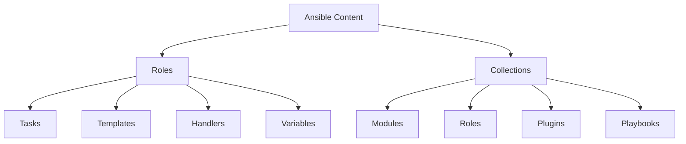

# How to Use Ansible Roles and Galaxy Collections for RHEL

Author: [nawazdhandala](https://www.github.com/nawazdhandala)

Tags: RHEL, Ansible, Galaxy, Roles, Collections, Automation, Linux

Description: Organize your RHEL automation with Ansible roles and leverage Galaxy collections for pre-built, community-maintained content.

---

Writing everything in one giant playbook works until it does not. Ansible roles let you break your automation into reusable pieces, and Galaxy collections give you access to thousands of pre-built roles and modules maintained by the community and Red Hat.

## Roles vs Collections



- **Roles** organize tasks, variables, templates, and handlers into a reusable unit
- **Collections** are packages that can contain roles, modules, plugins, and more

## Creating a Role

```bash
# Create a new role with the standard directory structure
ansible-galaxy role init roles/rhel_base
```

This creates:

```
roles/rhel_base/
  defaults/
    main.yml      # Default variables (lowest priority)
  files/          # Static files to copy
  handlers/
    main.yml      # Handlers (restart services, etc.)
  meta/
    main.yml      # Role metadata and dependencies
  tasks/
    main.yml      # Main task list
  templates/      # Jinja2 templates
  vars/
    main.yml      # Role variables (higher priority)
```

## Example: RHEL Base Configuration Role

```yaml
# roles/rhel_base/defaults/main.yml
# Default variables - users can override these
---
base_packages:
  - vim
  - tmux
  - curl
  - wget
  - bind-utils
  - net-tools
  - bash-completion
  - rsync
  - tar
  - unzip

base_services_enabled:
  - firewalld
  - chronyd
  - sshd

base_timezone: "UTC"
base_selinux_state: enforcing
```

```yaml
# roles/rhel_base/tasks/main.yml
# Main tasks for base RHEL configuration
---
- name: Install base packages
  ansible.builtin.dnf:
    name: "{{ base_packages }}"
    state: present

- name: Set timezone
  community.general.timezone:
    name: "{{ base_timezone }}"

- name: Configure SELinux
  ansible.posix.selinux:
    state: "{{ base_selinux_state }}"
    policy: targeted

- name: Enable base services
  ansible.builtin.systemd:
    name: "{{ item }}"
    enabled: true
    state: started
  loop: "{{ base_services_enabled }}"

- name: Set sysctl parameters
  ansible.posix.sysctl:
    name: "{{ item.key }}"
    value: "{{ item.value }}"
    sysctl_file: /etc/sysctl.d/99-base.conf
    reload: true
  loop:
    - { key: "vm.swappiness", value: "10" }
    - { key: "net.ipv4.ip_forward", value: "0" }
```

```yaml
# roles/rhel_base/handlers/main.yml
---
- name: Restart sshd
  ansible.builtin.systemd:
    name: sshd
    state: restarted

- name: Restart chronyd
  ansible.builtin.systemd:
    name: chronyd
    state: restarted
```

```yaml
# roles/rhel_base/meta/main.yml
---
galaxy_info:
  author: your-name
  description: Base configuration for RHEL servers
  license: MIT
  min_ansible_version: "2.14"
  platforms:
    - name: EL
      versions:
        - "9"
dependencies: []
```

## Using Roles in Playbooks

```yaml
# playbook-site.yml
# Apply roles to servers
---
- name: Configure all servers
  hosts: all
  become: true
  roles:
    - rhel_base

- name: Configure web servers
  hosts: webservers
  become: true
  roles:
    - rhel_base
    - rhel_webserver
    - rhel_monitoring

- name: Configure database servers
  hosts: dbservers
  become: true
  roles:
    - rhel_base
    - rhel_database
    - rhel_monitoring
```

## Installing Collections from Galaxy

```bash
# Search for RHEL-related collections
ansible-galaxy collection list

# Install specific collections
ansible-galaxy collection install ansible.posix
ansible-galaxy collection install community.general
ansible-galaxy collection install community.mysql
ansible-galaxy collection install containers.podman
ansible-galaxy collection install redhat.rhel_system_roles

# Install from a requirements file
ansible-galaxy collection install -r requirements.yml
```

## Requirements File

```yaml
# requirements.yml
# Pin collection versions for reproducibility
---
collections:
  - name: ansible.posix
    version: ">=1.5.0"
  - name: community.general
    version: ">=8.0.0"
  - name: community.mysql
    version: ">=3.0.0"
  - name: containers.podman
    version: ">=1.12.0"
  - name: redhat.rhel_system_roles
    version: ">=1.22.0"

roles:
  - name: geerlingguy.docker
    version: "6.1.0"
  - name: geerlingguy.postgresql
    version: "3.4.0"
```

```bash
# Install everything from requirements
ansible-galaxy install -r requirements.yml
```

## Using Collection Modules in Playbooks

```yaml
# Using fully qualified collection names (FQCN)
---
- name: Example using collection modules
  hosts: all
  become: true

  tasks:
    - name: Set SELinux to enforcing
      ansible.posix.selinux:
        state: enforcing
        policy: targeted

    - name: Configure sysctl
      ansible.posix.sysctl:
        name: vm.swappiness
        value: "10"

    - name: Manage a Podman container
      containers.podman.podman_container:
        name: myapp
        image: nginx
        state: started
```

## Project Structure

```
ansible-project/
  ansible.cfg
  inventory/
    production
    staging
  group_vars/
    all/
      vars.yml
      vault.yml
  playbooks/
    site.yml
    patch.yml
    deploy.yml
  roles/
    rhel_base/
    rhel_webserver/
    rhel_database/
    rhel_monitoring/
  collections/
    requirements.yml
```

```ini
# ansible.cfg
[defaults]
roles_path = ./roles
collections_path = ./collections
inventory = ./inventory/production
vault_password_file = ~/.vault_pass
```

## Creating Your Own Collection

```bash
# Create a collection skeleton
ansible-galaxy collection init mycompany.rhel_tools

# This creates:
# mycompany/rhel_tools/
#   galaxy.yml
#   plugins/
#   roles/
#   docs/
#   meta/
```

```yaml
# mycompany/rhel_tools/galaxy.yml
namespace: mycompany
name: rhel_tools
version: 1.0.0
readme: README.md
authors:
  - Your Team
description: Custom RHEL automation tools
dependencies: {}
```

## Wrapping Up

Roles and collections turn your Ansible code from scripts into a library. Roles give you reusable building blocks for your specific environment. Galaxy collections give you access to community-maintained modules and roles. The combination means you spend less time writing boilerplate and more time on what makes your infrastructure unique. Use requirements.yml to pin versions so your automation is reproducible, and always use fully qualified collection names (FQCNs) for clarity.
