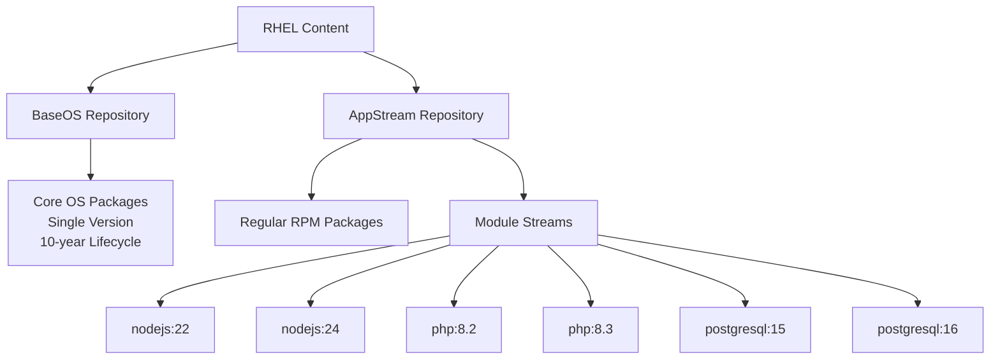
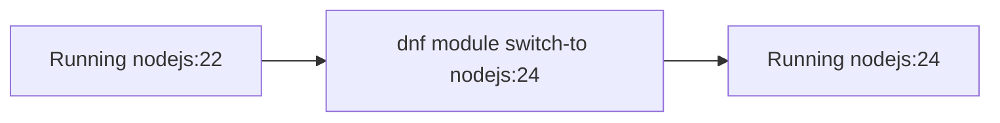

# How to Use Application Streams and Module Streams on RHEL

Author: [nawazdhandala](https://www.github.com/nawazdhandala)

Tags: RHEL, Application Streams, Module Streams, DNF, Linux

Description: Learn how to use RHEL Application Streams and module streams to install and manage multiple versions of languages, databases, and tools on the same system.

---

One of the biggest challenges with traditional Linux package management is that you get one version of each software package, and that is it. If the repo ships Python 3.9 and you need Python 3.11, tough luck. RHEL solves this with Application Streams, which let you choose between different versions of software through a concept called module streams.

I have been using this extensively in environments where different applications need different runtime versions, and it works well once you understand how the pieces fit together.

## What Are Application Streams?

RHEL splits its content into two main repositories:

- **BaseOS** - Core operating system packages (kernel, systemd, glibc, etc.) that follow the standard RHEL lifecycle
- **AppStream** - User-space applications, languages, databases, and tools that can be delivered in multiple versions

The AppStream repository is where module streams come into play. It lets Red Hat ship multiple versions of software (like Node.js 22 and Node.js 24) and lets you pick which one you want.


```mermaid
flowchart TD
    A[RHEL Content] --> B[BaseOS Repository]
    A --> C[AppStream Repository]
    B --> D[Core OS Packages<br>Single Version<br>10-year Lifecycle]
    C --> E[Regular RPM Packages]
    C --> F[Module Streams]
    F --> G[nodejs:22]
    F --> H[nodejs:24]
    F --> I[php:8.2]
    F --> J[php:8.3]
    F --> K[postgresql:15]
    F --> L[postgresql:16]
```

## Understanding Module Concepts

Before diving into commands, let me clarify the terminology:

- **Module** - A set of RPM packages that represent a component (e.g., nodejs, php, postgresql)
- **Stream** - A specific version of a module (e.g., nodejs:22, nodejs:24)
- **Profile** - A predefined set of packages within a stream for a specific use case (e.g., "common," "devel," "server")
- **Default stream** - The stream that gets installed if you do not specify one. RHEL 9 does not define default module streams in the AppStream repository, although a system administrator can configure custom defaults.

## Listing Available Modules

```bash
# List all available modules

dnf module list
```

The output shows each module, its available streams, the currently enabled stream (marked with [e]), any configured default stream or default profile (marked with [d]), and installed profiles (marked with [i]).

```bash
# Filter the list to a specific module
dnf module list nodejs

# Show detailed information about a module
dnf module info nodejs
```

To see what profiles are available:

```bash
# List profiles for a specific stream
dnf module info --profile nodejs:24
```

## Enabling and Installing Module Streams

### Installing the Initial Application Stream RPM

If you just want the initial Application Stream RPM version of a package, a regular install works:

```bash
# Install nodejs using the non-modular RPM package
sudo dnf install nodejs
```

In RHEL 9, Red Hat provides initial Application Stream versions as RPM packages that can be installed with `dnf install`. This does not enable a module stream.

### Installing a Specific Stream

To pick a specific version:

```bash
# Enable the nodejs:24 stream
sudo dnf module enable nodejs:24

# Then install nodejs
sudo dnf install nodejs
```

Or do it in one step:

```bash
# Install a specific stream and profile in one command
sudo dnf module install nodejs:24/common
```

### Checking What Is Enabled

```bash
# Show all enabled module streams
dnf module list --enabled

# Check the status of a specific module
dnf module list nodejs
```

## Switching Between Streams

This is where things get interesting. Say you have been running Node.js 22 and want to move to Node.js 24.

```bash
# Switch to the new stream
sudo dnf module switch-to nodejs:24
```

The `switch-to` command enables the new stream, updates installed profiles when possible, and synchronizes installed modular packages with the versions provided by the new stream.


```mermaid
flowchart LR
    A[Running nodejs:22] --> B[dnf module switch-to nodejs:24]
    B --> C[Running nodejs:24]
```

You cannot switch directly from one enabled stream to another by using `dnf module enable`. DNF will refuse to do it:

```bash
The operation would result in switching of module 'nodejs' stream '22' to stream '24'
Error: It is not possible to switch enabled streams of a module unless explicitly enabled via configuration option module_stream_switch.
```

## Working with Profiles

Profiles define what packages get installed for a particular use case.

```bash
# See available profiles for a stream
dnf module info --profile php:8.2
```

Common profile types:

- **common** - Basic runtime packages
- **devel** - Development headers and libraries
- **server** - Server-specific packages (databases)
- **minimal** - Bare minimum packages

```bash
# Install the development profile for PHP 8.2
sudo dnf module install php:8.2/devel

# Install a different profile for an already-enabled stream
sudo dnf module install php:8.2/common
```

Installing multiple profiles is additive. You get the union of packages from all installed profiles.

## Removing and Resetting Modules

### Removing Installed Module Packages

```bash
# Remove packages from all installed profiles within a stream
sudo dnf module remove nodejs:24

# Remove all packages whose names are provided by the specified stream
sudo dnf module remove --all nodejs:24
```

### Resetting a Module

Resetting a module removes the enabled/disabled state but does not remove installed packages:

```bash
# Reset a module to its initial state
sudo dnf module reset nodejs
```

### Disabling a Module

If you want to make sure a module stream is never accidentally enabled:

```bash
# Disable a module entirely
sudo dnf module disable nodejs
```

A disabled module makes all of its streams unavailable, so packages from those streams will not be considered for installation.

## Practical Examples

### Setting Up a PHP 8.2 Development Environment

```bash
# Enable PHP 8.2 stream
sudo dnf module enable php:8.2

# Install the development profile
sudo dnf module install php:8.2/devel

# Verify the version
php --version
```

### Running PostgreSQL 16

```bash
# Check available PostgreSQL streams
dnf module list postgresql

# Install PostgreSQL 16 server profile
sudo dnf module install postgresql:16/server

# Initialize the database
sudo postgresql-setup --initdb

# Start and enable the service
sudo systemctl enable --now postgresql

# Verify
psql --version
```

### Setting Up Multiple Python Versions

RHEL ships Python 3.9 as part of BaseOS (not a module), but additional versions are available:

```bash
# Check available Python RPM packages
dnf list python3.11 python3.12

# Install an additional Python version alongside the default
sudo dnf install python3.12

# Use the specific version
python3.12 --version
```

## Module Stream Lifecycles

Not all streams have the same support lifecycle. Some are supported for the full RHEL lifecycle, while others have shorter lifecycles.

```bash
# Check the lifecycle information (available in RHEL documentation)
dnf module info nodejs:24
```

The `Module RHEL Life Cycle` page on Red Hat's documentation site lists the exact support dates for each stream. Plan your deployments accordingly, as running an end-of-life stream means no more security patches.

## Troubleshooting Module Issues

### "Nothing provides module()" Errors

If you see errors about missing module dependencies:

```bash
# Reset the problematic module
sudo dnf module reset problematic-module

# Clean cache
sudo dnf clean all

# Try again
sudo dnf module enable problematic-module:stream
```

### Conflicting Streams

If packages from different streams conflict:

```bash
# Check what module provides a specific package
dnf module provides package-name

# Remove conflicting packages first
sudo dnf remove conflicting-package
sudo dnf module reset module-name
```

### Listing Installed Module Profiles

To see which module streams have installed profiles:

```bash
# List module streams with installed profiles
dnf module list --installed
```

## Best Practices

1. **Choose your streams early.** Switching streams on a production system is doable but it introduces risk. Pick the version you need during initial setup.

2. **Document which streams you use.** In your server documentation or configuration management, record which module streams are enabled. This avoids surprises during rebuilds.

3. **Watch lifecycle dates.** Streams have end-of-life dates. Plan your upgrades before a stream loses support.

4. **Use profiles.** Do not just install packages manually, use the module profiles. They ensure you get all the right dependencies for your use case.

5. **Test stream switches.** Before switching a stream in production, test the process in a staging environment. Some applications might not be compatible with a new version out of the box.

## Summary

Application Streams and module streams give RHEL the flexibility to offer multiple versions of software without the complexity of third-party repositories. The workflow is straightforward: list available streams, enable the one you need, install it, and go. When you need to switch versions, use `dnf module switch-to` for the target stream. It is a clean system that works well once you understand the module, stream, and profile hierarchy.
