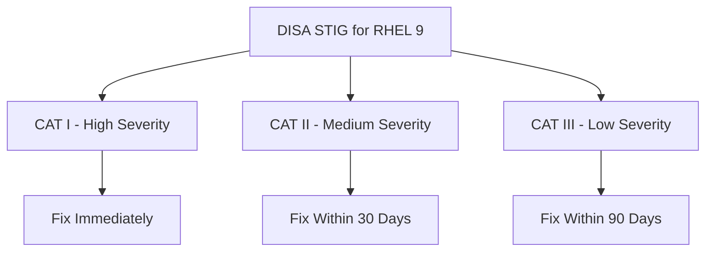

# How to Apply DISA STIG Controls to RHEL 9 with Ansible Playbooks

Author: [nawazdhandala](https://www.github.com/nawazdhandala)

Tags: RHEL, DISA STIG, Ansible, Compliance, Linux

Description: Apply DISA STIG security controls to RHEL 9 servers using Ansible playbooks, automating compliance for government and DoD environments.

---

If you are working in a government or Department of Defense environment, DISA STIGs (Security Technical Implementation Guides) are not optional. They define the security configuration standards that every system must meet. Applying them manually is a nightmare, especially when you have hundreds of controls to implement across dozens of servers. Ansible is the right tool for this job.

## Understanding DISA STIGs

DISA STIGs are more prescriptive than CIS benchmarks. Each finding has a severity category:

- **CAT I (High)** - Directly exploitable vulnerabilities. Fix immediately.
- **CAT II (Medium)** - Configuration weaknesses. Fix within 30 days.
- **CAT III (Low)** - Best practices. Fix within 90 days.



## Install the Required Tools

```bash
# Install Ansible and SCAP tools
dnf install -y ansible-core openscap-scanner scap-security-guide

# Verify the STIG profile is available
oscap info /usr/share/xml/scap/ssg/content/ssg-rhel9-ds.xml | grep -i stig
```

## Use the Pre-Built STIG Ansible Playbook

The scap-security-guide ships with a ready-made STIG playbook:

```bash
# Find the STIG playbook
ls /usr/share/scap-security-guide/ansible/rhel9-playbook-stig*.yml

# Preview what the playbook will change
ansible-playbook -i localhost, -c local \
  --check --diff \
  /usr/share/scap-security-guide/ansible/rhel9-playbook-stig.yml

# Apply STIG hardening
ansible-playbook -i localhost, -c local \
  /usr/share/scap-security-guide/ansible/rhel9-playbook-stig.yml
```

## Apply STIG Controls Across Multiple Servers

Create an inventory and apply the STIG playbook fleet-wide:

```bash
# Create inventory
cat > /etc/ansible/inventory.ini << 'EOF'
[stig_servers]
web01.mil.gov
web02.mil.gov
db01.mil.gov

[stig_servers:vars]
ansible_user=sysadmin
ansible_become=yes
ansible_become_method=sudo
EOF

# Apply STIG hardening to all servers
ansible-playbook -i /etc/ansible/inventory.ini \
  /usr/share/scap-security-guide/ansible/rhel9-playbook-stig.yml
```

## Implement Key STIG Controls Manually with Ansible

Here are the most critical STIG controls implemented as Ansible tasks:

### FIPS mode (CAT I)

```yaml
# V-257844 - RHEL 9 must implement NIST FIPS-validated cryptography
- name: Check if FIPS mode is enabled
  ansible.builtin.command:
    cmd: fips-mode-setup --check
  register: fips_status
  changed_when: false
  failed_when: false

- name: Enable FIPS mode
  ansible.builtin.command:
    cmd: fips-mode-setup --enable
  when: "'is not enabled' in fips_status.stdout"
  notify: reboot system
```

### SSH hardening (CAT I and II)

```yaml
# STIG SSH requirements
- name: Configure STIG-required SSH settings
  ansible.builtin.blockinfile:
    path: /etc/ssh/sshd_config.d/stig.conf
    create: yes
    mode: '0600'
    block: |
      # V-257987 - Disable root login
      PermitRootLogin no
      # V-257989 - Disable empty passwords
      PermitEmptyPasswords no
      # V-257988 - Disable host-based auth
      HostbasedAuthentication no
      # V-257993 - Set client alive interval
      ClientAliveInterval 600
      ClientAliveCountMax 0
      # V-257991 - Use approved ciphers
      Ciphers aes256-ctr,aes192-ctr,aes128-ctr,aes256-gcm@openssh.com,aes128-gcm@openssh.com
      # V-257992 - Use approved MACs
      MACs hmac-sha2-512,hmac-sha2-256,hmac-sha2-512-etm@openssh.com,hmac-sha2-256-etm@openssh.com
  notify: restart sshd
```

### Audit system configuration (CAT II)

```yaml
# STIG audit requirements
- name: Configure STIG audit rules
  ansible.builtin.copy:
    dest: /etc/audit/rules.d/stig.rules
    mode: '0640'
    content: |
      # V-257890 - Audit privileged functions
      -a always,exit -F arch=b64 -S execve -C uid!=euid -F euid=0 -k execpriv
      -a always,exit -F arch=b32 -S execve -C uid!=euid -F euid=0 -k execpriv

      # V-257901 - Audit account modifications
      -w /etc/passwd -p wa -k usergroup_modification
      -w /etc/group -p wa -k usergroup_modification
      -w /etc/shadow -p wa -k usergroup_modification
      -w /etc/gshadow -p wa -k usergroup_modification

      # V-257907 - Audit sudo usage
      -w /etc/sudoers -p wa -k privileged-actions
      -w /etc/sudoers.d/ -p wa -k privileged-actions

      # V-257910 - Audit kernel module changes
      -w /sbin/insmod -p x -k modules
      -w /sbin/rmmod -p x -k modules
      -w /sbin/modprobe -p x -k modules
  notify: restart auditd
```

### Password policy (CAT II)

```yaml
# STIG password requirements
- name: Set password minimum length to 15
  ansible.builtin.lineinfile:
    path: /etc/security/pwquality.conf
    regexp: '^#?\s*minlen'
    line: 'minlen = 15'

- name: Set password complexity - require all character classes
  ansible.builtin.lineinfile:
    path: /etc/security/pwquality.conf
    regexp: '^#?\s*minclass'
    line: 'minclass = 4'

- name: Configure account lockout
  ansible.builtin.copy:
    dest: /etc/security/faillock.conf
    mode: '0644'
    content: |
      deny = 3
      fail_interval = 900
      unlock_time = 0
      even_deny_root
      silent
```

## Build a Complete STIG Playbook

```yaml
---
# DISA STIG Hardening Playbook for RHEL 9
- name: Apply DISA STIG Controls
  hosts: stig_servers
  become: yes

  handlers:
    - name: restart sshd
      ansible.builtin.service:
        name: sshd
        state: restarted

    - name: restart auditd
      ansible.builtin.command:
        cmd: service auditd restart

    - name: reboot system
      ansible.builtin.reboot:
        reboot_timeout: 300

  roles:
    - role: stig-ssh
    - role: stig-audit
    - role: stig-passwords
    - role: stig-kernel

  post_tasks:
    - name: Run STIG compliance scan
      ansible.builtin.command:
        cmd: >
          oscap xccdf eval
          --profile xccdf_org.ssgproject.content_profile_stig
          --results /var/log/compliance/stig-results.xml
          --report /var/log/compliance/stig-report.html
          /usr/share/xml/scap/ssg/content/ssg-rhel9-ds.xml
      register: scan_result
      failed_when: false
      changed_when: false
```

## Verify STIG Compliance After Remediation

```bash
# Run the STIG profile scan
oscap xccdf eval \
  --profile xccdf_org.ssgproject.content_profile_stig \
  --results /tmp/stig-results.xml \
  --report /tmp/stig-report.html \
  /usr/share/xml/scap/ssg/content/ssg-rhel9-ds.xml || true

# Show the summary
echo "Pass: $(grep -c 'result="pass"' /tmp/stig-results.xml)"
echo "Fail: $(grep -c 'result="fail"' /tmp/stig-results.xml)"
```

## Handle STIG Exceptions (POA&M)

Not every STIG control can be applied to every system. Document exceptions in a Plan of Action and Milestones (POA&M):

```yaml
# Tag tasks that are exceptions so they can be skipped
- name: V-257844 - FIPS Mode (Exception - breaks legacy app)
  ansible.builtin.debug:
    msg: "POA&M: FIPS mode disabled due to legacy application XYZ"
  tags:
    - exception
    - V-257844
```

STIG compliance through Ansible is the only sane way to manage it at scale. The key is to start with the pre-built playbooks, customize where needed, document your exceptions, and run verification scans after every change.
