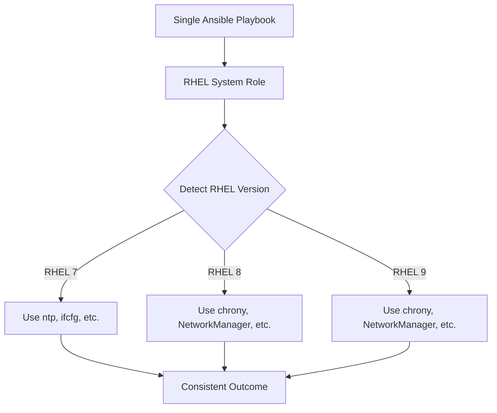

# How to Apply RHEL System Roles Across Multiple RHEL Versions

Author: [nawazdhandala](https://www.github.com/nawazdhandala)

Tags: RHEL, System Roles, Ansible, Multi-Version, Linux

Description: Learn how to use RHEL System Roles to manage configurations consistently across RHEL 7, 8, and 9 systems from a single set of Ansible playbooks.

---

Most organizations do not run a single RHEL version everywhere. You probably have RHEL 7 machines that refuse to die, RHEL 8 servers in production, and RHEL 9 for new deployments. RHEL System Roles are designed to work across multiple versions, abstracting away the differences so you can write one playbook that works on all of them.

## How Cross-Version Support Works

RHEL System Roles handle version differences internally. The role detects which RHEL version is running on the target and adjusts its behavior accordingly.



For example, the `timesync` role uses ntpd on RHEL 7 and chrony on RHEL 8/9. You do not need to worry about which time daemon is available. You just tell the role what NTP servers you want and it figures out the rest.

## Installing System Roles

On the Ansible control node:

```bash
# Install the system roles package
sudo dnf install rhel-system-roles

# Verify the available roles
ls /usr/share/ansible/roles/ | grep rhel-system-roles
```

If you manage RHEL 7 hosts from a RHEL 9 control node, you can also install roles via Ansible Galaxy:

```bash
# Alternative: install from Ansible Galaxy
ansible-galaxy collection install redhat.rhel_system_roles
```

## Inventory for Mixed Environments

Organize your inventory by function, not by RHEL version:

```ini
# inventory
[webservers]
web-rhel7.example.com    ansible_python_interpreter=/usr/bin/python2
web-rhel8.example.com
web-rhel9.example.com

[dbservers]
db-rhel7.example.com     ansible_python_interpreter=/usr/bin/python2
db-rhel8.example.com
db-rhel9.example.com

[all:vars]
# Default Python 3 interpreter for RHEL 8/9
ansible_python_interpreter=/usr/bin/python3
```

Note the `ansible_python_interpreter` setting for RHEL 7 hosts, which default to Python 2.

## Example: Time Synchronization Across Versions

```yaml
# playbook-timesync.yml
# Configure NTP consistently across RHEL 7, 8, and 9
---
- name: Configure time synchronization
  hosts: all
  become: true
  vars:
    timesync_ntp_servers:
      - hostname: ntp1.example.com
        iburst: true
      - hostname: ntp2.example.com
        iburst: true
      - hostname: 0.rhel.pool.ntp.org
        iburst: true
        pool: true

  roles:
    - rhel-system-roles.timesync
```

This single playbook will:
- On RHEL 7: configure ntpd with these servers
- On RHEL 8: configure chrony with these servers
- On RHEL 9: configure chrony with these servers

## Example: Network Configuration Across Versions

```yaml
# playbook-network.yml
# Configure a static IP consistently across RHEL versions
---
- name: Configure network
  hosts: all
  become: true
  vars:
    network_connections:
      - name: eth0
        type: ethernet
        autoconnect: true
        ip:
          address:
            - "{{ static_ip }}/24"
          gateway4: "{{ gateway }}"
          dns:
            - 10.0.0.53
            - 10.0.0.54
          dns_search:
            - example.com

  roles:
    - rhel-system-roles.network
```

On RHEL 7, this might use ifcfg files. On RHEL 8 and 9, it uses NetworkManager directly. The outcome is the same.

## Example: Logging Across Versions

```yaml
# playbook-logging.yml
# Configure centralized logging across RHEL versions
---
- name: Configure logging
  hosts: all
  become: true
  vars:
    logging_inputs:
      - name: system_input
        type: basics
        state: present

    logging_outputs:
      - name: remote_output
        type: remote
        target: logserver.example.com
        port: 514
        protocol: tcp
        state: present

    logging_flows:
      - name: flow_remote
        inputs:
          - system_input
        outputs:
          - remote_output

  roles:
    - rhel-system-roles.logging
```

## Handling Version-Specific Variables

Sometimes you need different values per RHEL version. Use group_vars or conditionals:

```yaml
# group_vars/all.yml
# Common variables for all versions
---
timesync_ntp_servers:
  - hostname: ntp1.example.com
    iburst: true
```

```yaml
# For version-specific overrides, use ansible_distribution_major_version
# playbook-version-specific.yml
---
- name: Version-aware configuration
  hosts: all
  become: true
  vars:
    # Common settings
    common_firewall_services:
      - ssh
      - http
      - https

  pre_tasks:
    - name: Set RHEL 7 specific variables
      ansible.builtin.set_fact:
        extra_packages:
          - python2-firewall
      when: ansible_distribution_major_version == "7"

    - name: Set RHEL 8/9 specific variables
      ansible.builtin.set_fact:
        extra_packages:
          - python3-firewall
      when: ansible_distribution_major_version in ["8", "9"]

  roles:
    - rhel-system-roles.firewall
```

## Testing Across Versions

Before rolling out to production, test with a small group from each version:

```ini
# inventory-test
[test_hosts]
test-rhel7.example.com  ansible_python_interpreter=/usr/bin/python2
test-rhel8.example.com
test-rhel9.example.com
```

```bash
# Run in check mode first
ansible-playbook -i inventory-test playbook-timesync.yml --check --diff

# Then apply for real
ansible-playbook -i inventory-test playbook-timesync.yml
```

## Available System Roles and Version Support

| Role | RHEL 7 | RHEL 8 | RHEL 9 |
|------|--------|--------|--------|
| timesync | Yes (ntpd) | Yes (chrony) | Yes (chrony) |
| network | Yes | Yes | Yes |
| firewall | Yes | Yes | Yes |
| logging | Yes | Yes | Yes |
| sshd | Yes | Yes | Yes |
| certificate | Yes | Yes | Yes |
| ha_cluster | No | Yes | Yes |
| postfix | Yes | Yes | Yes |

## Common Gotchas

1. **Python interpreter**: RHEL 7 uses Python 2 by default. Set `ansible_python_interpreter=/usr/bin/python2` for those hosts.

2. **SELinux differences**: Some SELinux policies changed between versions. The system roles handle this, but custom tasks might need adjustments.

3. **Package names**: Package names sometimes differ between versions. Let the system roles handle package installation rather than doing it in pre_tasks.

4. **Firewall backend**: RHEL 7 uses iptables by default while RHEL 8/9 use nftables. The firewall system role abstracts this away.

## Wrapping Up

RHEL System Roles are the right tool when you need consistent configuration across a mixed-version environment. They save you from writing version-specific conditionals and from tracking which config file format each RHEL version uses. The key mindset shift is to describe what you want (NTP servers, network settings, firewall rules) and let the role figure out how to implement it on each version.
