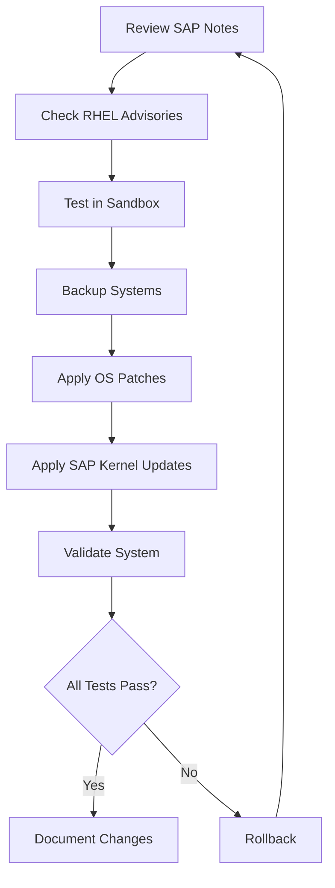

# How to Apply SAP Notes and OS Patches on RHEL

Author: [nawazdhandala](https://www.github.com/nawazdhandala)

Tags: RHEL, SAP, Patching, OS Updates, Linux

Description: Learn the proper procedures for applying SAP Notes and RHEL OS patches to SAP systems while minimizing downtime and risk.

---

Keeping your SAP systems patched is critical for security and stability, but patching SAP environments on RHEL requires careful planning. This guide covers the workflow for applying both SAP Notes (SAP-specific fixes) and RHEL OS patches in a controlled manner.

## Patching Workflow



## Prerequisites

- RHEL running SAP workloads
- SAP S-user credentials for accessing SAP Notes
- Root or sudo access
- A maintenance window scheduled with stakeholders

## Step 1: Review Relevant SAP Notes

Before patching, check the SAP Launchpad for applicable notes:

```bash
# Key SAP Notes for RHEL:
# 3108316 - SAP on RHEL: Requirements and Information
# 2772999 - Red Hat Enterprise Linux 9.x: Installation and Configuration
# 2235581 - SAP HANA: Supported Operating Systems

# Check the current RHEL version
cat /etc/redhat-release

# Check the running kernel version
uname -r

# Check installed SAP packages
rpm -qa | grep -i sap | sort
```

## Step 2: Check Available RHEL Updates

```bash
# List all available security updates
sudo dnf updateinfo list security

# List updates specific to SAP packages
sudo dnf updateinfo list --advisories="RHSA*" | grep -i sap

# Check for kernel updates (important for SAP)
sudo dnf check-update kernel

# Review the details of a specific advisory
sudo dnf updateinfo info RHSA-2026:XXXX
```

## Step 3: Create a System Snapshot

```bash
# If using LVM, create a snapshot before patching
# This allows a quick rollback if something goes wrong
sudo lvcreate --size 10G --snapshot --name root_snap /dev/rhel/root

# Verify the snapshot was created
sudo lvs

# Also create a backup of SAP configuration files
sudo tar czf /root/sap-config-backup-$(date +%Y%m%d).tar.gz \
  /usr/sap/ \
  /etc/sysctl.d/sap* \
  /etc/security/limits.d/*sap*
```

## Step 4: Stop SAP Services Before Patching

```bash
# Stop the SAP application server (replace SID and instance number)
sudo su - sidadm -c 'stopsap all'

# If running SAP HANA, stop the database
sudo su - hdbadm -c 'HDB stop'

# Verify all SAP processes are stopped
ps -ef | grep -i sap
```

## Step 5: Apply RHEL OS Patches

```bash
# Apply only security patches (most conservative)
sudo dnf update --security -y

# Or apply all available updates
sudo dnf update -y

# If you need to apply a specific package update only
sudo dnf update -y package-name

# Check if a reboot is required
sudo dnf needs-restarting -r
```

## Step 6: Apply SAP Kernel Updates

SAP kernel patches are applied separately from OS patches:

```bash
# Switch to the SAP admin user
sudo su - sidadm

# Download the SAP kernel update from SAP Software Download Center
# Extract to a staging directory
mkdir -p /tmp/sap-kernel-update
cd /tmp/sap-kernel-update

# Extract the SAR archive using SAPCAR
/usr/sap/SID/SYS/exe/run/SAPCAR -xvf /path/to/SAPEXE_*.SAR
/usr/sap/SID/SYS/exe/run/SAPCAR -xvf /path/to/SAPEXEDB_*.SAR

# Stop the instance if not already stopped
stopsap all

# Back up the current kernel directory
cp -rp /usr/sap/SID/SYS/exe/uc /usr/sap/SID/SYS/exe/uc.bak

# Copy new kernel files
cp -p /tmp/sap-kernel-update/* /usr/sap/SID/SYS/exe/uc/linuxx86_64/
```

## Step 7: Reboot If Required

```bash
# Check if a reboot is needed
sudo dnf needs-restarting -r

# If reboot is needed
sudo reboot

# After reboot, verify the new kernel is running
uname -r

# Verify SAP prerequisites are still met
sudo sysctl kernel.shmmax kernel.sem
cat /sys/kernel/mm/transparent_hugepage/enabled
```

## Step 8: Start SAP Services and Validate

```bash
# Start SAP HANA (if applicable)
sudo su - hdbadm -c 'HDB start'

# Start the SAP application server
sudo su - sidadm -c 'startsap all'

# Verify SAP processes are running
sudo su - sidadm -c 'sapcontrol -nr 00 -function GetProcessList'

# Run a basic connectivity test
sudo su - sidadm -c 'sapcontrol -nr 00 -function GetSystemInstanceList'
```

## Step 9: Remove the Snapshot After Validation

```bash
# If everything is working, remove the LVM snapshot
sudo lvremove /dev/rhel/root_snap

# Verify the snapshot is removed
sudo lvs
```

## Conclusion

Patching SAP systems on RHEL requires a methodical approach that covers both OS-level and SAP-level updates. Always test patches in a non-production environment first, maintain rollback capabilities, and follow the patching sequence of stopping SAP, applying patches, rebooting if needed, and then restarting SAP services. Document every change for audit compliance.
