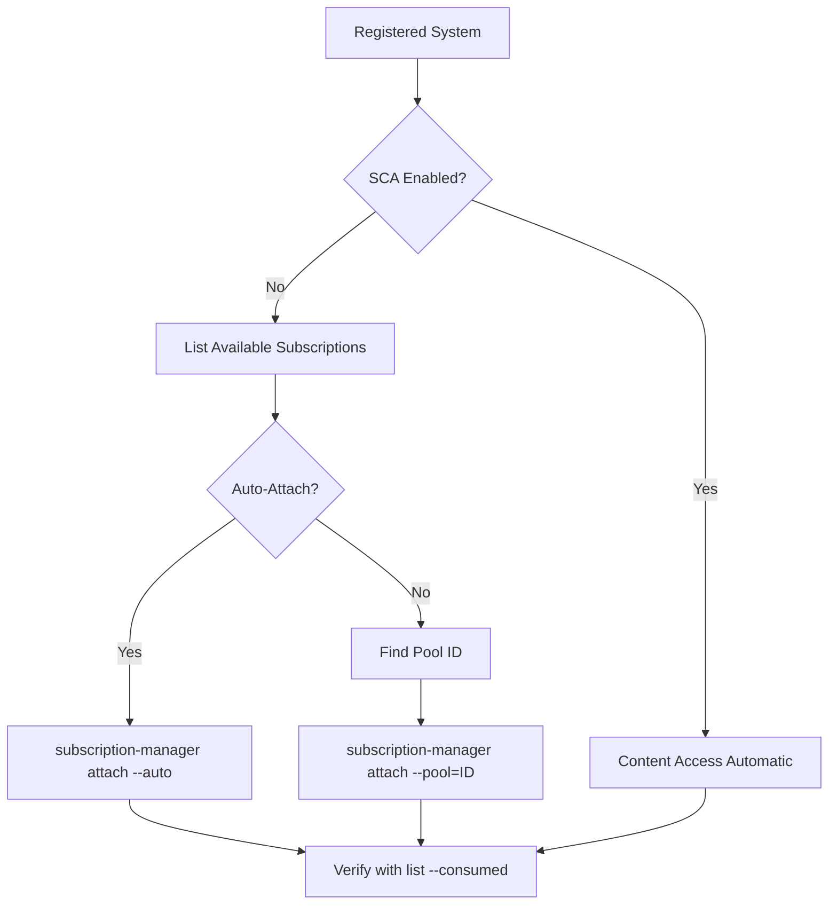

# How to Attach and Manage Subscriptions with subscription-manager on RHEL

Author: [nawazdhandala](https://www.github.com/nawazdhandala)

Tags: RHEL, Subscriptions, subscription-manager, Red Hat, Linux

Description: A hands-on guide to attaching, listing, removing, and managing RHEL subscriptions using subscription-manager, including auto-attach and pool-based attachment.

---

Once your RHEL system is registered with Red Hat, the next step is making sure it has the right subscriptions attached. Subscriptions determine what content your system can access, from base OS packages to add-ons like High Availability or supplementary tools. This guide covers the day-to-day tasks of managing subscriptions with `subscription-manager`.

## Subscriptions vs. Registration

Registration and subscription attachment are two separate steps. Registration identifies your system to Red Hat. Subscription attachment grants the system access to specific content. With Simple Content Access (SCA) enabled, explicit attachment is not required, but understanding how subscriptions work is still important for auditing and compliance.

## Checking Current Subscription Status

Start by looking at what is currently attached:

```bash
# Show overall subscription status
sudo subscription-manager status

# List all consumed (attached) subscriptions
sudo subscription-manager list --consumed
```

The `--consumed` flag shows subscriptions currently attached to this system, including pool IDs, quantities, and expiration dates.

## Listing Available Subscriptions

To see what subscriptions your account offers but are not yet attached to this system:

```bash
# Show all available subscriptions in your account
sudo subscription-manager list --available

# Filter to show only subscriptions matching this system
sudo subscription-manager list --available --match-installed
```

The `--match-installed` flag narrows results to subscriptions compatible with the software installed on this system. This is helpful when your account has dozens of different subscription types.

## Auto-Attaching Subscriptions

The simplest way to attach subscriptions is to let `subscription-manager` choose for you:

```bash
# Automatically attach the best matching subscription
sudo subscription-manager attach --auto
```

Auto-attach looks at the system's architecture, installed products, and system purpose attributes to pick the most appropriate subscription. For most single-system deployments, this works perfectly.

## Attaching a Specific Subscription by Pool ID

When you need a specific subscription, perhaps one that includes a particular add-on, attach it by pool ID:

```bash
# First, find the pool ID from the available list
sudo subscription-manager list --available | grep -A5 "Pool ID"

# Attach a specific subscription using its pool ID
sudo subscription-manager attach --pool=abc123def456
```

You can attach multiple pools at once:

```bash
# Attach multiple subscriptions in one command
sudo subscription-manager attach --pool=pool_id_1 --pool=pool_id_2
```

## Subscription Management Workflow



## Removing a Subscription

If you need to free up a subscription, perhaps to move it to another system, remove it by serial number:

```bash
# List consumed subscriptions to find the serial number
sudo subscription-manager list --consumed

# Remove a specific subscription by its serial number
sudo subscription-manager remove --serial=1234567890
```

To remove all attached subscriptions at once:

```bash
# Remove all subscriptions from this system
sudo subscription-manager remove --all
```

This does not unregister the system. It only detaches subscriptions.

## Checking Product Certificates

Each installed Red Hat product has a product certificate. These certificates tell `subscription-manager` what products are on the system and help with auto-attach decisions:

```bash
# List installed product certificates
sudo subscription-manager list --installed
```

The output shows product names, IDs, and whether they are covered by a valid subscription (status "Subscribed" or "Not Subscribed").

## Refreshing Subscription Data

If you have made changes on the Customer Portal, such as adding new subscriptions to your account, the local system cache may be stale. Force a refresh:

```bash
# Pull fresh subscription data from Red Hat
sudo subscription-manager refresh
```

This updates the local cache of available subscriptions and entitlement certificates.

## Viewing Subscription Details

For a detailed look at a specific attached subscription:

```bash
# Show full details of consumed subscriptions
sudo subscription-manager list --consumed --pool-only
```

To check when subscriptions expire:

```bash
# List consumed subscriptions and look at end dates
sudo subscription-manager list --consumed | grep -E "Subscription Name|Ends"
```

## Managing Subscriptions with Ansible

For fleet management, use Ansible to ensure subscriptions are consistently attached:

```yaml
# Ansible task to auto-attach subscriptions
- name: Auto-attach RHEL subscription
  community.general.redhat_subscription:
    state: present
    auto_attach: true

# Ansible task to attach a specific pool
- name: Attach specific subscription pool
  community.general.redhat_subscription:
    state: present
    pool_ids:
      - abc123def456
```

## Subscription Quantity and Multi-Entitlement

Some subscriptions support stacking, where you attach multiple quantities for systems that need extra entitlements (for example, virtual guests on a hypervisor). Check if a subscription supports this:

```bash
# Look for "Multi-Entitlement" in available subscriptions
sudo subscription-manager list --available | grep -B2 -A2 "Multi-Entitlement"
```

When attaching a multi-entitlement subscription, specify the quantity:

```bash
# Attach with a specific quantity
sudo subscription-manager attach --pool=pool_id --quantity=2
```

## Dealing with Expired Subscriptions

When a subscription expires, the system will still function, but you will stop receiving updates. Check for expiration warnings:

```bash
# Check overall compliance status
sudo subscription-manager status
```

If the status shows "Invalid" or "Insufficient", either renew the subscription in the Customer Portal or attach a different valid one.

## Summary

Managing subscriptions on RHEL is mostly about knowing a few key `subscription-manager` subcommands: `list`, `attach`, `remove`, and `refresh`. If your account uses Simple Content Access, most of this is handled automatically upon registration. But for environments with specific compliance requirements or complex subscription portfolios, understanding pool-based attachment and subscription removal is essential for keeping things tidy and making the most of your entitlements.
