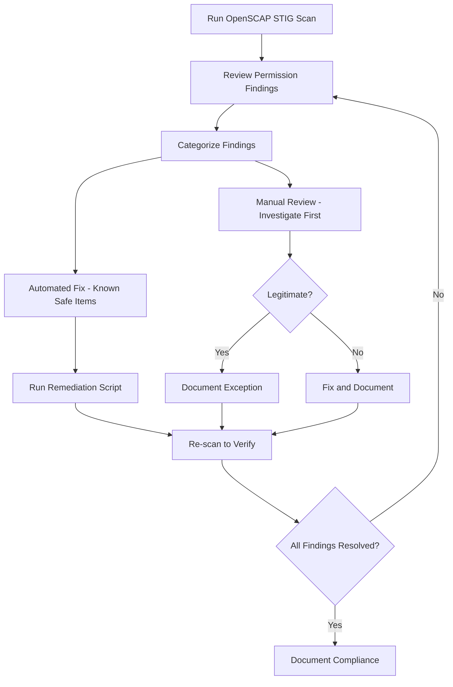

# How to Audit and Fix File Permissions for STIG Compliance on RHEL

Author: [nawazdhandala](https://www.github.com/nawazdhandala)

Tags: RHEL, File Permissions, STIG, Compliance, Linux

Description: Audit and remediate file permissions on RHEL to meet DISA STIG requirements, covering critical system files, directories, and ownership standards.

---

The DISA STIGs (Security Technical Implementation Guides) have specific requirements for file permissions on RHEL. Failing a STIG scan because of wrong permissions on system files is one of the most common compliance issues I see. This guide covers the key permission requirements and how to find and fix violations.

## Understanding STIG Permission Requirements

STIGs require specific permissions on critical files and directories. The general principles:

- System executables should be owned by root and not writable by others
- Configuration files should be readable only by root or the appropriate service account
- No world-writable files in system directories
- No unowned files (files with no valid user or group)
- Correct permissions on home directories

## Auditing with OpenSCAP

The fastest way to audit STIG compliance is with OpenSCAP:

```bash
# Install OpenSCAP tools and STIG content
sudo dnf install openscap-scanner scap-security-guide -y

# Run a STIG scan focused on file permissions
sudo oscap xccdf eval \
    --profile xccdf_org.ssgproject.content_profile_stig \
    --results /tmp/stig-results.xml \
    --report /tmp/stig-report.html \
    /usr/share/xml/scap/ssg/content/ssg-rhel9-ds.xml
```

Open the HTML report to see which permission checks failed.

## Key File Permission Checks

### /etc/passwd and /etc/group

```bash
# Check current permissions
ls -l /etc/passwd /etc/group

# STIG requires: 644 owned by root:root
sudo chmod 644 /etc/passwd
sudo chmod 644 /etc/group
sudo chown root:root /etc/passwd
sudo chown root:root /etc/group
```

### /etc/shadow and /etc/gshadow

```bash
# Check current permissions
ls -l /etc/shadow /etc/gshadow

# STIG requires: 0000 owned by root:root
sudo chmod 0000 /etc/shadow
sudo chmod 0000 /etc/gshadow
sudo chown root:root /etc/shadow
sudo chown root:root /etc/gshadow
```

### SSH Configuration

```bash
# SSH server config
sudo chmod 600 /etc/ssh/sshd_config
sudo chown root:root /etc/ssh/sshd_config

# SSH private host keys
sudo chmod 600 /etc/ssh/ssh_host_*_key
sudo chown root:root /etc/ssh/ssh_host_*_key

# SSH public host keys
sudo chmod 644 /etc/ssh/ssh_host_*_key.pub
sudo chown root:root /etc/ssh/ssh_host_*_key.pub
```

### Cron Directories

```bash
# Set correct permissions on cron directories
sudo chmod 700 /etc/cron.d
sudo chmod 700 /etc/cron.daily
sudo chmod 700 /etc/cron.hourly
sudo chmod 700 /etc/cron.monthly
sudo chmod 700 /etc/cron.weekly
sudo chown root:root /etc/cron.d /etc/cron.daily /etc/cron.hourly /etc/cron.monthly /etc/cron.weekly

# Crontab files
sudo chmod 600 /etc/crontab
sudo chown root:root /etc/crontab
```

## Finding Permission Violations

### World-Writable Files

```bash
# Find world-writable files (excluding standard locations)
sudo find / -xdev -type f -perm -0002 -not -path "/proc/*" -not -path "/sys/*" 2>/dev/null
```

### Unowned Files

```bash
# Find files with no valid owner
sudo find / -xdev -nouser 2>/dev/null

# Find files with no valid group
sudo find / -xdev -nogroup 2>/dev/null
```

### Files with SUID/SGID That Should Not Have Them

```bash
# List all SUID files
sudo find / -xdev -type f -perm -4000 2>/dev/null

# List all SGID files
sudo find / -xdev -type f -perm -2000 2>/dev/null
```

Compare against the expected list. On a clean RHEL install, the legitimate SUID files include `passwd`, `sudo`, `su`, `mount`, `umount`, and a few others.

## Automated Remediation Script

```bash
# Create a STIG permission remediation script
sudo tee /usr/local/sbin/fix-stig-permissions.sh << 'SCRIPT'
#!/bin/bash
# Fix common STIG file permission findings

echo "Fixing /etc/passwd and /etc/group..."
chmod 644 /etc/passwd /etc/group
chown root:root /etc/passwd /etc/group

echo "Fixing /etc/shadow and /etc/gshadow..."
chmod 0000 /etc/shadow /etc/gshadow
chown root:root /etc/shadow /etc/gshadow

echo "Fixing SSH configurations..."
chmod 600 /etc/ssh/sshd_config
chown root:root /etc/ssh/sshd_config
chmod 600 /etc/ssh/ssh_host_*_key
chmod 644 /etc/ssh/ssh_host_*_key.pub

echo "Fixing cron directories..."
chmod 700 /etc/cron.d /etc/cron.daily /etc/cron.hourly /etc/cron.monthly /etc/cron.weekly
chmod 600 /etc/crontab
chown root:root /etc/crontab

echo "Fixing home directory permissions..."
for dir in /home/*/; do
    if [ -d "$dir" ]; then
        chmod 700 "$dir"
    fi
done

echo "Done. Run OpenSCAP to verify."
SCRIPT

sudo chmod 700 /usr/local/sbin/fix-stig-permissions.sh
```

## STIG Compliance Workflow



## Verifying RPM Package Permissions

Check if file permissions match what the RPM expects:

```bash
# Verify all installed packages for permission changes
sudo rpm -Va | grep "^.M"

# The .M flag means permissions differ from the RPM database
# Fix by reinstalling the affected package
sudo dnf reinstall <package-name>
```

## Home Directory Permissions

STIG requires home directories be 750 or more restrictive:

```bash
# Check all home directories
ls -ld /home/*/

# Fix any that are too permissive
for dir in /home/*/; do
    current=$(stat -c '%a' "$dir")
    if [ "$current" -gt 750 ]; then
        echo "Fixing $dir: $current -> 700"
        chmod 700 "$dir"
    fi
done
```

## Ongoing Compliance

Permissions drift over time. Schedule regular scans:

```bash
# Add to cron for weekly compliance checks
echo "0 2 * * 0 /usr/bin/oscap xccdf eval --profile xccdf_org.ssgproject.content_profile_stig --results /var/log/stig-scan-\$(date +\%Y\%m\%d).xml /usr/share/xml/scap/ssg/content/ssg-rhel9-ds.xml" | sudo tee -a /var/spool/cron/root
```

STIG file permission compliance is not a one-time fix. Build it into your regular security maintenance cycle and catch drift before the auditors do.
