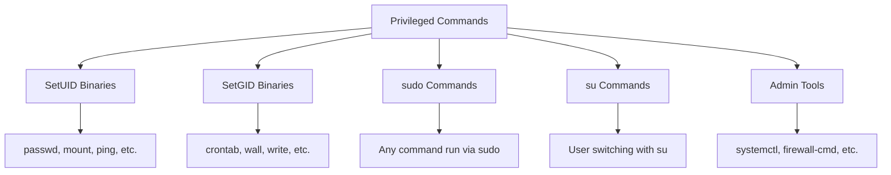

# How to Audit Privileged Command Execution on RHEL

Author: [nawazdhandala](https://www.github.com/nawazdhandala)

Tags: RHEL, auditd, Privileged Commands, Security, Compliance, Linux

Description: Configure auditd on RHEL to track execution of privileged commands including setuid/setgid binaries, sudo usage, and administrative tools.

---

Privileged commands are programs that run with elevated permissions, such as setuid/setgid binaries and commands executed through sudo. Auditing these commands is essential for security monitoring and compliance. This guide shows you how to set up comprehensive privileged command auditing on RHEL.

## What Are Privileged Commands?

Privileged commands fall into several categories:



## Finding All Privileged Binaries

First, identify all setuid and setgid binaries on your system:

```bash
# Find all setuid executables
sudo find / -xdev -type f -perm -4000 2>/dev/null

# Find all setgid executables
sudo find / -xdev -type f -perm -2000 2>/dev/null

# Find both setuid and setgid
sudo find / -xdev \( -perm -4000 -o -perm -2000 \) -type f 2>/dev/null | sort
```

Common setuid binaries on RHEL include:

```bash
/usr/bin/chage
/usr/bin/gpasswd
/usr/bin/mount
/usr/bin/newgrp
/usr/bin/passwd
/usr/bin/su
/usr/bin/sudo
/usr/bin/umount
/usr/sbin/pam_timestamp_check
/usr/sbin/unix_chkpwd
```

## Creating Audit Rules for Privileged Commands

### Automated Rule Generation

The best approach is to automatically generate rules for all privileged binaries:

```bash
#!/bin/bash
# /usr/local/bin/gen-priv-audit-rules.sh
# Generate audit rules for all setuid/setgid binaries

RULES_FILE="/etc/audit/rules.d/30-privileged.rules"

echo "## Privileged command execution audit rules" > "$RULES_FILE"
echo "## Generated on $(date)" >> "$RULES_FILE"
echo "" >> "$RULES_FILE"

# Find all setuid and setgid executables on all local filesystems
for partition in $(findmnt -n -l -k -it xfs,ext4,ext3 --output TARGET); do
    find "$partition" -xdev \( -perm -4000 -o -perm -2000 \) -type f 2>/dev/null | \
    while read -r binary; do
        echo "-a always,exit -F path=${binary} -F perm=x -F auid>=1000 -F auid!=4294967295 -k privileged" >> "$RULES_FILE"
    done
done

echo "" >> "$RULES_FILE"
echo "## End of privileged command rules" >> "$RULES_FILE"

RULE_COUNT=$(grep -c "^-a" "$RULES_FILE")
echo "Generated $RULE_COUNT privileged command audit rules"
```

Make it executable and run it:

```bash
sudo chmod +x /usr/local/bin/gen-priv-audit-rules.sh
sudo /usr/local/bin/gen-priv-audit-rules.sh
```

### Manual Rules for Key Commands

If you prefer to manually specify rules for the most important commands:

```bash
sudo tee /etc/audit/rules.d/30-privileged-manual.rules << 'EOF'
## Audit key privileged commands

# Password and account management
-a always,exit -F path=/usr/bin/passwd -F perm=x -F auid>=1000 -F auid!=4294967295 -k privileged-passwd
-a always,exit -F path=/usr/bin/chage -F perm=x -F auid>=1000 -F auid!=4294967295 -k privileged-chage
-a always,exit -F path=/usr/bin/gpasswd -F perm=x -F auid>=1000 -F auid!=4294967295 -k privileged-gpasswd
-a always,exit -F path=/usr/sbin/usermod -F perm=x -F auid>=1000 -F auid!=4294967295 -k privileged-usermod
-a always,exit -F path=/usr/sbin/useradd -F perm=x -F auid>=1000 -F auid!=4294967295 -k privileged-useradd
-a always,exit -F path=/usr/sbin/userdel -F perm=x -F auid>=1000 -F auid!=4294967295 -k privileged-userdel
-a always,exit -F path=/usr/sbin/groupadd -F perm=x -F auid>=1000 -F auid!=4294967295 -k privileged-groupadd
-a always,exit -F path=/usr/sbin/groupdel -F perm=x -F auid>=1000 -F auid!=4294967295 -k privileged-groupdel

# Privilege escalation
-a always,exit -F path=/usr/bin/su -F perm=x -F auid>=1000 -F auid!=4294967295 -k privileged-su
-a always,exit -F path=/usr/bin/sudo -F perm=x -F auid>=1000 -F auid!=4294967295 -k privileged-sudo
-a always,exit -F path=/usr/bin/newgrp -F perm=x -F auid>=1000 -F auid!=4294967295 -k privileged-newgrp

# Mount operations
-a always,exit -F path=/usr/bin/mount -F perm=x -F auid>=1000 -F auid!=4294967295 -k privileged-mount
-a always,exit -F path=/usr/bin/umount -F perm=x -F auid>=1000 -F auid!=4294967295 -k privileged-umount

# Cron
-a always,exit -F path=/usr/bin/crontab -F perm=x -F auid>=1000 -F auid!=4294967295 -k privileged-cron

# SSH key management
-a always,exit -F path=/usr/bin/ssh-agent -F perm=x -F auid>=1000 -F auid!=4294967295 -k privileged-ssh

# Package management
-a always,exit -F path=/usr/bin/dnf -F perm=x -F auid>=1000 -F auid!=4294967295 -k privileged-pkg
-a always,exit -F path=/usr/bin/rpm -F perm=x -F auid>=1000 -F auid!=4294967295 -k privileged-pkg
EOF
```

## Auditing sudo Specifically

In addition to the setuid audit rule on the sudo binary, you should also monitor the sudo log and configuration:

```bash
sudo tee /etc/audit/rules.d/31-sudo.rules << 'EOF'
## Detailed sudo auditing

# Monitor sudo configuration
-w /etc/sudoers -p wa -k sudo-config
-w /etc/sudoers.d/ -p wa -k sudo-config

# Monitor sudo log
-w /var/log/sudo.log -p wa -k sudo-log

# Audit the sudo command execution via syscall
-a always,exit -F arch=b64 -S execve -C uid!=euid -F euid=0 -k sudo-execve
-a always,exit -F arch=b32 -S execve -C uid!=euid -F euid=0 -k sudo-execve
EOF
```

The last two rules catch any command executed where the effective UID differs from the real UID and the effective UID is root, which captures sudo and similar privilege escalation tools.

## Loading and Verifying Rules

```bash
# Load the rules
sudo augenrules --load

# Verify privileged rules are loaded
sudo auditctl -l | grep privileged

# Count the total rules
sudo auditctl -l | wc -l
```

## Searching for Privileged Command Events

```bash
# Find all privileged command executions
sudo ausearch -k privileged -ts today -i

# Find sudo usage specifically
sudo ausearch -k privileged-sudo -ts today -i

# Find password changes
sudo ausearch -k privileged-passwd -ts today -i

# Find all privilege escalation (su and sudo)
sudo ausearch -k privileged-su -k privileged-sudo -ts today -i

# Generate a summary report
sudo aureport -x --summary | head -20
```

## Understanding the Output

A typical privileged command audit event:

```bash
type=SYSCALL msg=audit(1709568000.789:1234): arch=c000003e syscall=59
success=yes exit=0 a0=55d4a8f01010 a1=55d4a8f01080 a2=55d4a8f010f0 a3=7ffe1234
items=2 ppid=5678 pid=9012 auid=1000 uid=0 gid=0 euid=0
comm="passwd" exe="/usr/bin/passwd" key="privileged-passwd"
type=EXECVE msg=audit(1709568000.789:1234): argc=2 a0="passwd" a1="jdoe"
```

This tells you:
- User with auid=1000 ran the passwd command
- They were running as root (uid=0) because passwd is setuid
- The target was user "jdoe"

## Keeping Rules Updated

When you install new software, it might add new setuid/setgid binaries. Set up a periodic check:

```bash
sudo tee /etc/cron.weekly/update-priv-audit-rules << 'SCRIPT'
#!/bin/bash
# Weekly check for new privileged binaries
/usr/local/bin/gen-priv-audit-rules.sh

# Note: if audit rules are immutable, changes won't take effect
# until the next reboot. Log a message for the admin.
if auditctl -s | grep -q "enabled 2"; then
    logger -t priv-audit "New privileged audit rules generated. Reboot required to load (rules are immutable)."
fi
SCRIPT

sudo chmod +x /etc/cron.weekly/update-priv-audit-rules
```

## Summary

Auditing privileged command execution on RHEL is a fundamental security practice. Use automated scripts to generate rules for all setuid/setgid binaries, add specific rules for sudo and su, and regularly search the audit logs for unexpected privileged command usage. Keep the rules updated as new software is installed, and remember that immutable rules require a reboot to update.
