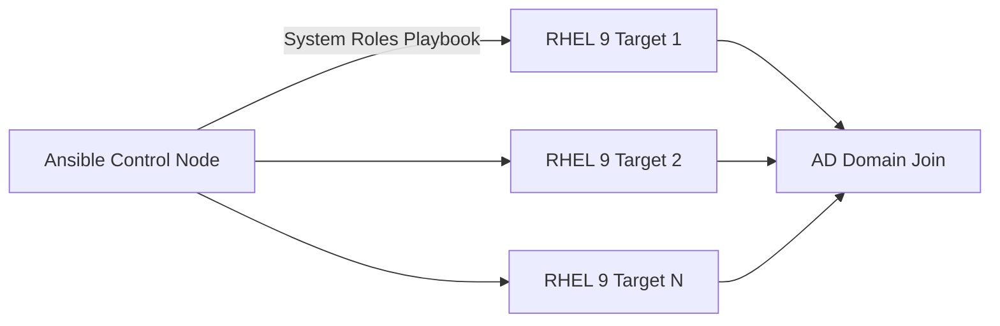

# How to Automate Active Directory Integration Using RHEL System Roles

Author: [nawazdhandala](https://www.github.com/nawazdhandala)

Tags: RHEL, Active Directory, Ansible, System Roles, Linux

Description: A practical guide to automating Active Directory domain joins and configuration on RHEL 9 using RHEL System Roles and Ansible, covering the ad_integration and sssd roles.

---

Joining one RHEL system to Active Directory manually is fine. Joining 50 or 500 the same way is a recipe for inconsistency and wasted time. RHEL System Roles provide Ansible roles that automate AD integration across your fleet, ensuring every system gets the same configuration. This guide shows how to use these roles to join systems to AD, configure SSSD, and manage access policies at scale.

## What Are RHEL System Roles?

RHEL System Roles are a collection of officially supported Ansible roles that ship with RHEL. They cover common system administration tasks including networking, storage, timesync, and Active Directory integration.



## Step 1 - Install RHEL System Roles

On your Ansible control node:

```bash
# Install RHEL System Roles
sudo dnf install rhel-system-roles -y

# Verify installation
ls /usr/share/ansible/roles/ | grep -i ad
```

The AD integration role is located at `/usr/share/ansible/roles/rhel-system-roles.ad_integration/`.

## Step 2 - Set Up the Inventory

Create an inventory file with the systems you want to join to AD.

```bash
# Create an inventory file
cat > /etc/ansible/inventory.yml << 'EOF'
all:
  children:
    linux_servers:
      hosts:
        server1.example.com:
        server2.example.com:
        server3.example.com:
      vars:
        ansible_user: root
        ansible_ssh_private_key_file: /root/.ssh/id_rsa
EOF
```

## Step 3 - Create the AD Integration Playbook

Create a playbook that uses the ad_integration role to join systems to AD.

```yaml
# ad-join.yml - Join RHEL systems to Active Directory
---
- name: Join RHEL systems to Active Directory
  hosts: linux_servers
  become: true

  vars:
    ad_integration_realm: EXAMPLE.COM
    ad_integration_password: "{{ ad_admin_password }}"
    ad_integration_user: Administrator
    ad_integration_join_to_dc: dc1.example.com
    ad_integration_manage_dns: false
    ad_integration_timesync: true

  roles:
    - rhel-system-roles.ad_integration
```

## Step 4 - Store the AD Password Securely

Use Ansible Vault to encrypt the AD admin password.

```bash
# Create an encrypted variable file
ansible-vault create /etc/ansible/ad-secrets.yml
```

Add the password:

```yaml
ad_admin_password: "YourADAdminPassword"
```

## Step 5 - Run the Playbook

```bash
# Run the AD join playbook
ansible-playbook -i /etc/ansible/inventory.yml \
  ad-join.yml \
  --extra-vars @/etc/ansible/ad-secrets.yml \
  --ask-vault-pass
```

## Step 6 - Configure SSSD with System Roles

After joining the domain, configure SSSD settings consistently across all systems.

```yaml
# sssd-config.yml - Configure SSSD for AD integration
---
- name: Configure SSSD for Active Directory
  hosts: linux_servers
  become: true

  vars:
    ad_integration_realm: EXAMPLE.COM
    ad_integration_password: "{{ ad_admin_password }}"
    ad_integration_user: Administrator
    ad_integration_manage_dns: false

  tasks:
    - name: Configure SSSD settings
      ansible.builtin.template:
        src: sssd.conf.j2
        dest: /etc/sssd/sssd.conf
        owner: root
        group: root
        mode: '0600'
      notify: restart sssd

    - name: Enable mkhomedir
      ansible.builtin.command: authselect enable-feature with-mkhomedir
      changed_when: true

    - name: Enable and start oddjobd
      ansible.builtin.systemd:
        name: oddjobd
        enabled: true
        state: started

  handlers:
    - name: restart sssd
      ansible.builtin.systemd:
        name: sssd
        state: restarted

  roles:
    - rhel-system-roles.ad_integration
```

Create the SSSD template:

```ini
# sssd.conf.j2
[sssd]
domains = {{ ad_integration_realm | lower }}
services = nss, pam, ssh, sudo
config_file_version = 2

[domain/{{ ad_integration_realm | lower }}]
id_provider = ad
auth_provider = ad
access_provider = ad
cache_credentials = True
use_fully_qualified_names = False
fallback_homedir = /home/%u
default_shell = /bin/bash
ad_gpo_access_control = permissive
```

## Step 7 - Configure Access Control

Limit which AD users and groups can log in to the Linux systems.

```yaml
# access-control.yml - Configure AD login access
---
- name: Configure AD access control
  hosts: linux_servers
  become: true

  tasks:
    - name: Allow specific AD groups to log in
      ansible.builtin.command: >
        realm permit -g "Linux Admins@example.com" "Linux Users@example.com"
      changed_when: true

    - name: Configure sudo for AD admin group
      ansible.builtin.copy:
        dest: /etc/sudoers.d/ad-admins
        content: '%linux\ admins ALL=(ALL) ALL'
        mode: '0440'
        owner: root
        group: root
        validate: 'visudo -cf %s'
```

## Step 8 - Configure Timesync

Time synchronization is critical for Kerberos. Use the timesync role to ensure all systems are in sync.

```yaml
# timesync.yml - Ensure time sync for Kerberos
---
- name: Configure time synchronization
  hosts: linux_servers
  become: true

  vars:
    timesync_ntp_servers:
      - hostname: dc1.example.com
        iburst: true
      - hostname: dc2.example.com
        iburst: true

  roles:
    - rhel-system-roles.timesync
```

## Step 9 - Verify the Configuration

Create a verification playbook to check that everything is working.

```yaml
# verify-ad.yml - Verify AD integration
---
- name: Verify AD integration
  hosts: linux_servers
  become: true

  tasks:
    - name: Check domain membership
      ansible.builtin.command: realm list
      register: realm_output
      changed_when: false

    - name: Display domain status
      ansible.builtin.debug:
        var: realm_output.stdout_lines

    - name: Check SSSD status
      ansible.builtin.systemd:
        name: sssd
      register: sssd_status

    - name: Verify AD user resolution
      ansible.builtin.command: id administrator@example.com
      register: id_output
      changed_when: false

    - name: Display user info
      ansible.builtin.debug:
        var: id_output.stdout
```

Run the verification:

```bash
ansible-playbook -i /etc/ansible/inventory.yml verify-ad.yml
```

## Complete Workflow Playbook

Here is a combined playbook that handles the full workflow:

```yaml
# full-ad-integration.yml
---
- name: Full AD integration workflow
  hosts: linux_servers
  become: true

  vars:
    ad_integration_realm: EXAMPLE.COM
    ad_integration_password: "{{ ad_admin_password }}"
    ad_integration_user: Administrator
    timesync_ntp_servers:
      - hostname: dc1.example.com
        iburst: true

  roles:
    - rhel-system-roles.timesync
    - rhel-system-roles.ad_integration

  tasks:
    - name: Enable mkhomedir
      ansible.builtin.command: authselect enable-feature with-mkhomedir
      changed_when: true

    - name: Start oddjobd
      ansible.builtin.systemd:
        name: oddjobd
        enabled: true
        state: started

    - name: Configure AD access
      ansible.builtin.command: realm permit -g "Linux Admins@example.com"
      changed_when: true

    - name: Configure sudo for AD admins
      ansible.builtin.copy:
        dest: /etc/sudoers.d/ad-admins
        content: '%linux\ admins ALL=(ALL) ALL'
        mode: '0440'
        validate: 'visudo -cf %s'
```

Using RHEL System Roles for AD integration saves time, ensures consistency, and gives you a repeatable, auditable process. Store your playbooks in version control, and every AD join will be identical and documented.
