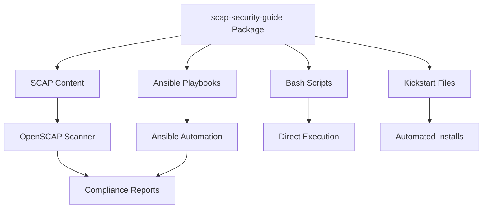

# How to Automate CIS Benchmark Compliance for RHEL with scap-security-guide

Author: [nawazdhandala](https://www.github.com/nawazdhandala)

Tags: RHEL, CIS, Scap-security-guide, Automation, Linux

Description: Automate CIS benchmark compliance on RHEL using the scap-security-guide project, including pre-built Ansible playbooks, bash scripts, and Kickstart integration.

---

The scap-security-guide (SSG) project is a community-driven effort that provides ready-to-use security content for SCAP scanners. On RHEL, it ships as an RPM and includes everything you need to automate CIS compliance: SCAP datastreams, Ansible playbooks, bash remediation scripts, and Kickstart snippets. Instead of writing all your hardening automation from scratch, you can lean heavily on what SSG already provides.

## Install scap-security-guide

```bash
# Install the package
dnf install -y scap-security-guide

# See what was installed
rpm -ql scap-security-guide | head -30

# Key directories:
# /usr/share/xml/scap/ssg/content/  - SCAP datastream files
# /usr/share/scap-security-guide/ansible/ - Ansible playbooks
# /usr/share/scap-security-guide/bash/ - Bash scripts
# /usr/share/scap-security-guide/kickstart/ - Kickstart files
```

## Explore the Available Content

```bash
# List all available profiles
oscap info /usr/share/xml/scap/ssg/content/ssg-rhel9-ds.xml 2>/dev/null | grep "Title:"

# Show details for the CIS Level 1 profile
oscap info --profile xccdf_org.ssgproject.content_profile_cis_server_l1 \
  /usr/share/xml/scap/ssg/content/ssg-rhel9-ds.xml
```



## Method 1: Ansible Playbooks

The SSG ships with complete Ansible playbooks for each profile:

```bash
# List available Ansible playbooks
ls /usr/share/scap-security-guide/ansible/rhel9-playbook-*.yml

# Preview what the CIS Level 1 playbook will do
ansible-playbook --check --diff \
  -i localhost, -c local \
  /usr/share/scap-security-guide/ansible/rhel9-playbook-cis_server_l1.yml

# Apply CIS Level 1 hardening locally
ansible-playbook \
  -i localhost, -c local \
  /usr/share/scap-security-guide/ansible/rhel9-playbook-cis_server_l1.yml
```

To apply across multiple servers, create an inventory file:

```bash
# Create an inventory file
cat > /tmp/inventory.ini << 'EOF'
[rhel9_servers]
server1.example.com
server2.example.com
server3.example.com

[rhel9_servers:vars]
ansible_user=admin
ansible_become=yes
EOF

# Run the playbook against all servers
ansible-playbook \
  -i /tmp/inventory.ini \
  /usr/share/scap-security-guide/ansible/rhel9-playbook-cis_server_l1.yml
```

## Method 2: Bash Remediation Scripts

For environments where Ansible is not available, use the bash scripts:

```bash
# List available bash scripts
ls /usr/share/scap-security-guide/bash/rhel9-script-*.sh

# Review the script before running
less /usr/share/scap-security-guide/bash/rhel9-script-cis_server_l1.sh

# Run the CIS Level 1 hardening script
bash /usr/share/scap-security-guide/bash/rhel9-script-cis_server_l1.sh
```

## Method 3: Kickstart Integration

For new deployments, include CIS hardening in the Kickstart file:

```bash
# View the CIS Kickstart file
cat /usr/share/scap-security-guide/kickstart/ssg-rhel9-cis_server_l1-ks.cfg
```

Use the SSG Kickstart as a starting point and customize it for your environment:

```bash
# Copy and customize the Kickstart file
cp /usr/share/scap-security-guide/kickstart/ssg-rhel9-cis_server_l1-ks.cfg \
  /var/www/html/ks/rhel9-cis.cfg

# The Kickstart file includes:
# - Secure partitioning
# - Package selection
# - %addon org_fedora_oscap section for applying the profile
```

The key section in the Kickstart file is the OpenSCAP addon:

```bash
# This goes in your Kickstart file
%addon org_fedora_oscap
  content-type = scap-security-guide
  profile = xccdf_org.ssgproject.content_profile_cis_server_l1
%end
```

## Method 4: Generate Targeted Remediation

If you only want to fix specific failures rather than applying the entire profile, generate remediation from scan results:

```bash
# Run a scan first
oscap xccdf eval \
  --profile xccdf_org.ssgproject.content_profile_cis_server_l1 \
  --results /tmp/scan-results.xml \
  /usr/share/xml/scap/ssg/content/ssg-rhel9-ds.xml

# Generate Ansible playbook for only the failed rules
oscap xccdf generate fix \
  --fix-type ansible \
  --result-id "" \
  --output /tmp/targeted-fix.yml \
  /tmp/scan-results.xml

# Generate bash script for only the failed rules
oscap xccdf generate fix \
  --fix-type bash \
  --result-id "" \
  --output /tmp/targeted-fix.sh \
  /tmp/scan-results.xml
```

## Build a CI/CD Pipeline for Compliance

Integrate SSG into your server build pipeline:

```bash
# Example build script that applies hardening and verifies
#!/bin/bash
set -e

echo "Step 1: Apply CIS Level 1 hardening"
ansible-playbook -i localhost, -c local \
  /usr/share/scap-security-guide/ansible/rhel9-playbook-cis_server_l1.yml

echo "Step 2: Verify compliance"
oscap xccdf eval \
  --profile xccdf_org.ssgproject.content_profile_cis_server_l1 \
  --results /var/log/compliance/initial-scan.xml \
  --report /var/log/compliance/initial-scan.html \
  /usr/share/xml/scap/ssg/content/ssg-rhel9-ds.xml || true

echo "Step 3: Count results"
PASS=$(grep -c 'result="pass"' /var/log/compliance/initial-scan.xml)
FAIL=$(grep -c 'result="fail"' /var/log/compliance/initial-scan.xml)
echo "Results: $PASS passed, $FAIL failed"

# Fail the build if too many failures
if [ "$FAIL" -gt 5 ]; then
    echo "Too many failures, build rejected"
    exit 1
fi
```

## Customize the SSG Content

You can create a tailoring file to customize which rules are applied:

```bash
# Use oscap to create a basic tailoring file
# Or use SCAP Workbench for a graphical approach

# Apply a scan with a tailoring file
oscap xccdf eval \
  --profile xccdf_org.ssgproject.content_profile_cis_server_l1 \
  --tailoring-file /path/to/tailoring.xml \
  --results /tmp/tailored-results.xml \
  /usr/share/xml/scap/ssg/content/ssg-rhel9-ds.xml
```

## Keep SSG Updated

The scap-security-guide is updated regularly with new rules and fixes:

```bash
# Check the installed version
rpm -qi scap-security-guide

# Update to the latest version
dnf update -y scap-security-guide

# After updating, re-run your compliance scans to check against the latest rules
```

## Schedule Automated Compliance Checks

```bash
# Create a systemd timer for weekly compliance scans
cat > /etc/systemd/system/compliance-scan.service << 'EOF'
[Unit]
Description=Weekly CIS Compliance Scan

[Service]
Type=oneshot
ExecStart=/usr/local/bin/cis-scan.sh
EOF

cat > /etc/systemd/system/compliance-scan.timer << 'EOF'
[Unit]
Description=Weekly CIS Compliance Scan Timer

[Timer]
OnCalendar=Sun *-*-* 02:00:00
Persistent=true

[Install]
WantedBy=timers.target
EOF

systemctl enable --now compliance-scan.timer
```

The scap-security-guide is one of the best tools in the RHEL security toolkit. It saves you from reinventing the wheel on compliance automation and gives you content that is maintained by people who think about security policy all day. Use it, customize it for your environment, and build it into your server lifecycle.
