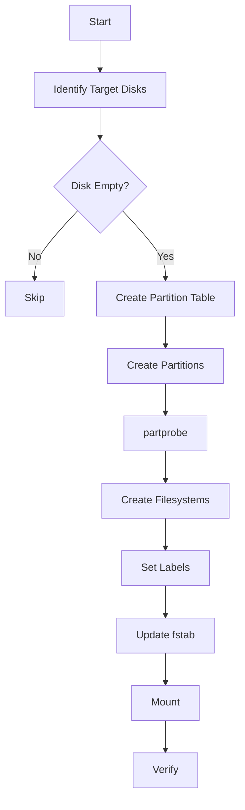

# How to Automate Disk Partitioning with Scripted parted Commands on RHEL

Author: [nawazdhandala](https://www.github.com/nawazdhandala)

Tags: RHEL, Parted, Scripting, Automation, Linux

Description: Automate disk partitioning on RHEL using scripted parted commands for repeatable, consistent storage provisioning across multiple servers.

---

## Why Script Partitioning?

When you are provisioning dozens or hundreds of servers, manually running fdisk or parted on each one is not practical. Scripted partitioning gives you consistency, speed, and reproducibility. Every server gets the exact same layout, every time.

parted is ideal for scripting because it accepts commands as arguments without entering interactive mode.

## parted in Script Mode

The key flag is `-s` (or `--script`), which suppresses confirmation prompts:

```bash
# Script mode prevents parted from asking questions
sudo parted -s /dev/sdb mklabel gpt
```

## Basic Partitioning Script

Here is a complete script that partitions a disk with a standard layout:

```bash
#!/bin/bash
# partition-disk.sh - Automated disk partitioning for data servers
# Usage: ./partition-disk.sh /dev/sdb

DISK=$1

if [ -z "$DISK" ]; then
    echo "Usage: $0 /dev/sdX"
    exit 1
fi

# Safety check: make sure the disk has no mounted partitions
if mount | grep -q "$DISK"; then
    echo "ERROR: $DISK has mounted partitions. Unmount them first."
    exit 1
fi

echo "Partitioning $DISK..."

# Create GPT partition table
sudo parted -s "$DISK" mklabel gpt

# Create partitions
# Partition 1: 50 GB for application data
sudo parted -s "$DISK" mkpart data xfs 1MiB 50GiB

# Partition 2: 100 GB for database storage
sudo parted -s "$DISK" mkpart database xfs 50GiB 150GiB

# Partition 3: Remaining space for logs
sudo parted -s "$DISK" mkpart logs xfs 150GiB 100%

# Inform the kernel about the new partition table
sudo partprobe "$DISK"

# Create filesystems
sudo mkfs.xfs -f "${DISK}1"
sudo mkfs.xfs -f "${DISK}2"
sudo mkfs.xfs -f "${DISK}3"

# Set filesystem labels
sudo xfs_admin -L "data" "${DISK}1"
sudo xfs_admin -L "database" "${DISK}2"
sudo xfs_admin -L "logs" "${DISK}3"

# Create mount points
sudo mkdir -p /mnt/{data,database,logs}

# Add fstab entries using labels
echo 'LABEL=data      /mnt/data      xfs  defaults,noatime  0 0' | sudo tee -a /etc/fstab
echo 'LABEL=database  /mnt/database  xfs  defaults,noatime  0 0' | sudo tee -a /etc/fstab
echo 'LABEL=logs      /mnt/logs      xfs  defaults,noatime  0 0' | sudo tee -a /etc/fstab

# Mount everything
sudo mount -a

echo "Partitioning complete."
lsblk "$DISK"
df -h /mnt/data /mnt/database /mnt/logs
```

## Using sfdisk for MBR Scripting

sfdisk accepts partition definitions from stdin, making it great for piping:

```bash
# Partition a disk with sfdisk using a heredoc
sudo sfdisk /dev/sdb << EOF
label: gpt
,50G,L
,100G,L
,,L
EOF
```

The format is `start,size,type`. Commas separate fields, and empty values use defaults.

## Conditional Partitioning Based on Disk Size

```bash
#!/bin/bash
# Smart partitioning based on disk size

DISK=$1
DISK_SIZE=$(sudo blockdev --getsize64 "$DISK")
DISK_GB=$((DISK_SIZE / 1073741824))

echo "Disk $DISK is ${DISK_GB} GB"

sudo parted -s "$DISK" mklabel gpt

if [ "$DISK_GB" -lt 500 ]; then
    # Small disk: single partition
    sudo parted -s "$DISK" mkpart data xfs 1MiB 100%
elif [ "$DISK_GB" -lt 2000 ]; then
    # Medium disk: two partitions
    sudo parted -s "$DISK" mkpart data xfs 1MiB 70%
    sudo parted -s "$DISK" mkpart logs xfs 70% 100%
else
    # Large disk: three partitions
    sudo parted -s "$DISK" mkpart data xfs 1MiB 50%
    sudo parted -s "$DISK" mkpart database xfs 50% 80%
    sudo parted -s "$DISK" mkpart logs xfs 80% 100%
fi

sudo partprobe "$DISK"
lsblk "$DISK"
```

## Partitioning Multiple Disks

```bash
#!/bin/bash
# Partition all unused data disks

# Get a list of disks that have no partitions
for DISK in /dev/sd{b,c,d,e}; do
    if [ -b "$DISK" ]; then
        PARTS=$(lsblk -n "$DISK" | wc -l)
        if [ "$PARTS" -eq 1 ]; then
            echo "Partitioning $DISK..."
            sudo parted -s "$DISK" mklabel gpt
            sudo parted -s "$DISK" mkpart data xfs 1MiB 100%
            sudo partprobe "$DISK"
            sudo mkfs.xfs -f "${DISK}1"
        else
            echo "Skipping $DISK - already has partitions"
        fi
    fi
done
```

## Idempotent Partitioning

For automation tools like Ansible, idempotency is important. The script should be safe to run multiple times:

```bash
#!/bin/bash
# Idempotent partition script - safe to run repeatedly

DISK=$1
PART="${DISK}1"

# Check if already partitioned correctly
if sudo blkid "$PART" | grep -q 'TYPE="xfs"'; then
    echo "$PART already exists with XFS. Skipping."
    exit 0
fi

# Check if mounted
if mount | grep -q "$PART"; then
    echo "$PART is mounted. Skipping."
    exit 0
fi

# Partition and format
sudo parted -s "$DISK" mklabel gpt
sudo parted -s "$DISK" mkpart data xfs 1MiB 100%
sudo partprobe "$DISK"
sudo mkfs.xfs -f "$PART"

echo "Partitioned and formatted $PART"
```

## Automation Flow



## Integration with Ansible

For larger deployments, use the parted and filesystem Ansible modules:

```yaml
# Ansible task example for reference
- name: Create partition
  community.general.parted:
    device: /dev/sdb
    number: 1
    state: present
    label: gpt
    part_start: 1MiB
    part_end: 100%

- name: Create filesystem
  community.general.filesystem:
    fstype: xfs
    dev: /dev/sdb1

- name: Mount filesystem
  ansible.posix.mount:
    path: /mnt/data
    src: /dev/sdb1
    fstype: xfs
    state: mounted
```

## Error Handling

Always add error handling to production scripts:

```bash
#!/bin/bash
set -euo pipefail

DISK=$1

# Verify the device exists
if [ ! -b "$DISK" ]; then
    echo "ERROR: $DISK is not a valid block device"
    exit 1
fi

# Verify it is not the boot disk
ROOT_DISK=$(mount | grep "on / " | awk '{print $1}' | sed 's/[0-9]*$//')
if [ "$DISK" = "$ROOT_DISK" ]; then
    echo "ERROR: $DISK appears to be the boot disk. Refusing to partition."
    exit 1
fi

echo "Safe to proceed with $DISK"
```

## Wrap-Up

Scripted partitioning with parted on RHEL saves time and ensures consistency. Use `parted -s` for non-interactive operation, add safety checks to prevent accidents, and make scripts idempotent for use with configuration management tools. Whether you are provisioning 10 servers or 10,000, automated partitioning is the way to go.
