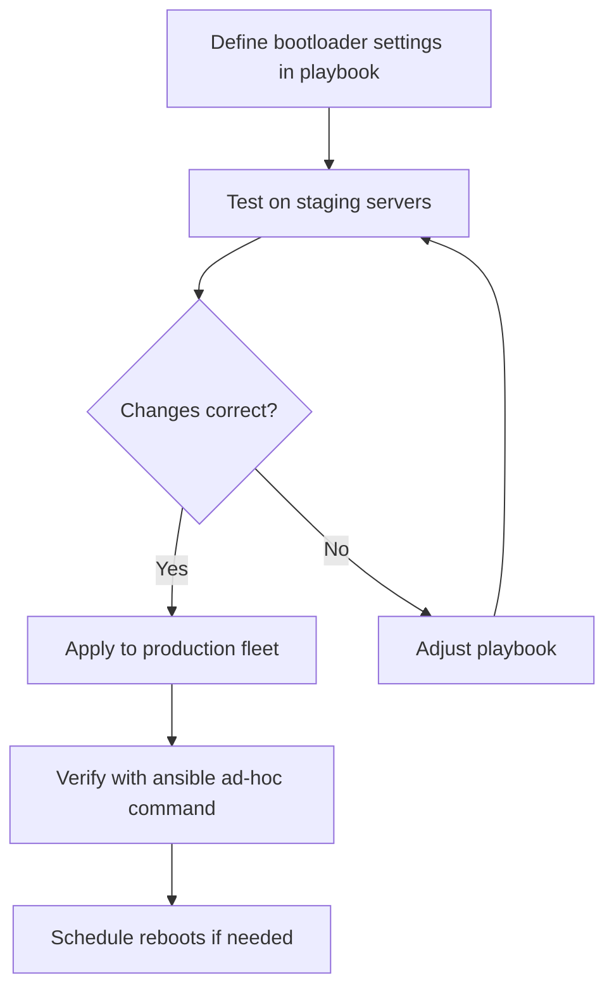

# How to Automate GRUB2 Config Using the bootloader RHEL System Role

Author: [nawazdhandala](https://www.github.com/nawazdhandala)

Tags: RHEL, GRUB2, Ansible, System Roles, Linux

Description: Learn how to use the RHEL bootloader system role to automate GRUB2 configuration across multiple RHEL servers with Ansible, including kernel parameter management and boot loader settings.

---

## What Are RHEL System Roles?

RHEL System Roles are a collection of Ansible roles provided and supported by Red Hat. They offer a consistent, automated way to configure common RHEL subsystems across your fleet. The bootloader role specifically handles GRUB2 configuration, kernel command-line parameters, and boot entry management.

Instead of SSH-ing into each server and running `grubby` commands, you define the desired boot configuration in a playbook and let Ansible apply it everywhere.

## Installing RHEL System Roles

```bash
# Install the RHEL System Roles package
sudo dnf install rhel-system-roles -y

# Verify the installation
rpm -qa | grep rhel-system-roles

# List available roles
ls /usr/share/ansible/roles/ | grep rhel

# The bootloader role documentation
ls /usr/share/doc/rhel-system-roles/bootloader/
```

## Setting Up the Ansible Environment

```bash
# Install Ansible if not already present
sudo dnf install ansible-core -y

# Create a project directory
mkdir -p ~/bootloader-automation
cd ~/bootloader-automation

# Create an inventory file
cat > inventory.ini <<EOF
[webservers]
web01.example.com
web02.example.com

[dbservers]
db01.example.com
db02.example.com

[all:vars]
ansible_user=admin
ansible_become=true
EOF
```

## Basic Bootloader Configuration Playbook

```yaml
# bootloader-config.yml
---
- name: Configure boot loader settings on RHEL servers
  hosts: all
  become: true
  roles:
    - role: rhel-system-roles.bootloader
      vars:
        bootloader_settings:
          - kernel: ALL
            options:
              - name: transparent_hugepage
                value: never
              - name: net.ifnames
                value: "0"
```

Run the playbook:

```bash
# Apply the bootloader configuration
ansible-playbook -i inventory.ini bootloader-config.yml
```

## Adding Kernel Parameters

```yaml
# add-kernel-params.yml
---
- name: Add performance tuning kernel parameters
  hosts: dbservers
  become: true
  roles:
    - role: rhel-system-roles.bootloader
      vars:
        bootloader_settings:
          - kernel: ALL
            options:
              - name: transparent_hugepage
                value: never
              - name: hugepages
                value: "1024"
              - name: numa_balancing
                value: "0"
              - name: intel_iommu
                value: "on"
```

## Removing Kernel Parameters

```yaml
# remove-kernel-params.yml
---
- name: Remove unnecessary kernel parameters
  hosts: all
  become: true
  roles:
    - role: rhel-system-roles.bootloader
      vars:
        bootloader_settings:
          - kernel: ALL
            options:
              - name: quiet
                state: absent
              - name: rhgb
                state: absent
```

## Configuring Different Parameter Sets for Different Hosts

```yaml
# role-based-bootloader.yml
---
- name: Configure web servers with network-optimized parameters
  hosts: webservers
  become: true
  roles:
    - role: rhel-system-roles.bootloader
      vars:
        bootloader_settings:
          - kernel: ALL
            options:
              - name: net.ifnames
                value: "0"
              - name: biosdevname
                value: "0"

- name: Configure database servers with memory-optimized parameters
  hosts: dbservers
  become: true
  roles:
    - role: rhel-system-roles.bootloader
      vars:
        bootloader_settings:
          - kernel: ALL
            options:
              - name: transparent_hugepage
                value: never
              - name: hugepages
                value: "2048"
              - name: numa_balancing
                value: "0"
```

## Practical Workflow



## Verifying Changes

After running the playbook, verify the changes were applied:

```bash
# Check kernel parameters on remote hosts
ansible all -i inventory.ini -m command -a "cat /proc/cmdline"

# Check grubby output
ansible all -i inventory.ini -m command -a "grubby --info=DEFAULT"

# Check if a reboot is needed
ansible all -i inventory.ini -m command -a "needs-restarting -r" --become
```

## Advantages of Using the System Role

| Manual Approach | System Role Approach |
|----------------|---------------------|
| SSH into each server | Run one playbook |
| Run grubby on each | Declarative YAML configuration |
| Easy to miss a server | Applies to entire groups |
| No audit trail | Playbook is version-controlled |
| Hard to reproduce | Idempotent and repeatable |

## Error Handling

```yaml
# bootloader-with-checks.yml
---
- name: Configure bootloader with pre-checks
  hosts: all
  become: true
  pre_tasks:
    - name: Check current kernel parameters
      command: cat /proc/cmdline
      register: current_cmdline
      changed_when: false

    - name: Display current parameters
      debug:
        var: current_cmdline.stdout

  roles:
    - role: rhel-system-roles.bootloader
      vars:
        bootloader_settings:
          - kernel: ALL
            options:
              - name: transparent_hugepage
                value: never

  post_tasks:
    - name: Verify changes applied
      command: grubby --info=DEFAULT
      register: grubby_output
      changed_when: false

    - name: Show updated configuration
      debug:
        var: grubby_output.stdout_lines
```

## Wrapping Up

The RHEL bootloader system role takes the tedium out of managing GRUB2 settings across a fleet of servers. Write a playbook once, test it on staging, and roll it out to production. The role handles the differences between BIOS and UEFI systems, uses `grubby` under the hood so changes follow RHEL best practices, and gives you a version-controlled, auditable record of every boot parameter change. For any environment with more than a handful of RHEL servers, this is the way to manage boot loader configuration.
