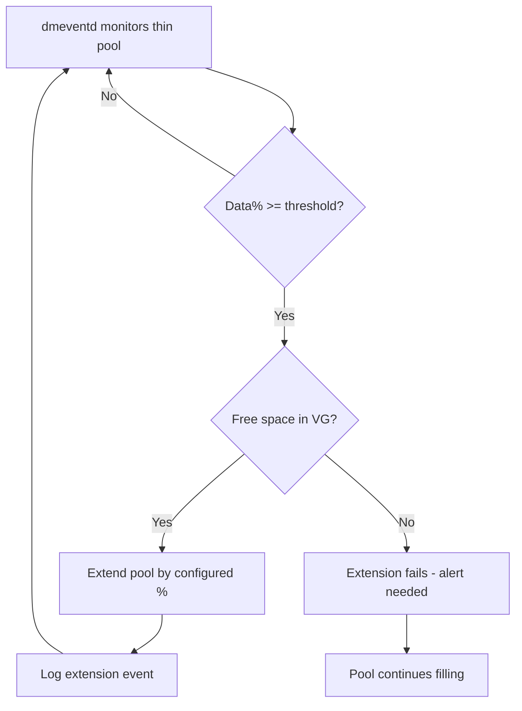

# How to Automate LVM Thin Pool Extension on RHEL

Author: [nawazdhandala](https://www.github.com/nawazdhandala)

Tags: RHEL, LVM, Thin Pool, Automation, Linux

Description: Learn how to configure automatic LVM thin pool extension on RHEL using dmeventd and custom scripts to prevent pool exhaustion.

---

A thin pool that fills to 100% causes every thin volume in the pool to freeze. The best defense is automation - let the system extend the pool before it runs out of space. RHEL has built-in support for this through the `dmeventd` monitoring daemon and LVM configuration.

## Built-in Auto-Extension with dmeventd

LVM includes a daemon called `dmeventd` that monitors thin pool usage and can automatically extend pools when they reach a threshold. This is the recommended approach.

### Step 1: Configure LVM Auto-Extension

Edit `/etc/lvm/lvm.conf`:

```bash
vi /etc/lvm/lvm.conf
```

Find the `activation` section and set these values:

```
activation {
    thin_pool_autoextend_threshold = 80
    thin_pool_autoextend_percent = 20
}
```

This means:
- When the pool reaches 80% full, auto-extend triggers
- The pool grows by 20% of its current size

### Step 2: Enable the Monitoring Service

```bash
# Enable and start the LVM monitoring service
systemctl enable --now lvm2-monitor
```

Verify it is running:

```bash
# Check monitoring daemon status
systemctl status lvm2-monitor
```

### Step 3: Verify Monitoring Is Active

```bash
# Check that thin pool monitoring is active
lvs -o lv_name,seg_monitor vg_data/thinpool
```

You should see "monitored" in the output. If not, enable monitoring:

```bash
# Enable monitoring on the thin pool
lvchange --monitor y vg_data/thinpool
```

### Step 4: Test the Configuration

You can test by temporarily lowering the threshold:

```bash
# Check current pool usage
lvs -o lv_name,data_percent vg_data/thinpool
```

If the pool is at 50%, temporarily set the threshold to 40% to trigger an extension, then set it back.

## How Auto-Extension Works



The important thing to understand is that auto-extension can only work if there is free space in the volume group. If the VG is full, extension fails and the pool keeps filling.

## Monitoring Auto-Extension Events

Check the system journal for extension events:

```bash
# Look for LVM auto-extension messages
journalctl -u lvm2-monitor --since "7 days ago" | grep -i "extend\|thin"
```

Also check:

```bash
# General LVM events
journalctl | grep -i "dmeventd\|thin_pool"
```

## Custom Auto-Extension Script

For more control than what `dmeventd` provides, use a custom script. This is useful when you want to:
- Send notifications before and after extension
- Handle the "VG full" case by adding physical volumes
- Apply different policies per pool

```bash
#!/bin/bash
# /usr/local/bin/thinpool-autoextend.sh
# Custom thin pool auto-extension with notifications

THRESHOLD=80
EXTEND_PERCENT=20
ADMIN_EMAIL="admin@example.com"

# Process each thin pool
lvs --noheadings -o vg_name,lv_name,data_percent,lv_size --units g \
    --select 'lv_attr=~^t' 2>/dev/null | while read -r VG LV DATA SIZE; do

    DATA_INT=${DATA%.*}

    if [ "$DATA_INT" -ge "$THRESHOLD" ] 2>/dev/null; then
        # Calculate extension size
        SIZE_NUM=${SIZE%g}
        EXTEND_SIZE=$(echo "$SIZE_NUM * $EXTEND_PERCENT / 100" | bc)

        # Check for VG free space
        VG_FREE=$(vgs --noheadings -o vg_free --units g "$VG" | tr -d ' g')
        VG_FREE_INT=${VG_FREE%.*}

        if [ "$VG_FREE_INT" -ge "${EXTEND_SIZE%.*}" ] 2>/dev/null; then
            # Extend the pool
            lvextend -L "+${EXTEND_SIZE}g" "$VG/$LV"
            RESULT=$?

            if [ $RESULT -eq 0 ]; then
                NEW_SIZE=$(lvs --noheadings -o lv_size --units g "$VG/$LV" | tr -d ' ')
                logger "Auto-extended thin pool $VG/$LV by ${EXTEND_SIZE}G to ${NEW_SIZE}"
                mail -s "Thin pool $VG/$LV auto-extended" "$ADMIN_EMAIL" << EOF
Thin pool $VG/$LV was automatically extended.

Previous data usage: ${DATA}%
Extension size: ${EXTEND_SIZE}G
New pool size: ${NEW_SIZE}
VG free space remaining: $(vgs --noheadings -o vg_free --units g "$VG" | tr -d ' ')
EOF
            else
                logger -p user.crit "Failed to extend thin pool $VG/$LV"
            fi
        else
            # Not enough VG space
            logger -p user.crit "Cannot extend $VG/$LV - VG $VG has only ${VG_FREE}G free"
            mail -s "CRITICAL: Thin pool $VG/$LV needs space" "$ADMIN_EMAIL" << EOF
Thin pool $VG/$LV is at ${DATA}% and cannot be extended.

VG $VG has only ${VG_FREE}G free space.
Pool needs ${EXTEND_SIZE}G for extension.

Immediate action required:
1. Add a physical volume: pvcreate /dev/sdX && vgextend $VG /dev/sdX
2. Or remove old snapshots: lvremove $VG/old_snapshot
3. Or move data off some thin volumes
EOF
        fi
    fi
done
```

Schedule it:

```bash
chmod +x /usr/local/bin/thinpool-autoextend.sh
echo "*/10 * * * * /usr/local/bin/thinpool-autoextend.sh" >> /var/spool/cron/root
```

## Handling VG Exhaustion

When the volume group itself is full, you need to add storage:

```bash
# Add a new disk to the volume group
pvcreate /dev/sdd
vgextend vg_data /dev/sdd

# The thin pool can now be extended (auto or manual)
lvextend -L +100G vg_data/thinpool
```

## Auto-Extension for Metadata

Do not forget metadata. Configure metadata auto-extension too:

In `/etc/lvm/lvm.conf`:

```
activation {
    thin_pool_autoextend_threshold = 80
    thin_pool_autoextend_percent = 20
}
```

These settings apply to both data and metadata. For manual metadata extension:

```bash
# Extend metadata by 512 MB
lvextend --poolmetadatasize +512M vg_data/thinpool
```

## Systemd Timer Alternative

Instead of cron, use a systemd timer for the custom script:

```bash
# Create the service unit
cat > /etc/systemd/system/thinpool-autoextend.service << 'EOF'
[Unit]
Description=Thin Pool Auto-Extension Check

[Service]
Type=oneshot
ExecStart=/usr/local/bin/thinpool-autoextend.sh
EOF

# Create the timer
cat > /etc/systemd/system/thinpool-autoextend.timer << 'EOF'
[Unit]
Description=Check thin pools every 10 minutes

[Timer]
OnBootSec=5min
OnUnitActiveSec=10min

[Install]
WantedBy=timers.target
EOF

# Enable the timer
systemctl enable --now thinpool-autoextend.timer
```

## Verifying Your Setup

Run through this checklist:

```bash
# 1. LVM monitoring is active
systemctl is-active lvm2-monitor

# 2. Thin pool is being monitored
lvs -o lv_name,seg_monitor --select 'lv_attr=~^t'

# 3. Auto-extend is configured
grep -A5 "thin_pool_autoextend" /etc/lvm/lvm.conf | grep -v "^#"

# 4. VG has free space for extension
vgs -o vg_name,vg_free

# 5. Current pool usage
lvs -o lv_name,data_percent,metadata_percent --select 'lv_attr=~^t'
```

## Summary

Automating thin pool extension on RHEL prevents one of the most disruptive storage failures. Use the built-in `dmeventd` auto-extension (set `thin_pool_autoextend_threshold` and `thin_pool_autoextend_percent` in lvm.conf) for basic automation. Add a custom script for notifications and handling VG exhaustion. Always monitor that the volume group itself has room to grow, because auto-extension fails silently when there is no VG free space.
