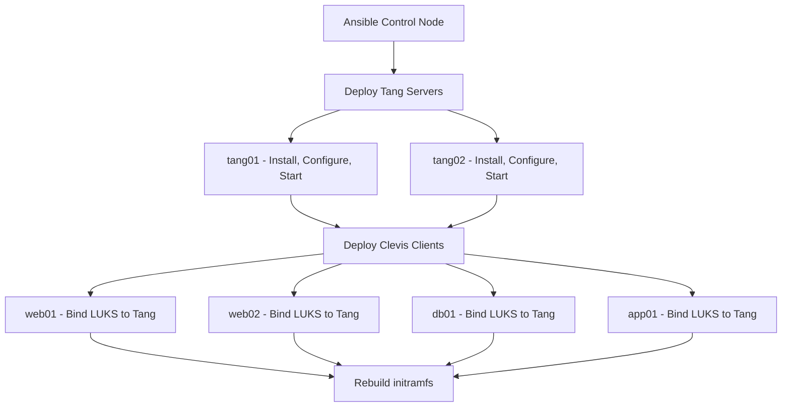

# How to Automate NBDE Deployment with RHEL 9 System Roles

Author: [nawazdhandala](https://www.github.com/nawazdhandala)

Tags: RHEL, NBDE, Ansible, System Roles, Linux

Description: Use RHEL 9 System Roles to automate the deployment of Network-Bound Disk Encryption with Tang servers and Clevis clients across your infrastructure using Ansible.

---

Setting up NBDE manually on each server works fine for a handful of systems, but when you are managing dozens or hundreds of encrypted RHEL 9 hosts, Ansible automation becomes essential. The RHEL System Roles include roles for both Tang server deployment and Clevis client configuration, letting you manage NBDE across your entire fleet from a single playbook.

## Installing RHEL System Roles

On your Ansible control node:

```bash
# Install the system roles package
sudo dnf install rhel-system-roles -y

# Verify the NBDE roles are available
ls /usr/share/ansible/roles/ | grep nbde
```

You should see two roles:
- `rhel-system-roles.nbde_server` - for Tang server deployment
- `rhel-system-roles.nbde_client` - for Clevis client configuration

## Setting Up the Inventory

Create an inventory that separates Tang servers from clients:

```bash
# Create the inventory file
cat > /home/ansible/nbde-inventory << 'EOF'
[tang_servers]
tang01.example.com
tang02.example.com

[nbde_clients]
web01.example.com
web02.example.com
db01.example.com
app01.example.com

[all:vars]
ansible_user=admin
ansible_become=true
EOF
```

## Deploying Tang Servers

Create a playbook for the Tang server deployment:

```yaml
# deploy-tang.yml - Deploy Tang servers
- name: Deploy Tang NBDE servers
  hosts: tang_servers
  roles:
    - role: rhel-system-roles.nbde_server
      vars:
        nbde_server_manage_firewall: true
        nbde_server_manage_selinux: true
```

Run the playbook:

```bash
# Deploy Tang to all designated servers
ansible-playbook -i nbde-inventory deploy-tang.yml
```

This installs Tang, generates keys, opens the firewall port, and starts the service.

## Deploying Clevis Clients

The client playbook needs to know which LUKS devices to bind and which Tang servers to use:

```yaml
# deploy-clevis.yml - Configure Clevis on client servers
- name: Configure NBDE clients
  hosts: nbde_clients
  roles:
    - role: rhel-system-roles.nbde_client
      vars:
        nbde_client_bindings:
          - device: /dev/sda3
            encryption_key_src: /root/luks-passphrase.txt
            servers:
              - http://tang01.example.com
              - http://tang02.example.com
```

The `encryption_key_src` points to a file containing the existing LUKS passphrase on each client. This file should be created securely before running the playbook:

```bash
# On each client, securely create the passphrase file
ansible nbde_clients -m copy -a "content='your-luks-passphrase' dest=/root/luks-passphrase.txt mode=0600"
```

Run the Clevis deployment:

```bash
# Deploy Clevis bindings
ansible-playbook -i nbde-inventory deploy-clevis.yml
```

After deployment, clean up the passphrase files:

```bash
# Remove passphrase files from all clients
ansible nbde_clients -m file -a "path=/root/luks-passphrase.txt state=absent"
```

## Complete NBDE Deployment Playbook

Here is a combined playbook that deploys both Tang and Clevis:

```yaml
# nbde-full-deploy.yml - Complete NBDE deployment
- name: Deploy Tang servers
  hosts: tang_servers
  roles:
    - role: rhel-system-roles.nbde_server
      vars:
        nbde_server_manage_firewall: true
        nbde_server_manage_selinux: true

- name: Configure Clevis clients with SSS
  hosts: nbde_clients
  roles:
    - role: rhel-system-roles.nbde_client
      vars:
        nbde_client_bindings:
          - device: /dev/sda3
            encryption_key_src: /root/luks-passphrase.txt
            servers:
              - http://tang01.example.com
              - http://tang02.example.com
```

## Deployment Workflow



## Verifying the Deployment

After running the playbook, verify everything is working:

```bash
# Check Tang servers are running
ansible tang_servers -m command -a "systemctl status tangd.socket"

# Check Clevis bindings on all clients
ansible nbde_clients -m command -a "clevis luks list -d /dev/sda3"

# Verify initramfs has Clevis modules
ansible nbde_clients -m shell -a "lsinitrd | grep clevis | head -5"
```

## Handling Different LUKS Devices per Host

If different servers have encryption on different devices, use host variables:

```yaml
# host_vars/web01.example.com.yml
nbde_client_bindings:
  - device: /dev/sda3
    encryption_key_src: /root/luks-passphrase.txt
    servers:
      - http://tang01.example.com
      - http://tang02.example.com

# host_vars/db01.example.com.yml
nbde_client_bindings:
  - device: /dev/nvme0n1p3
    encryption_key_src: /root/luks-passphrase.txt
    servers:
      - http://tang01.example.com
      - http://tang02.example.com
  - device: /dev/sdb1
    encryption_key_src: /root/luks-passphrase-data.txt
    servers:
      - http://tang01.example.com
      - http://tang02.example.com
```

## Tang Key Rotation with Ansible

Automate key rotation on Tang servers:

```yaml
# tang-key-rotation.yml - Rotate Tang keys
- name: Rotate Tang server keys
  hosts: tang_servers
  tasks:
    - name: Generate new Tang keys
      command: /usr/libexec/tangd-keygen /var/db/tang
      notify: restart tangd

  handlers:
    - name: restart tangd
      systemd:
        name: tangd.socket
        state: restarted
```

## Troubleshooting Ansible NBDE Deployment

Common issues and how to diagnose them:

```bash
# Check if the role ran successfully
ansible-playbook -i nbde-inventory deploy-clevis.yml -v

# If binding fails, check if the LUKS device exists
ansible nbde_clients -m command -a "lsblk -f"

# Verify Tang connectivity from clients
ansible nbde_clients -m uri -a "url=http://tang01.example.com/adv return_content=yes"
```

## Rolling Out Updates

When you need to change the NBDE configuration (add a new Tang server, change bindings), update the playbook and re-run it. The system role is designed to be idempotent:

```bash
# Re-run after adding a third Tang server
ansible-playbook -i nbde-inventory deploy-clevis.yml
```

The RHEL System Roles handle the complexity of NBDE deployment, making it practical to manage encrypted volumes at scale. Combined with your existing Ansible infrastructure, NBDE becomes just another configuration item in your automation pipeline.
