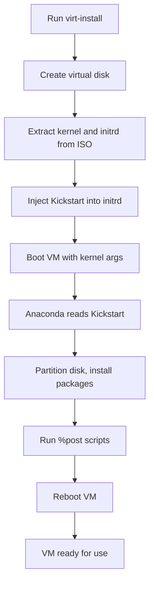

# How to Automate RHEL 9 Deployments Using Kickstart on KVM with virt-install

Author: [nawazdhandala](https://github.com/nawazdhandala)

Tags: RHEL, KVM, Kickstart, Virtualization, virt-install, Automation

Description: Automate RHEL 9 virtual machine creation on KVM using virt-install and Kickstart files, covering hypervisor setup, VM provisioning, and scripting batch deployments.

---

KVM is the go-to hypervisor for Linux virtualization. It is built into the kernel, performs well, and does not cost you a licensing fee. Combine it with `virt-install` and a Kickstart file, and you can spin up fully configured RHEL 9 VMs with a single command. No clicking through installers, no manual configuration.

This guide covers setting up KVM on RHEL 9, creating VMs with `virt-install`, and automating the whole process with Kickstart.

## Setting Up the KVM Hypervisor

First, verify that your hardware supports virtualization:

```bash
# Check for virtualization extensions in the CPU
grep -E '(vmx|svm)' /proc/cpuinfo | head -1
```

If you see `vmx` (Intel) or `svm` (AMD), hardware virtualization is supported. If not, check your BIOS/UEFI settings and enable VT-x or AMD-V.

Install the virtualization packages:

```bash
# Install KVM, QEMU, libvirt, and management tools
sudo dnf install -y @virtualization-host-environment
```

This meta-group pulls in `qemu-kvm`, `libvirt`, `virt-install`, `virt-viewer`, and other essential packages.

Start and enable the libvirt daemon:

```bash
# Enable and start libvirtd
sudo systemctl enable --now libvirtd
```

Verify the installation:

```bash
# Confirm KVM modules are loaded
lsmod | grep kvm

# Check libvirt is running
sudo virsh list --all
```

## Preparing the Kickstart File

Before creating VMs, you need a Kickstart file and the RHEL 9 ISO. Place them where the hypervisor can reach them.

Here is a minimal Kickstart file for VM provisioning:

```bash
# Kickstart file for automated RHEL 9 VM installation
# Save as /var/lib/libvirt/kickstarts/rhel9-base.cfg

text
eula --agreed

# Install from the ISO mounted as a virtual CDROM
cdrom

# System settings
lang en_US.UTF-8
keyboard us
timezone America/New_York --utc
timesource --ntp-server=0.rhel.pool.ntp.org

# Network - use DHCP from the default libvirt network
network --bootproto=dhcp --device=enp1s0 --activate --hostname=rhel9-vm.lab.local

# Root and user accounts
rootpw --iscrypted $6$rounds=656000$yoursalt$yourhash
user --name=admin --groups=wheel --iscrypted --password=$6$rounds=656000$yoursalt$yourhash

# Disk layout - automatic partitioning on the virtual disk
ignoredisk --only-use=vda
clearpart --all --drives=vda --initlabel
autopart --type=lvm

# Security
selinux --enforcing
firewall --enabled --service=ssh

firstboot --disable
reboot

%packages
@^minimal-environment
vim-enhanced
tmux
bash-completion
chrony
%end

%post --log=/root/ks-post.log
# Enable chronyd
systemctl enable chronyd

# Update packages
dnf update -y
%end
```

Create the directory and save the file:

```bash
# Create a directory for Kickstart files
sudo mkdir -p /var/lib/libvirt/kickstarts

# Create the Kickstart file (paste the content above)
sudo vim /var/lib/libvirt/kickstarts/rhel9-base.cfg
```

Also, place your RHEL 9 ISO in a convenient location:

```bash
# Create a directory for ISOs
sudo mkdir -p /var/lib/libvirt/isos

# Move or copy your ISO there
sudo cp rhel-9.4-x86_64-dvd.iso /var/lib/libvirt/isos/
```

## Creating a VM with virt-install

The `virt-install` command creates a VM, attaches the ISO, passes the Kickstart file, and starts the installation in one go.

```bash
# Create a RHEL 9 VM with virt-install and Kickstart
sudo virt-install \
  --name rhel9-web01 \
  --ram 4096 \
  --vcpus 2 \
  --disk path=/var/lib/libvirt/images/rhel9-web01.qcow2,size=40,format=qcow2 \
  --os-variant rhel9.4 \
  --location /var/lib/libvirt/isos/rhel-9.4-x86_64-dvd.iso \
  --initrd-inject=/var/lib/libvirt/kickstarts/rhel9-base.cfg \
  --extra-args="inst.ks=file:/rhel9-base.cfg console=ttyS0" \
  --network network=default \
  --graphics none \
  --console pty,target_type=serial \
  --noautoconsole
```

Let me break down the key flags:

| Flag | Purpose |
|------|---------|
| `--name` | VM name as it appears in virsh |
| `--ram` | Memory in MiB |
| `--vcpus` | Number of virtual CPUs |
| `--disk` | Virtual disk path, size in GiB, and format |
| `--os-variant` | Optimization hint for the guest OS |
| `--location` | Path to the ISO (used to extract kernel/initrd) |
| `--initrd-inject` | Injects the Kickstart file into the initrd |
| `--extra-args` | Kernel boot arguments, including the Kickstart path |
| `--network` | Which libvirt network to attach to |
| `--graphics none` | No graphical console (headless) |
| `--noautoconsole` | Do not automatically attach to the VM console |

The `--initrd-inject` option is the key to making this work. It packs your Kickstart file into the initial ramdisk so the installer can find it with `inst.ks=file:/rhel9-base.cfg`.

To check available OS variants:

```bash
# List available OS variants for RHEL
osinfo-query os | grep rhel
```

## Monitoring the Installation

You can watch the installation progress through the serial console:

```bash
# Connect to the VM console
sudo virsh console rhel9-web01
```

Press Enter if you do not see output immediately. To detach from the console, press `Ctrl+]`.

Check the VM status:

```bash
# List all VMs and their states
sudo virsh list --all
```

Once the installation finishes, the VM will reboot (as specified in the Kickstart file) and come up running.

## The Deployment Flow

Here is what happens when you run the `virt-install` command:



## Scripting Batch VM Creation

The real power comes when you script the creation of multiple VMs. Here is a shell script that creates several VMs from a list:

```bash
#!/bin/bash
# batch-create-vms.sh - Create multiple RHEL 9 VMs using Kickstart
# Usage: ./batch-create-vms.sh

ISO="/var/lib/libvirt/isos/rhel-9.4-x86_64-dvd.iso"
KS="/var/lib/libvirt/kickstarts/rhel9-base.cfg"
IMG_DIR="/var/lib/libvirt/images"

# Define VMs: name, RAM (MiB), vCPUs, disk (GiB)
declare -a VMS=(
    "rhel9-web01,4096,2,40"
    "rhel9-web02,4096,2,40"
    "rhel9-db01,8192,4,100"
    "rhel9-app01,4096,2,60"
)

for VM_DEF in "${VMS[@]}"; do
    IFS=',' read -r NAME RAM VCPUS DISK <<< "$VM_DEF"

    echo "Creating VM: $NAME (RAM: ${RAM}M, vCPUs: $VCPUS, Disk: ${DISK}G)"

    sudo virt-install \
        --name "$NAME" \
        --ram "$RAM" \
        --vcpus "$VCPUS" \
        --disk path="${IMG_DIR}/${NAME}.qcow2,size=${DISK},format=qcow2" \
        --os-variant rhel9.4 \
        --location "$ISO" \
        --initrd-inject="$KS" \
        --extra-args="inst.ks=file:/$(basename $KS) console=ttyS0" \
        --network network=default \
        --graphics none \
        --console pty,target_type=serial \
        --noautoconsole

    echo "$NAME creation started."
done

echo "All VMs queued for installation."
```

Make it executable and run it:

```bash
# Make the script executable
chmod +x batch-create-vms.sh

# Run it
sudo ./batch-create-vms.sh
```

Each VM installs in parallel since we used `--noautoconsole`. On decent hardware, you can spin up a handful of VMs simultaneously without issues.

## Using Different Kickstart Files per VM

For different server roles, maintain separate Kickstart files and pass the right one for each VM. Modify the script to accept a Kickstart path per VM:

```bash
# Extended VM definition: name, RAM, vCPUs, disk, kickstart file
declare -a VMS=(
    "rhel9-web01,4096,2,40,rhel9-web.cfg"
    "rhel9-db01,8192,4,100,rhel9-db.cfg"
)
```

Then reference it in the loop:

```bash
IFS=',' read -r NAME RAM VCPUS DISK KS_FILE <<< "$VM_DEF"
KS="/var/lib/libvirt/kickstarts/$KS_FILE"
```

## Managing VMs After Creation

Once your VMs are running, manage them with `virsh`:

```bash
# List running VMs
sudo virsh list

# Shut down a VM gracefully
sudo virsh shutdown rhel9-web01

# Start a VM
sudo virsh start rhel9-web01

# Get the IP address of a VM (from the default network)
sudo virsh domifaddr rhel9-web01

# Delete a VM and its disk
sudo virsh destroy rhel9-web01
sudo virsh undefine rhel9-web01 --remove-all-storage
```

## Practical Tips

- Use `qcow2` format for disks. It supports thin provisioning, so a 40 GiB disk only uses the space it actually needs on the host.
- Set `--os-variant` correctly. It tunes disk, network, and other virtual hardware settings for the guest OS. Using the wrong variant can cause poor performance.
- For production VMs, use bridged networking instead of the default NAT network. This gives VMs real IPs on your physical network.
- Keep your Kickstart files in a Git repository alongside these scripts. When you need to recreate a VM six months later, you will have the exact configuration that was used.
- If you are running many VMs on a single host, consider setting CPU pinning and memory huge pages for better performance under load.

Combining `virt-install` with Kickstart turns VM provisioning into a one-liner. It is the simplest form of infrastructure as code, and it works well for lab environments, CI/CD test runners, and small-scale production setups.
