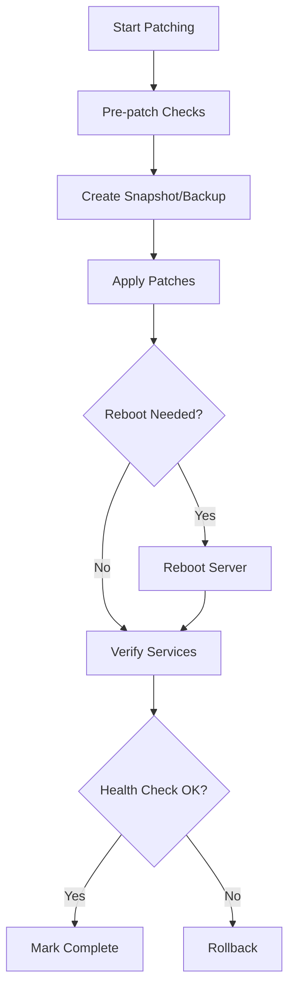

# How to Automate RHEL Patching with Ansible

Author: [nawazdhandala](https://www.github.com/nawazdhandala)

Tags: RHEL, Ansible, Patching, Security, Automation, Linux

Description: Build an automated patching workflow for RHEL servers using Ansible, including pre-patch checks, staged rollouts, and rollback capabilities.

---

Manual patching does not scale. If you are SSH-ing into servers one at a time to run `dnf update`, you are wasting hours every patch cycle and introducing inconsistency. Ansible lets you automate the entire process with pre-checks, staged rollouts, and automatic reboots when needed.

## Patching Workflow



## Basic Patching Playbook

```yaml
# playbook-patch.yml
# Apply all available updates to RHEL servers
---
- name: Patch RHEL servers
  hosts: patch_targets
  become: true
  serial: "25%"  # Patch 25% of servers at a time

  tasks:
    - name: Check for available updates
      ansible.builtin.dnf:
        list: updates
      register: available_updates

    - name: Display update count
      ansible.builtin.debug:
        msg: "{{ available_updates.results | length }} updates available"

    - name: Apply all updates
      ansible.builtin.dnf:
        name: "*"
        state: latest
        security: false  # Set to true for security-only patches
      register: patch_result

    - name: Check if reboot is required
      ansible.builtin.command: needs-restarting -r
      register: reboot_check
      failed_when: false
      changed_when: reboot_check.rc == 1

    - name: Reboot if required
      ansible.builtin.reboot:
        reboot_timeout: 600
        msg: "Rebooting for patching"
      when: reboot_check.rc == 1

    - name: Verify system is healthy after reboot
      ansible.builtin.command: systemctl is-system-running
      register: system_status
      retries: 5
      delay: 10
      until: system_status.stdout == "running"
      changed_when: false
```

## Security-Only Patching

To apply only security updates:

```yaml
# playbook-patch-security.yml
# Apply only security updates
---
- name: Apply security patches
  hosts: patch_targets
  become: true
  serial: "25%"

  tasks:
    - name: Apply security updates only
      ansible.builtin.dnf:
        name: "*"
        state: latest
        security: true
      register: patch_result

    - name: Show what was updated
      ansible.builtin.debug:
        msg: "{{ patch_result.results }}"
      when: patch_result.changed
```

## Full Patching Playbook with Pre-checks and Rollback

```yaml
# playbook-patch-full.yml
# Production patching with pre-checks, backups, and validation
---
- name: Pre-patch checks
  hosts: patch_targets
  become: true
  serial: "25%"

  tasks:
    - name: Check disk space (need at least 2GB free on /)
      ansible.builtin.shell: |
        # Check available space in MB on root filesystem
        df -m / | awk 'NR==2 {print $4}'
      register: disk_space
      changed_when: false

    - name: Fail if disk space is low
      ansible.builtin.fail:
        msg: "Only {{ disk_space.stdout }}MB free on /. Need at least 2048MB."
      when: disk_space.stdout | int < 2048

    - name: Record running services before patching
      ansible.builtin.shell: |
        # Save list of running services for comparison after patching
        systemctl list-units --type=service --state=running --no-legend | awk '{print $1}'
      register: pre_patch_services
      changed_when: false

    - name: Save pre-patch service list
      ansible.builtin.copy:
        content: "{{ pre_patch_services.stdout }}"
        dest: /var/tmp/pre_patch_services.txt
        mode: "0644"

    - name: Record installed kernel version
      ansible.builtin.command: uname -r
      register: pre_patch_kernel
      changed_when: false

    - name: Apply all updates
      ansible.builtin.dnf:
        name: "*"
        state: latest
      register: patch_result

    - name: Check if reboot is needed
      ansible.builtin.command: needs-restarting -r
      register: reboot_check
      failed_when: false
      changed_when: reboot_check.rc == 1

    - name: Reboot if required
      ansible.builtin.reboot:
        reboot_timeout: 600
      when: reboot_check.rc == 1

    - name: Wait for system to be ready
      ansible.builtin.wait_for_connection:
        delay: 30
        timeout: 300
      when: reboot_check.rc == 1

    - name: Verify system health
      ansible.builtin.command: systemctl is-system-running
      register: system_health
      retries: 5
      delay: 10
      until: system_health.stdout in ["running", "degraded"]
      changed_when: false

    - name: Check that critical services are running
      ansible.builtin.systemd:
        name: "{{ item }}"
        state: started
      loop:
        - sshd
        - firewalld
        - chronyd
      register: service_check

    - name: Record post-patch kernel version
      ansible.builtin.command: uname -r
      register: post_patch_kernel
      changed_when: false

    - name: Report patching summary
      ansible.builtin.debug:
        msg: |
          Patching complete on {{ inventory_hostname }}
          Updates applied: {{ patch_result.changed }}
          Reboot performed: {{ reboot_check.rc == 1 }}
          Kernel before: {{ pre_patch_kernel.stdout }}
          Kernel after: {{ post_patch_kernel.stdout }}
          System status: {{ system_health.stdout }}
```

## Staged Rollout Strategy

Use inventory groups and the `serial` keyword:

```ini
# inventory
[patch_canary]
canary1.example.com

[patch_stage1]
web1.example.com
web2.example.com

[patch_stage2]
web3.example.com
web4.example.com
app1.example.com
app2.example.com

[patch_targets:children]
patch_canary
patch_stage1
patch_stage2
```

```yaml
# playbook-patch-staged.yml
# Staged rollout: canary first, then groups
---
- name: Patch canary servers
  hosts: patch_canary
  become: true
  tasks:
    - name: Apply updates to canary
      ansible.builtin.include_tasks: tasks/patch-and-verify.yml

- name: Confirm canary is healthy
  hosts: patch_canary
  tasks:
    - name: Pause for manual verification
      ansible.builtin.pause:
        prompt: "Canary patched. Check it and press Enter to continue (or Ctrl+C to abort)"

- name: Patch stage 1
  hosts: patch_stage1
  become: true
  serial: 1  # One at a time
  tasks:
    - name: Apply updates to stage 1
      ansible.builtin.include_tasks: tasks/patch-and-verify.yml

- name: Patch stage 2
  hosts: patch_stage2
  become: true
  serial: "50%"  # Half at a time
  tasks:
    - name: Apply updates to stage 2
      ansible.builtin.include_tasks: tasks/patch-and-verify.yml
```

## Excluding Specific Packages

Sometimes you need to skip certain packages:

```yaml
# Exclude specific packages from updates
- name: Apply updates excluding certain packages
  ansible.builtin.dnf:
    name: "*"
    state: latest
    exclude:
      - kernel*
      - docker*
```

## Generating a Patch Report

```yaml
# playbook-patch-report.yml
# Generate a patching report
---
- name: Generate patch report
  hosts: all
  become: true

  tasks:
    - name: Get last patch date
      ansible.builtin.shell: |
        # Find the most recent dnf transaction that was an update
        dnf history list --reverse | tail -5
      register: patch_history
      changed_when: false

    - name: Get installed security errata
      ansible.builtin.command: dnf updateinfo list installed --security
      register: security_errata
      changed_when: false

    - name: Get pending updates
      ansible.builtin.dnf:
        list: updates
      register: pending

    - name: Write report
      ansible.builtin.debug:
        msg: |
          Host: {{ inventory_hostname }}
          Pending updates: {{ pending.results | length }}
          Recent history:
          {{ patch_history.stdout }}
```

## Running the Playbook

```bash
# Dry run first
ansible-playbook -i inventory playbook-patch-full.yml --check

# Run for real
ansible-playbook -i inventory playbook-patch-full.yml

# Patch only specific hosts
ansible-playbook -i inventory playbook-patch-full.yml --limit web1.example.com
```

## Wrapping Up

Automated patching with Ansible is about building confidence. Start with canary servers, verify health after each stage, and have a clear rollback path. The `serial` keyword is your best friend for controlling how fast patches roll out. The pre-checks (disk space, service list) catch problems before they become outages. Once you have this working, patching goes from a stressful weekend activity to a routine Tuesday afternoon task.
