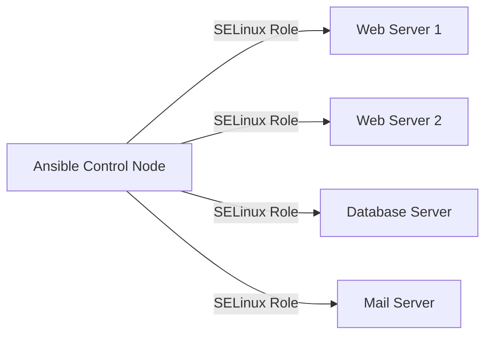

# How to Automate SELinux Configuration Using RHEL System Roles and Ansible

Author: [nawazdhandala](https://www.github.com/nawazdhandala)

Tags: RHEL, SELinux, Ansible, System Roles, Automation, Linux

Description: Use the RHEL System Roles selinux role with Ansible to automate SELinux configuration across your fleet, including booleans, file contexts, ports, and user mappings.

---

## Why Automate SELinux?

Manually running `semanage` and `setsebool` commands on every server is tedious and error-prone. When you have dozens or hundreds of RHEL systems, you need to automate SELinux configuration just like you automate everything else. The RHEL System Roles provide an officially supported Ansible role for SELinux that handles booleans, file contexts, ports, login mappings, and custom modules in a declarative way.

## What Are RHEL System Roles?

RHEL System Roles are a collection of Ansible roles provided and supported by Red Hat. They cover common system administration tasks including networking, storage, timesync, logging, and SELinux. They are tested across RHEL versions and follow Red Hat's best practices.

## Prerequisites

```bash
# Install RHEL System Roles on the Ansible control node
sudo dnf install -y rhel-system-roles

# Or install via Ansible Galaxy
ansible-galaxy collection install redhat.rhel_system_roles
```

The SELinux role is available at `/usr/share/ansible/roles/rhel-system-roles.selinux/` after installation.

## Architecture



## Basic Playbook Structure

Create a playbook that uses the SELinux system role:

```yaml
---
- name: Configure SELinux on web servers
  hosts: webservers
  become: true

  vars:
    selinux_state: enforcing
    selinux_policy: targeted

  roles:
    - role: rhel-system-roles.selinux
```

## Configuring SELinux Mode

Set the SELinux mode and policy:

```yaml
vars:
  # Set SELinux to enforcing with targeted policy
  selinux_state: enforcing
  selinux_policy: targeted
```

Valid states: `enforcing`, `permissive`, `disabled`

## Managing Booleans

```yaml
vars:
  selinux_booleans:
    # Allow Apache to make network connections
    - name: httpd_can_network_connect
      state: on
      persistent: true

    # Allow Apache to connect to databases
    - name: httpd_can_network_connect_db
      state: on
      persistent: true

    # Allow Apache to send mail
    - name: httpd_can_sendmail
      state: on
      persistent: true

    # Allow NFS home directories
    - name: use_nfs_home_dirs
      state: on
      persistent: true
```

## Managing File Contexts

```yaml
vars:
  selinux_fcontexts:
    # Custom web content directory
    - target: '/data/website(/.*)?'
      setype: httpd_sys_content_t
      state: present

    # Writable upload directory
    - target: '/data/website/uploads(/.*)?'
      setype: httpd_sys_rw_content_t
      state: present

    # Custom log directory
    - target: '/data/logs(/.*)?'
      setype: var_log_t
      state: present

  # Apply the file contexts after defining them
  selinux_restore_dirs:
    - /data/website
    - /data/logs
```

## Managing Ports

```yaml
vars:
  selinux_ports:
    # Allow Apache on port 8888
    - ports: 8888
      proto: tcp
      setype: http_port_t
      state: present

    # Allow SSH on port 2222
    - ports: 2222
      proto: tcp
      setype: ssh_port_t
      state: present

    # Allow custom app on port range
    - ports: 9000-9010
      proto: tcp
      setype: http_port_t
      state: present
```

## Managing User Mappings

```yaml
vars:
  selinux_logins:
    # Map regular users to confined user
    - login: __default__
      seuser: user_u
      state: present

    # Map admin to staff
    - login: admin1
      seuser: staff_u
      state: present

    # Map guest
    - login: guest
      seuser: guest_u
      state: present
```

## Installing Custom Modules

```yaml
vars:
  selinux_modules:
    # Install a custom policy module
    - path: files/myapp_custom.pp
      priority: 400
      state: enabled

    # Install a CIL module
    - path: files/deny_httpd_shadow.cil
      priority: 400
      state: enabled
```

Place the module files in your Ansible project's `files/` directory.

## Complete Playbook Example

Here is a complete playbook for a web server:

```yaml
---
- name: Configure SELinux for web servers
  hosts: webservers
  become: true

  vars:
    # Set enforcing mode
    selinux_state: enforcing
    selinux_policy: targeted

    # Configure booleans
    selinux_booleans:
      - name: httpd_can_network_connect
        state: on
        persistent: true
      - name: httpd_can_network_connect_db
        state: on
        persistent: true
      - name: httpd_can_sendmail
        state: on
        persistent: true

    # Configure file contexts
    selinux_fcontexts:
      - target: '/srv/www(/.*)?'
        setype: httpd_sys_content_t
        state: present
      - target: '/srv/www/uploads(/.*)?'
        setype: httpd_sys_rw_content_t
        state: present

    # Restore contexts on these directories
    selinux_restore_dirs:
      - /srv/www

    # Configure ports
    selinux_ports:
      - ports: 8443
        proto: tcp
        setype: http_port_t
        state: present

  roles:
    - role: rhel-system-roles.selinux
```

## Playbook for Database Servers

```yaml
---
- name: Configure SELinux for database servers
  hosts: dbservers
  become: true

  vars:
    selinux_state: enforcing
    selinux_policy: targeted

    selinux_fcontexts:
      - target: '/data/mysql(/.*)?'
        setype: mysqld_db_t
        state: present

    selinux_restore_dirs:
      - /data/mysql

    selinux_ports:
      - ports: 3307
        proto: tcp
        setype: mysqld_port_t
        state: present

  roles:
    - role: rhel-system-roles.selinux
```

## Running the Playbook

```bash
# Run the playbook
ansible-playbook -i inventory selinux-webservers.yml

# Run with verbose output
ansible-playbook -i inventory selinux-webservers.yml -v

# Dry run (check mode)
ansible-playbook -i inventory selinux-webservers.yml --check --diff
```

## Handling Reboot Requirements

Changing from `disabled` to `enforcing` requires a reboot and filesystem relabel. The role handles this:

```yaml
vars:
  selinux_state: enforcing
  selinux_policy: targeted

post_tasks:
  - name: Reboot if SELinux state changed
    reboot:
    when: selinux_reboot_required | default(false)
```

## Inventory Organization

Organize your inventory to apply different SELinux configurations to different server roles:

```ini
[webservers]
web01.example.com
web02.example.com

[dbservers]
db01.example.com

[mailservers]
mail01.example.com
```

Use group variables in `group_vars/` to set SELinux configuration per role.

## Idempotency

The SELinux system role is idempotent. Running it multiple times produces the same result. Booleans that are already set correctly are skipped. File contexts that already exist are not recreated. This makes it safe to run as part of regular configuration management.

## Verifying Configuration

Add verification tasks after the role:

```yaml
post_tasks:
  - name: Verify SELinux is enforcing
    command: getenforce
    register: selinux_mode
    changed_when: false

  - name: Display SELinux mode
    debug:
      msg: "SELinux mode is {{ selinux_mode.stdout }}"
```

## Wrapping Up

Automating SELinux with the RHEL System Roles means your entire fleet stays consistently configured. Define your booleans, file contexts, ports, and user mappings in Ansible variables, run the playbook, and every server gets the same configuration. No more SSHing into boxes to run `semanage` commands manually. The role handles idempotency, ordering, and restorecon for you. Keep your playbooks in version control and run them regularly to prevent configuration drift.
