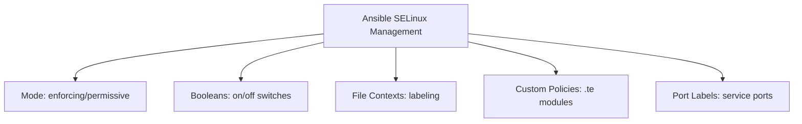

# How to Automate SELinux Policy Management with Ansible

Author: [nawazdhandala](https://www.github.com/nawazdhandala)

Tags: RHEL, Ansible, SELinux, Security, Automation, Linux

Description: Use Ansible to manage SELinux modes, booleans, file contexts, and custom policies consistently across your RHEL servers.

---

SELinux is one of the most powerful security features in RHEL, and also one of the most frequently disabled because people find it hard to manage. Ansible makes SELinux management consistent and reproducible, removing the excuse to turn it off.

## SELinux Management with Ansible



## Setting SELinux Mode

```yaml
# playbook-selinux-mode.yml
# Ensure SELinux is in enforcing mode everywhere
---
- name: Configure SELinux mode
  hosts: all
  become: true

  tasks:
    - name: Set SELinux to enforcing
      ansible.posix.selinux:
        state: enforcing
        policy: targeted
      register: selinux_result

    - name: Reboot if SELinux state changed and requires it
      ansible.builtin.reboot:
        msg: "Rebooting to apply SELinux state change"
      when: selinux_result.reboot_required | default(false)
```

## Managing SELinux Booleans

Booleans are the most common SELinux configuration. They enable or disable specific behaviors:

```yaml
# playbook-selinux-booleans.yml
# Configure SELinux booleans based on server role
---
- name: Configure SELinux booleans
  hosts: all
  become: true

  vars:
    # Booleans for web servers
    webserver_booleans:
      - { name: httpd_can_network_connect, state: true }
      - { name: httpd_can_network_connect_db, state: true }
      - { name: httpd_can_sendmail, state: true }
      - { name: httpd_use_nfs, state: true }
      - { name: httpd_enable_homedirs, state: false }
      - { name: httpd_execmem, state: false }

    # Booleans for NFS
    nfs_booleans:
      - { name: use_nfs_home_dirs, state: true }
      - { name: nfs_export_all_rw, state: true }

    # Booleans for Samba
    samba_booleans:
      - { name: samba_enable_home_dirs, state: true }
      - { name: samba_export_all_rw, state: true }

  tasks:
    - name: Set web server SELinux booleans
      ansible.posix.seboolean:
        name: "{{ item.name }}"
        state: "{{ item.state }}"
        persistent: true
      loop: "{{ webserver_booleans }}"
      when: "'webservers' in group_names"

    - name: Set NFS SELinux booleans
      ansible.posix.seboolean:
        name: "{{ item.name }}"
        state: "{{ item.state }}"
        persistent: true
      loop: "{{ nfs_booleans }}"
      when: "'nfs_servers' in group_names or 'nfs_clients' in group_names"
```

## Managing File Contexts

```yaml
# playbook-selinux-fcontexts.yml
# Set SELinux file contexts for custom directories
---
- name: Configure SELinux file contexts
  hosts: webservers
  become: true

  tasks:
    - name: Set web content context for custom directory
      community.general.sefcontext:
        target: "/srv/webapp(/.*)?"
        setype: httpd_sys_content_t
        state: present
      notify: Restore SELinux contexts

    - name: Set writable context for upload directory
      community.general.sefcontext:
        target: "/srv/webapp/uploads(/.*)?"
        setype: httpd_sys_rw_content_t
        state: present
      notify: Restore SELinux contexts

    - name: Set script context for CGI directory
      community.general.sefcontext:
        target: "/srv/webapp/cgi-bin(/.*)?"
        setype: httpd_sys_script_exec_t
        state: present
      notify: Restore SELinux contexts

    - name: Set log context for custom log directory
      community.general.sefcontext:
        target: "/srv/webapp/logs(/.*)?"
        setype: httpd_log_t
        state: present
      notify: Restore SELinux contexts

  handlers:
    - name: Restore SELinux contexts
      ansible.builtin.command: restorecon -Rv /srv/webapp
```

## Managing Port Labels

```yaml
# playbook-selinux-ports.yml
# Allow services to use non-standard ports
---
- name: Configure SELinux port labels
  hosts: all
  become: true

  tasks:
    - name: Allow Apache to listen on port 8443
      community.general.seport:
        ports: 8443
        proto: tcp
        setype: http_port_t
        state: present
      when: "'webservers' in group_names"

    - name: Allow PostgreSQL on non-standard port
      community.general.seport:
        ports: 5433
        proto: tcp
        setype: postgresql_port_t
        state: present
      when: "'dbservers' in group_names"

    - name: Allow SSH on non-standard port
      community.general.seport:
        ports: 2222
        proto: tcp
        setype: ssh_port_t
        state: present
```

## Deploying Custom SELinux Policies

For cases where booleans and contexts are not enough:

```yaml
# playbook-selinux-custom.yml
# Deploy custom SELinux policy module
---
- name: Deploy custom SELinux policy
  hosts: appservers
  become: true

  tasks:
    - name: Install SELinux policy development tools
      ansible.builtin.dnf:
        name:
          - policycoreutils-python-utils
          - selinux-policy-devel
        state: present

    - name: Copy custom policy source
      ansible.builtin.copy:
        dest: /tmp/myapp.te
        mode: "0644"
        content: |
          # Custom policy for myapp
          module myapp 1.0;

          require {
              type httpd_t;
              type user_home_t;
              class file { read open getattr };
          }

          # Allow httpd to read files in user home directories
          allow httpd_t user_home_t:file { read open getattr };

    - name: Compile the policy module
      ansible.builtin.command: checkmodule -M -m -o /tmp/myapp.mod /tmp/myapp.te
      changed_when: true

    - name: Package the policy module
      ansible.builtin.command: semodule_package -o /tmp/myapp.pp -m /tmp/myapp.mod
      changed_when: true

    - name: Install the policy module
      ansible.builtin.command: semodule -i /tmp/myapp.pp
      changed_when: true

    - name: Clean up build files
      ansible.builtin.file:
        path: "{{ item }}"
        state: absent
      loop:
        - /tmp/myapp.te
        - /tmp/myapp.mod
        - /tmp/myapp.pp
```

## Auditing SELinux Denials

```yaml
# playbook-selinux-audit.yml
# Check for SELinux denials across the fleet
---
- name: Audit SELinux denials
  hosts: all
  become: true

  tasks:
    - name: Check for recent SELinux denials
      ansible.builtin.shell: |
        # Find denials in the last 24 hours
        ausearch -m avc -ts recent 2>/dev/null | head -50 || echo "No recent denials"
      register: denials
      changed_when: false

    - name: Report denials
      ansible.builtin.debug:
        msg: |
          Host: {{ inventory_hostname }}
          SELinux denials:
          {{ denials.stdout }}
      when: "'No recent denials' not in denials.stdout"
```

## Wrapping Up

SELinux is too important to manage by hand or disable. Ansible gives you a way to manage booleans, file contexts, port labels, and even custom policies consistently across your fleet. The most common SELinux tasks (setting booleans, labeling directories) are one-liners with the ansible.posix collection. For custom policies, automate the compile-package-install workflow so it is repeatable. There is no good reason to run RHEL in permissive mode when you can automate the policy management.
