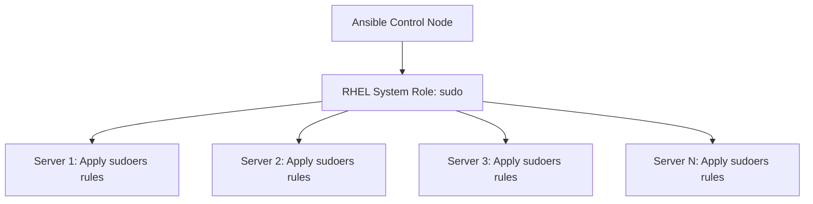

# How to Automate Sudo Configuration with the RHEL 9 Sudo System Role

Author: [nawazdhandala](https://www.github.com/nawazdhandala)

Tags: RHEL, sudo, Ansible, System Roles, Linux

Description: Use the RHEL System Role for sudo to automate sudoers configuration across your fleet with Ansible, ensuring consistent and auditable policies.

---

Managing sudoers files by hand works for a few servers but falls apart when you have dozens or hundreds. The RHEL System Roles collection includes a sudo role that lets you define your entire sudo policy in Ansible and push it consistently across your fleet.

## What Are RHEL System Roles

RHEL System Roles are a set of Ansible roles maintained by Red Hat for managing common system configurations. They ship as an RPM package and cover things like networking, storage, timesync, and sudo.



## Installing RHEL System Roles

On your Ansible control node:

```bash
# Install the RHEL System Roles package
sudo dnf install rhel-system-roles -y
```

The sudo role is installed to `/usr/share/ansible/roles/rhel-system-roles.sudo/`.

Verify the installation:

```bash
ls /usr/share/ansible/roles/ | grep sudo
```

## Basic Playbook Structure

Create a playbook that uses the sudo system role:

```bash
vi ~/playbooks/configure-sudo.yml
```

```yaml
---
- name: Configure sudo policies on all servers
  hosts: all
  become: true

  vars:
    # Reset any existing drop-in files (clean slate)
    sudo_remove_all: false

    # Define sudoers rules
    sudo_sudoers:
      - name: webadmins
        state: present
        users:
          - "%webadmins"
        hosts:
          - ALL
        commands:
          - /usr/bin/systemctl start httpd
          - /usr/bin/systemctl stop httpd
          - /usr/bin/systemctl restart httpd
          - /usr/bin/systemctl reload httpd
          - /usr/bin/systemctl status httpd

      - name: dbadmins
        state: present
        users:
          - "%dbadmins"
        hosts:
          - ALL
        commands:
          - /usr/bin/systemctl start postgresql
          - /usr/bin/systemctl stop postgresql
          - /usr/bin/systemctl restart postgresql
          - /usr/bin/systemctl status postgresql

      - name: monitoring
        state: present
        users:
          - "%monitoring"
        hosts:
          - ALL
        nopassword: true
        commands:
          - /usr/bin/journalctl
          - /usr/bin/ss
          - /usr/bin/lsblk

  roles:
    - rhel-system-roles.sudo
```

## Running the Playbook

```bash
# Run against all hosts in your inventory
ansible-playbook ~/playbooks/configure-sudo.yml

# Run against a specific group
ansible-playbook ~/playbooks/configure-sudo.yml --limit webservers

# Dry run to see what would change
ansible-playbook ~/playbooks/configure-sudo.yml --check --diff
```

## Advanced Configuration

### Using defaults

```yaml
sudo_sudoers:
  - name: global-defaults
    state: present
    defaults:
      - "!visiblepw"
      - "env_reset"
      - "env_keep += HOME"
      - 'secure_path="/usr/local/sbin:/usr/local/bin:/usr/sbin:/usr/bin:/sbin:/bin"'
      - 'logfile="/var/log/sudo.log"'
      - "log_year"
```

### Per-user rules

```yaml
sudo_sudoers:
  - name: deploy-user
    state: present
    users:
      - deploy
    hosts:
      - ALL
    runas:
      - root
    nopassword: true
    commands:
      - /opt/deploy/run-deploy.sh
      - /usr/bin/systemctl restart myapp
```

### Removing old rules

```yaml
sudo_sudoers:
  - name: old-team-rule
    state: absent
```

### Clean slate approach

If you want to remove all existing drop-in files and start fresh:

```yaml
sudo_remove_all: true
sudo_sudoers:
  # ... define all your rules here
```

## Organizing by Environment

### Use group variables for environment-specific rules

Create a directory structure:

```
inventory/
  group_vars/
    webservers.yml
    dbservers.yml
    all.yml
  hosts
```

In `group_vars/webservers.yml`:

```yaml
sudo_sudoers:
  - name: webadmins
    state: present
    users:
      - "%webadmins"
    hosts:
      - ALL
    commands:
      - /usr/bin/systemctl start httpd
      - /usr/bin/systemctl stop httpd
      - /usr/bin/systemctl restart httpd
      - /usr/bin/systemctl reload httpd
```

In `group_vars/dbservers.yml`:

```yaml
sudo_sudoers:
  - name: dbadmins
    state: present
    users:
      - "%dbadmins"
    hosts:
      - ALL
    commands:
      - /usr/bin/systemctl start postgresql
      - /usr/bin/systemctl stop postgresql
      - /usr/bin/systemctl restart postgresql
```

In `group_vars/all.yml`:

```yaml
# Rules that apply to all servers
sudo_sudoers:
  - name: monitoring
    state: present
    users:
      - "%monitoring"
    hosts:
      - ALL
    nopassword: true
    commands:
      - /usr/bin/journalctl
      - /usr/bin/ss
```

## Verifying the Configuration

After running the playbook, verify on a target host:

```bash
# Check that the files were created
ls -la /etc/sudoers.d/

# Validate syntax
sudo visudo -c

# Test a specific user's access
sudo -l -U alice
```

## Integrating with CI/CD

### Add syntax checking to your pipeline

```yaml
# In your CI/CD pipeline
- name: Validate sudo configuration
  hosts: localhost
  tasks:
    - name: Run ansible-playbook in check mode
      command: >
        ansible-playbook configure-sudo.yml
        --check --diff
        --syntax-check
```

### Use a staging environment

```bash
# Test on staging first
ansible-playbook configure-sudo.yml --limit staging --check --diff

# If it looks good, apply to staging
ansible-playbook configure-sudo.yml --limit staging

# Then apply to production
ansible-playbook configure-sudo.yml --limit production
```

## Troubleshooting

### Role not found

```bash
# Verify the role is installed
ansible-galaxy role list | grep sudo

# Check the role path
ansible-config dump | grep ROLES_PATH
```

### Playbook fails with syntax errors in sudoers

The system role validates syntax before writing files. If it reports an error, check your command paths and user specifications.

### Changes not taking effect

```bash
# Check if the file was actually written
ansible -m shell -a "ls -la /etc/sudoers.d/" webservers

# Check if there is a conflicting rule elsewhere
ansible -m shell -a "sudo visudo -c" webservers
```

## Wrapping Up

The RHEL System Role for sudo takes the guesswork out of managing sudoers across a fleet. Define your policies in Ansible variables, push them with a playbook, and every server gets the same consistent configuration. Use the check mode for dry runs, organize rules by environment using group variables, and always validate with `visudo -c` after deployment. This is how you manage sudo at scale without losing sleep over configuration drift.
