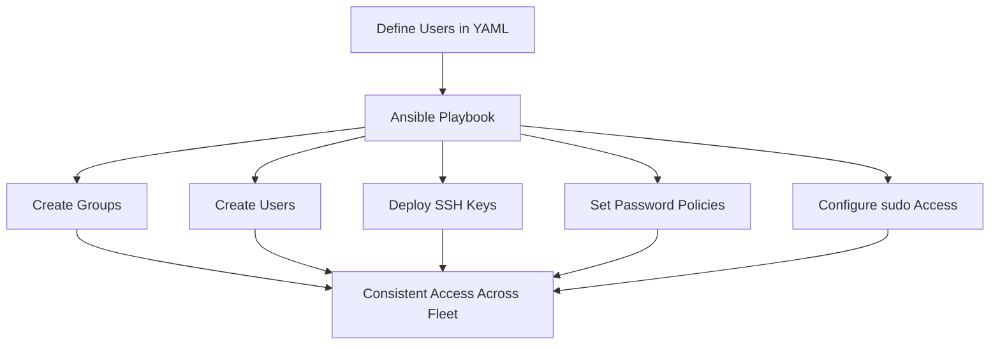

# How to Automate User and Group Management with Ansible on RHEL 9

Author: [nawazdhandala](https://www.github.com/nawazdhandala)

Tags: RHEL, Ansible, User Management, Groups, Automation, Linux

Description: Manage user accounts, groups, SSH keys, and access policies across RHEL 9 servers using Ansible for consistent identity management.

---

Creating users by hand on every server does not scale. Ansible lets you define your users and groups in one place and ensure every server has the right accounts with the right permissions and the right SSH keys.

## User Management Workflow



## Define Users as Variables

```yaml
# group_vars/all/users.yml
# Central user definitions
---
user_groups:
  - name: developers
    gid: 2000
  - name: ops
    gid: 2001
  - name: dba
    gid: 2002

users:
  - username: jdoe
    comment: "Jane Doe"
    uid: 3001
    groups:
      - developers
      - wheel
    ssh_keys:
      - "ssh-ed25519 AAAAC3NzaC1lZDI1NTE5AAAA... jdoe@workstation"
    shell: /bin/bash
    state: present

  - username: bsmith
    comment: "Bob Smith"
    uid: 3002
    groups:
      - ops
      - wheel
    ssh_keys:
      - "ssh-ed25519 AAAAC3NzaC1lZDI1NTE5AAAA... bsmith@workstation"
    shell: /bin/bash
    state: present

  - username: mjones
    comment: "Mary Jones"
    uid: 3003
    groups:
      - dba
    ssh_keys:
      - "ssh-ed25519 AAAAC3NzaC1lZDI1NTE5AAAA... mjones@workstation"
    shell: /bin/bash
    state: present

  # Remove a former employee
  - username: oldemployee
    state: absent
    remove: true
```

## Basic User Management Playbook

```yaml
# playbook-users.yml
# Manage users and groups across all servers
---
- name: Manage users and groups
  hosts: all
  become: true

  tasks:
    - name: Create groups
      ansible.builtin.group:
        name: "{{ item.name }}"
        gid: "{{ item.gid }}"
        state: present
      loop: "{{ user_groups }}"

    - name: Create or remove user accounts
      ansible.builtin.user:
        name: "{{ item.username }}"
        comment: "{{ item.comment | default(omit) }}"
        uid: "{{ item.uid | default(omit) }}"
        groups: "{{ item.groups | default(omit) }}"
        shell: "{{ item.shell | default('/bin/bash') }}"
        state: "{{ item.state }}"
        remove: "{{ item.remove | default(false) }}"
        create_home: true
      loop: "{{ users }}"

    - name: Deploy SSH authorized keys
      ansible.posix.authorized_key:
        user: "{{ item.username }}"
        key: "{{ item.ssh_keys | join('\n') }}"
        exclusive: true  # Remove any keys not in the list
        state: present
      loop: "{{ users }}"
      when:
        - item.state == "present"
        - item.ssh_keys is defined
```

## Setting Passwords Securely

Use Ansible Vault to store password hashes:

```bash
# Generate a password hash
python3 -c "import crypt; print(crypt.crypt('UserPassword123', crypt.mksalt(crypt.METHOD_SHA512)))"
```

```yaml
# group_vars/all/vault.yml (encrypted with ansible-vault)
vault_user_passwords:
  jdoe: "$6$rounds=656000$salt$hash..."
  bsmith: "$6$rounds=656000$salt$hash..."
```

```yaml
# In the playbook, set passwords
- name: Set user passwords
  ansible.builtin.user:
    name: "{{ item.username }}"
    password: "{{ vault_user_passwords[item.username] }}"
    update_password: on_create  # Only set password on first creation
  loop: "{{ users }}"
  when:
    - item.state == "present"
    - item.username in vault_user_passwords
```

## Configuring sudo Access

```yaml
# playbook-sudo.yml
# Configure sudo access for users and groups
---
- name: Configure sudo
  hosts: all
  become: true

  tasks:
    - name: Allow wheel group passwordless sudo
      ansible.builtin.copy:
        content: |
          # Allow wheel group members to use sudo without password
          %wheel ALL=(ALL) NOPASSWD: ALL
        dest: /etc/sudoers.d/wheel-nopasswd
        mode: "0440"
        validate: "visudo -cf %s"

    - name: Allow ops group to restart specific services
      ansible.builtin.copy:
        content: |
          # Allow ops group to manage specific services
          %ops ALL=(root) NOPASSWD: /usr/bin/systemctl restart httpd
          %ops ALL=(root) NOPASSWD: /usr/bin/systemctl restart nginx
          %ops ALL=(root) NOPASSWD: /usr/bin/systemctl restart postgresql
        dest: /etc/sudoers.d/ops-services
        mode: "0440"
        validate: "visudo -cf %s"

    - name: Allow dba group database access
      ansible.builtin.copy:
        content: |
          # Allow dba group to run commands as postgres user
          %dba ALL=(postgres) NOPASSWD: ALL
        dest: /etc/sudoers.d/dba-postgres
        mode: "0440"
        validate: "visudo -cf %s"
```

## Password Policy Configuration

```yaml
# playbook-password-policy.yml
# Configure password aging and complexity policies
---
- name: Configure password policies
  hosts: all
  become: true

  tasks:
    - name: Set default password aging in login.defs
      ansible.builtin.lineinfile:
        path: /etc/login.defs
        regexp: "^{{ item.key }}"
        line: "{{ item.key }}\t{{ item.value }}"
      loop:
        - { key: "PASS_MAX_DAYS", value: "90" }
        - { key: "PASS_MIN_DAYS", value: "7" }
        - { key: "PASS_MIN_LEN", value: "12" }
        - { key: "PASS_WARN_AGE", value: "14" }

    - name: Set password aging for existing users
      ansible.builtin.command: >
        chage --maxdays 90 --mindays 7 --warndays 14 {{ item.username }}
      loop: "{{ users }}"
      when: item.state == "present"
      changed_when: false
```

## Role-Based User Management

For different types of servers, you might want different user sets:

```yaml
# group_vars/webservers/users.yml
additional_users:
  - username: webadmin
    comment: "Web Administrator"
    uid: 4001
    groups:
      - ops
      - apache
    shell: /bin/bash
    state: present
```

```yaml
# playbook-users-rolebased.yml
---
- name: Manage users by server role
  hosts: all
  become: true

  tasks:
    - name: Manage base users on all servers
      ansible.builtin.include_tasks: tasks/manage-users.yml
      vars:
        user_list: "{{ users }}"

    - name: Manage role-specific users
      ansible.builtin.include_tasks: tasks/manage-users.yml
      vars:
        user_list: "{{ additional_users | default([]) }}"
      when: additional_users is defined
```

## Auditing User Access

```yaml
# playbook-user-audit.yml
# Audit user accounts across all servers
---
- name: Audit user accounts
  hosts: all
  become: true

  tasks:
    - name: Get all users with UID >= 1000
      ansible.builtin.shell: |
        # List all regular user accounts
        awk -F: '$3 >= 1000 && $3 < 65534 {print $1":"$3":"$7}' /etc/passwd
      register: system_users
      changed_when: false

    - name: Get users with sudo access
      ansible.builtin.shell: |
        # Find users in wheel or sudo groups
        getent group wheel | cut -d: -f4
      register: sudo_users
      changed_when: false

    - name: Display user audit
      ansible.builtin.debug:
        msg: |
          Host: {{ inventory_hostname }}
          Users: {{ system_users.stdout_lines }}
          Sudo users: {{ sudo_users.stdout }}
```

## Wrapping Up

Centralized user management with Ansible eliminates the "who has access to what" guessing game. Define your users in YAML, store passwords in Vault, manage SSH keys and sudo rules alongside the user definitions, and you have a complete identity management solution. The `exclusive: true` option on authorized_key is especially important since it removes any SSH keys that are not in your defined list, which is how you revoke access when someone leaves.
