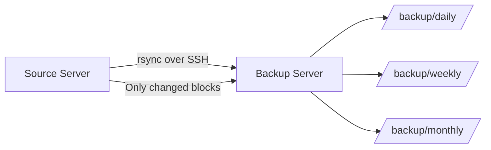

# How to Set Up Automated Backups with rsync and Cron on RHEL

Author: [nawazdhandala](https://www.github.com/nawazdhandala)

Tags: RHEL, Rsync, Cron, Backup, Automation, Linux

Description: Configure automated file and directory backups on RHEL using rsync with cron scheduling for reliable data protection.

---

rsync is the workhorse of Linux backup strategies. It copies only changed data, preserves permissions, and works over SSH. Combined with cron, you get a simple but effective backup system that does not need any extra software.

## How rsync Backups Work



## Basic rsync Backup Script

```bash
#!/bin/bash
# /usr/local/bin/backup.sh
# Daily backup script using rsync

# Configuration
BACKUP_SOURCE="/etc /home /var/www /opt/app"
BACKUP_DEST="/backup/daily"
LOG_FILE="/var/log/backup.log"
DATE=$(date +%Y-%m-%d_%H%M)

# Create backup directory if it does not exist
mkdir -p "$BACKUP_DEST"

# Log the start time
echo "=== Backup started at $(date) ===" >> "$LOG_FILE"

# Run rsync for each source directory
for SRC in $BACKUP_SOURCE; do
    echo "Backing up $SRC..." >> "$LOG_FILE"
    
    # rsync options:
    # -a  archive mode (preserves permissions, ownership, timestamps)
    # -v  verbose output
    # -z  compress data during transfer
    # --delete  remove files from destination that no longer exist in source
    # --exclude  skip certain directories
    rsync -avz --delete \
        --exclude='*.tmp' \
        --exclude='*.cache' \
        --exclude='.git' \
        "$SRC" "$BACKUP_DEST/" \
        >> "$LOG_FILE" 2>&1
done

# Log the end time
echo "=== Backup completed at $(date) ===" >> "$LOG_FILE"
echo "" >> "$LOG_FILE"
```

Make it executable:

```bash
sudo chmod +x /usr/local/bin/backup.sh
```

## Setting Up the Cron Job

```bash
# Edit the root crontab
sudo crontab -e
```

Add:

```bash
# Run daily backup at 2:00 AM
0 2 * * * /usr/local/bin/backup.sh

# Run weekly full backup on Sunday at 3:00 AM
0 3 * * 0 /usr/local/bin/backup-weekly.sh

# Clean up old backups on the 1st of each month
0 4 1 * * /usr/local/bin/backup-cleanup.sh
```

## Backup with Rotation

```bash
#!/bin/bash
# /usr/local/bin/backup-rotate.sh
# Backup with daily/weekly/monthly rotation

BACKUP_BASE="/backup"
SOURCE_DIRS="/etc /home /var/www"
DATE=$(date +%Y-%m-%d)
DAY_OF_WEEK=$(date +%u)  # 1=Monday, 7=Sunday
DAY_OF_MONTH=$(date +%d)
LOG="/var/log/backup-rotate.log"

# Determine backup type and destination
if [ "$DAY_OF_MONTH" = "01" ]; then
    BACKUP_TYPE="monthly"
    DEST="$BACKUP_BASE/monthly/$DATE"
elif [ "$DAY_OF_WEEK" = "7" ]; then
    BACKUP_TYPE="weekly"
    DEST="$BACKUP_BASE/weekly/$DATE"
else
    BACKUP_TYPE="daily"
    DEST="$BACKUP_BASE/daily/$DATE"
fi

echo "$(date): Starting $BACKUP_TYPE backup to $DEST" >> "$LOG"
mkdir -p "$DEST"

# Use hard links to the most recent backup to save space
LATEST="$BACKUP_BASE/latest"
LINK_OPTS=""
if [ -d "$LATEST" ]; then
    LINK_OPTS="--link-dest=$LATEST"
fi

# Run the backup
for SRC in $SOURCE_DIRS; do
    rsync -a --delete $LINK_OPTS \
        --exclude='*.tmp' \
        --exclude='lost+found' \
        "$SRC" "$DEST/" >> "$LOG" 2>&1
done

# Update the "latest" symlink
rm -f "$LATEST"
ln -s "$DEST" "$LATEST"

# Clean up old backups
# Keep 7 daily, 4 weekly, 6 monthly
find "$BACKUP_BASE/daily" -maxdepth 1 -type d -mtime +7 -exec rm -rf {} \; 2>/dev/null
find "$BACKUP_BASE/weekly" -maxdepth 1 -type d -mtime +28 -exec rm -rf {} \; 2>/dev/null
find "$BACKUP_BASE/monthly" -maxdepth 1 -type d -mtime +180 -exec rm -rf {} \; 2>/dev/null

echo "$(date): $BACKUP_TYPE backup complete" >> "$LOG"
```

## Pre-backup Database Dump

```bash
#!/bin/bash
# /usr/local/bin/backup-full.sh
# Full backup including database dumps

LOG="/var/log/backup-full.log"
BACKUP_DEST="/backup/daily/$(date +%Y-%m-%d)"
DB_DUMP_DIR="/var/tmp/db-dumps"

mkdir -p "$BACKUP_DEST" "$DB_DUMP_DIR"

echo "$(date): Starting full backup" >> "$LOG"

# Step 1: Dump databases before file backup
echo "Dumping PostgreSQL databases..." >> "$LOG"
sudo -u postgres pg_dumpall > "$DB_DUMP_DIR/postgresql_all.sql" 2>> "$LOG"

echo "Dumping MariaDB databases..." >> "$LOG"
mysqldump --all-databases > "$DB_DUMP_DIR/mariadb_all.sql" 2>> "$LOG"

# Step 2: Backup files including database dumps
rsync -a --delete \
    /etc \
    /home \
    /var/www \
    /opt/app \
    "$DB_DUMP_DIR" \
    "$BACKUP_DEST/" >> "$LOG" 2>&1

# Step 3: Clean up temp dumps
rm -rf "$DB_DUMP_DIR"

# Step 4: Verify the backup
BACKUP_SIZE=$(du -sh "$BACKUP_DEST" | cut -f1)
echo "$(date): Backup complete. Size: $BACKUP_SIZE" >> "$LOG"

# Step 5: Send notification
echo "Backup completed on $(hostname) - Size: $BACKUP_SIZE" | \
    mail -s "Backup Report $(date +%Y-%m-%d)" admin@example.com
```

## Verifying Backups

```bash
# Check backup size and file count
du -sh /backup/daily/*/
find /backup/daily/$(date +%Y-%m-%d) -type f | wc -l

# Verify specific files exist in the backup
ls -la /backup/daily/$(date +%Y-%m-%d)/etc/

# Compare source and backup
rsync -avnc /etc/ /backup/daily/$(date +%Y-%m-%d)/etc/
# -n = dry run, -c = checksum comparison
```

## Wrapping Up

rsync with cron is the simplest backup solution that actually works. The `--link-dest` option for hard-linked incremental backups is the key feature that makes this practical. Each daily backup looks like a full copy but only uses disk space for files that actually changed. Add database dumps before the file backup, set up rotation to manage disk space, and you have a reliable backup system with zero extra software required.
