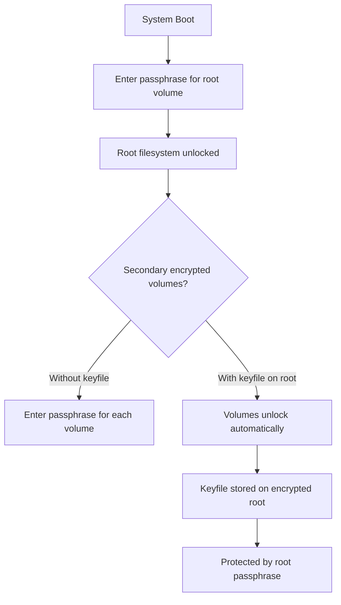

# How to Configure Automated LUKS Unlocking with a Keyfile on RHEL

Author: [nawazdhandala](https://www.github.com/nawazdhandala)

Tags: RHEL, LUKS, Keyfile, Automated Unlock, Encryption, Linux

Description: Set up automated LUKS volume unlocking on RHEL using keyfiles to avoid manual passphrase entry at boot for secondary encrypted volumes.

---

Manually entering a passphrase every time the system boots can be inconvenient, especially for servers with multiple encrypted volumes. Using a keyfile allows LUKS to unlock encrypted devices automatically during boot. This is particularly useful for secondary data volumes where the root filesystem is already encrypted with a passphrase. This guide covers keyfile setup on RHEL.

## When to Use Keyfile Unlocking



The keyfile is stored on the encrypted root filesystem. Since root is unlocked first with a passphrase, the keyfile is only accessible after the root passphrase is entered. This provides a chain of trust without requiring multiple passphrase entries.

## Step 1: Generate a Random Keyfile

```bash
# Generate a high-quality random keyfile
sudo dd if=/dev/urandom of=/root/luks-data.keyfile bs=4096 count=1

# Set strict permissions (only root can read)
sudo chmod 400 /root/luks-data.keyfile
sudo chown root:root /root/luks-data.keyfile
```

You can also create keyfiles from other random sources:

```bash
# Using openssl
sudo openssl rand -out /root/luks-data.keyfile 4096

# Set permissions
sudo chmod 400 /root/luks-data.keyfile
```

## Step 2: Add the Keyfile to the LUKS Device

```bash
# Add the keyfile to the LUKS device
# You will need to enter an existing passphrase to authorize this
sudo cryptsetup luksAddKey /dev/sdb /root/luks-data.keyfile

# Verify the key was added
sudo cryptsetup luksDump /dev/sdb | grep "Keyslots:" -A20
```

Test that the keyfile works:

```bash
# Close the device if open
sudo umount /mnt/encrypted-data 2>/dev/null
sudo cryptsetup luksClose data_encrypted 2>/dev/null

# Open with the keyfile
sudo cryptsetup luksOpen /dev/sdb data_encrypted --key-file /root/luks-data.keyfile

# Verify it worked
ls /dev/mapper/data_encrypted
```

## Step 3: Configure /etc/crypttab

The `/etc/crypttab` file tells the system how to unlock encrypted devices during boot:

```bash
# Get the UUID of the LUKS device
sudo blkid /dev/sdb
# Note the UUID value
```

Add an entry to `/etc/crypttab`:

```bash
# Format: name UUID=<uuid> keyfile options
# Example:
echo "data_encrypted UUID=12345678-1234-1234-1234-123456789abc /root/luks-data.keyfile luks" | \
    sudo tee -a /etc/crypttab
```

The fields are:
- `data_encrypted` - the name for the mapped device (/dev/mapper/data_encrypted)
- `UUID=...` - the UUID of the LUKS device
- `/root/luks-data.keyfile` - path to the keyfile
- `luks` - options (use `luks,discard` if the device is an SSD)

## Step 4: Configure /etc/fstab

Add the mount entry for the unlocked device:

```bash
# Add to fstab
echo "/dev/mapper/data_encrypted /mnt/encrypted-data xfs defaults 0 2" | \
    sudo tee -a /etc/fstab
```

## Step 5: Test the Configuration

```bash
# Close the device
sudo umount /mnt/encrypted-data 2>/dev/null
sudo cryptsetup luksClose data_encrypted 2>/dev/null

# Test crypttab and fstab without rebooting
sudo cryptdisks_start data_encrypted 2>/dev/null || \
    sudo cryptsetup luksOpen --key-file /root/luks-data.keyfile \
    UUID=12345678-1234-1234-1234-123456789abc data_encrypted

sudo mount -a

# Verify the mount
df -h /mnt/encrypted-data
```

## Step 6: Update the initramfs

If the encrypted volume needs to be available early in the boot process:

```bash
# Rebuild the initramfs to include the keyfile
sudo dracut --force

# Verify the initramfs was rebuilt
ls -la /boot/initramfs-$(uname -r).img
```

## Reboot and Verify

```bash
# Reboot the system
sudo systemctl reboot

# After reboot, verify the volume was automatically unlocked and mounted
df -h /mnt/encrypted-data
sudo cryptsetup status data_encrypted
```

## Setting Up Multiple Volumes with One Keyfile

You can use the same keyfile for multiple encrypted volumes:

```bash
# Add the keyfile to additional LUKS devices
sudo cryptsetup luksAddKey /dev/sdc /root/luks-data.keyfile
sudo cryptsetup luksAddKey /dev/sdd /root/luks-data.keyfile

# Add entries to /etc/crypttab for each device
cat << 'EOF' | sudo tee -a /etc/crypttab
data_vol1 UUID=uuid-for-sdc /root/luks-data.keyfile luks
data_vol2 UUID=uuid-for-sdd /root/luks-data.keyfile luks
EOF

# Add mount entries to /etc/fstab
cat << 'EOF' | sudo tee -a /etc/fstab
/dev/mapper/data_vol1 /mnt/data1 xfs defaults 0 2
/dev/mapper/data_vol2 /mnt/data2 xfs defaults 0 2
EOF
```

## Using a Keyfile on a USB Drive

For additional security, store the keyfile on a removable USB drive:

```bash
# Create the keyfile on the USB drive
sudo dd if=/dev/urandom of=/media/usb/luks.keyfile bs=4096 count=1
sudo chmod 400 /media/usb/luks.keyfile

# Add it to the LUKS device
sudo cryptsetup luksAddKey /dev/sdb /media/usb/luks.keyfile

# In crypttab, reference the USB path
# Note: you need to ensure the USB is mounted before the LUKS device
```

## Security Considerations

1. **Keyfile permissions are critical.** The keyfile must be readable only by root (chmod 400).

2. **The keyfile is only as secure as its storage location.** If stored on the encrypted root filesystem, it is protected by the root volume's passphrase.

3. **Keep a passphrase as a backup.** Never remove the passphrase key slot. If the keyfile is lost or corrupted, you need a passphrase to recover.

4. **Back up the keyfile securely.** If the keyfile is lost and you have no passphrase, the data is unrecoverable.

5. **For root volumes**, using a keyfile alone is generally not secure because the keyfile must be available before root is mounted. Use a passphrase for root and keyfiles only for secondary volumes.

## Troubleshooting

### Volume Does Not Unlock at Boot

```bash
# Check the system journal for errors
sudo journalctl -b | grep -i "crypt\|luks"

# Verify crypttab syntax
cat /etc/crypttab

# Verify the keyfile exists and has correct permissions
ls -la /root/luks-data.keyfile

# Test manual unlock
sudo cryptsetup luksOpen --key-file /root/luks-data.keyfile /dev/sdb data_encrypted
```

### Keyfile Path Not Found During Boot

Make sure the keyfile is on a filesystem that is mounted before the LUKS device is processed. The root filesystem is always available, making `/root/` a safe location for keyfiles.

## Summary

Automated LUKS unlocking with keyfiles on RHEL eliminates the need to manually enter passphrases for secondary encrypted volumes. Generate a random keyfile, add it to the LUKS device, configure `/etc/crypttab` with the keyfile path, and set up `/etc/fstab` for automatic mounting. Always keep a passphrase key slot as a backup, and store the keyfile on an encrypted filesystem to maintain the security chain.
