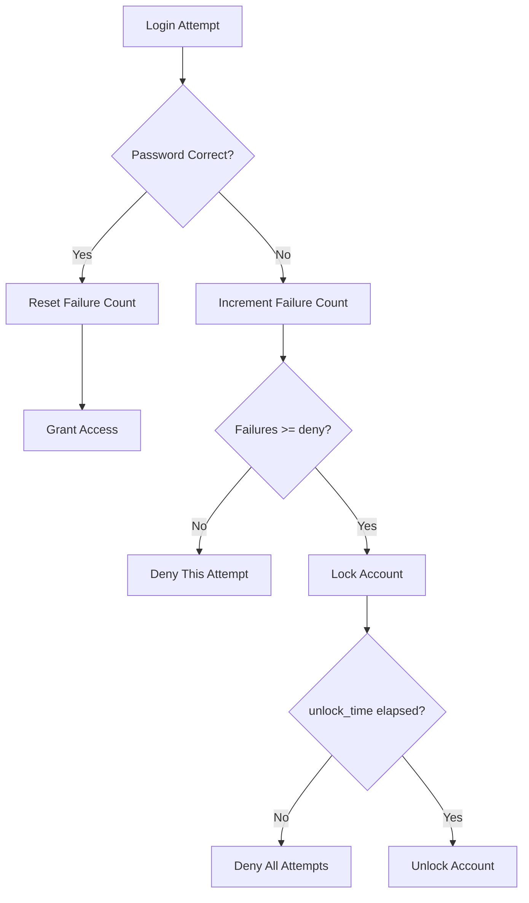

# How to Configure Automatic Account Locking with pam_faillock on RHEL

Author: [nawazdhandala](https://www.github.com/nawazdhandala)

Tags: RHEL, pam_faillock, Account Locking, Security, Linux

Description: Step-by-step guide to configuring pam_faillock on RHEL for automatic account lockout after failed login attempts, including how to unlock accounts and exclude specific users.

---

Brute-force attacks against user accounts are still one of the most common threats to any Linux server. On RHEL, `pam_faillock` is the standard module for automatically locking accounts after repeated failed authentication attempts. It replaced the older `pam_tally2` module, and it integrates cleanly with authselect.

## Enabling pam_faillock with authselect

The recommended way to enable faillock is through authselect, not by manually editing PAM files.

```bash
# Enable the faillock feature on the current profile
sudo authselect enable-feature with-faillock

# Verify it was enabled
sudo authselect current
```

This automatically inserts the correct `pam_faillock.so` lines into `/etc/pam.d/system-auth` and `/etc/pam.d/password-auth`.

## Configuring Lockout Parameters

The main configuration file for faillock is `/etc/security/faillock.conf`.

```bash
sudo vi /etc/security/faillock.conf
```

Here are the key settings:

```
# Number of failed attempts before locking the account
deny = 5

# Time in seconds before the lock is automatically released (900 = 15 minutes)
unlock_time = 900

# Time window in seconds for counting failures (600 = 10 minutes)
fail_interval = 600

# Directory to store failure records
dir = /var/run/faillock

# Do not print failure information when authenticating
silent

# Also track failures for root (disabled by default)
# even_deny_root

# Separate lockout time for root
# root_unlock_time = 60

# Log failed attempts to syslog
audit
```

### What these settings mean in practice

With the configuration above:
- If a user fails to log in 5 times within 10 minutes, the account is locked.
- The lock automatically expires after 15 minutes.
- The root account is not affected by default.



## Locking Root Too

By default, faillock does not lock the root account. This is intentional because locking root could leave you unable to fix problems. However, some compliance standards require it.

```bash
sudo vi /etc/security/faillock.conf
```

Uncomment or add:

```
# Enable lockout for root as well
even_deny_root

# Use a shorter lockout time for root
root_unlock_time = 60
```

Be extremely careful with this. If root gets locked and you do not have console access, you could be in trouble.

## Checking Account Lock Status

### View failed attempts for all users

```bash
# Show failure records for all users
sudo faillock
```

### View failures for a specific user

```bash
sudo faillock --user jsmith
```

Example output:

```
jsmith:
When                Type  Source                                           Valid
2026-03-04 10:15:32 RHOST 192.168.1.50                                    V
2026-03-04 10:15:35 RHOST 192.168.1.50                                    V
2026-03-04 10:15:38 RHOST 192.168.1.50                                    V
```

The `V` flag means the failure is still valid (within the fail_interval window).

## Manually Unlocking an Account

When a user gets locked out and calls you in a panic:

```bash
# Reset the failure counter for a specific user
sudo faillock --user jsmith --reset

# Verify the account is unlocked
sudo faillock --user jsmith
```

## Excluding Specific Users from Lockout

Some service accounts or emergency access accounts should never be locked out.

### Using the local_users_only option

If you only want faillock to apply to local users (not LDAP or AD users):

```
# In /etc/security/faillock.conf
local_users_only
```

### Using pam_access for exceptions

You can combine faillock with `pam_access.so` to create more nuanced rules. But the simplest approach for excluding specific accounts is to add them to the `even_deny_root` exception by not using that setting and handling root separately.

## Testing the Configuration

Always test faillock before relying on it in production.

### Test with a non-root user

```bash
# Try to log in with the wrong password repeatedly
ssh testuser@localhost
# Enter wrong password 5+ times

# Check if the account is locked
sudo faillock --user testuser
```

### Verify the lockout message

When a user is locked out, they will see a generic "Permission denied" or "Account locked" message depending on the PAM configuration.

```bash
# Check the secure log for faillock messages
sudo grep faillock /var/log/secure | tail -10
```

## Adjusting Settings for Compliance

Different compliance frameworks have different requirements:

### PCI DSS

```
deny = 6
unlock_time = 1800
fail_interval = 900
```

### CIS Benchmark

```
deny = 5
unlock_time = 900
fail_interval = 900
even_deny_root
root_unlock_time = 60
```

### STIG

```
deny = 3
unlock_time = 0
fail_interval = 900
even_deny_root
```

Note: `unlock_time = 0` means the account stays locked until an administrator manually unlocks it.

## Monitoring Lockout Events

Set up monitoring so you know when accounts are getting locked.

```bash
# Create a simple monitoring script
sudo vi /usr/local/bin/check-lockouts.sh
```

```bash
#!/bin/bash
# Check for locked accounts and log them
faillock 2>/dev/null | while IFS=: read -r user rest; do
    user=$(echo "$user" | tr -d ' ')
    if [ -n "$user" ] && [ "$user" != "When" ]; then
        count=$(faillock --user "$user" 2>/dev/null | grep -c " V$")
        if [ "$count" -ge 5 ]; then
            logger -p auth.warning "Account locked: $user ($count failed attempts)"
        fi
    fi
done
```

```bash
sudo chmod 700 /usr/local/bin/check-lockouts.sh
```

## Wrapping Up

pam_faillock is straightforward to set up on RHEL thanks to authselect integration. The main decisions you need to make are how many failures to allow, how long the lockout lasts, and whether to lock root. Get these right for your compliance requirements, test thoroughly, and make sure your team knows how to unlock accounts manually. An overly aggressive lockout policy can cause more trouble than it prevents, so find the right balance for your environment.
