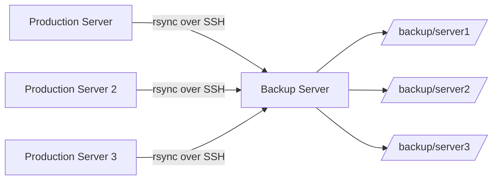

# How to Configure Backup to Remote Server with rsync over SSH on RHEL

Author: [nawazdhandala](https://www.github.com/nawazdhandala)

Tags: RHEL, Rsync, SSH, Backup, Remote, Linux

Description: Set up secure remote backups from RHEL servers to a central backup server using rsync over SSH with key-based authentication.

---

Backing up to the same server where your data lives is not a real backup. rsync over SSH lets you copy data to a remote backup server securely, efficiently, and with minimal bandwidth usage since it only transfers changed blocks.

## Architecture



## Step 1: Set Up SSH Key Authentication

On the production server, create a dedicated backup key:

```bash
# Create a key specifically for backups (no passphrase for automation)
sudo ssh-keygen -t ed25519 -f /root/.ssh/backup_key -N "" -C "backup@$(hostname)"
```

Copy the public key to the backup server:

```bash
# Copy the backup key to the remote backup server
sudo ssh-copy-id -i /root/.ssh/backup_key.pub backupuser@backup.example.com
```

## Step 2: Restrict the SSH Key on the Backup Server

On the backup server, restrict what the key can do:

```bash
# On the backup server, edit the authorized_keys for backupuser
# Add restrictions before the key
cat >> /home/backupuser/.ssh/authorized_keys << 'AUTHKEY'
command="/usr/local/bin/validate-rsync.sh",no-port-forwarding,no-X11-forwarding,no-agent-forwarding,no-pty ssh-ed25519 AAAAC3NzaC1lZDI1NTE5AAAA... backup@prodserver1
AUTHKEY
```

Create the validation wrapper:

```bash
#!/bin/bash
# /usr/local/bin/validate-rsync.sh
# Only allow rsync commands

case "$SSH_ORIGINAL_COMMAND" in
    rsync\ --server*)
        # Allow rsync server commands
        $SSH_ORIGINAL_COMMAND
        ;;
    *)
        echo "Only rsync is allowed"
        exit 1
        ;;
esac
```

```bash
chmod +x /usr/local/bin/validate-rsync.sh
```

## Step 3: Create the Backup Script

```bash
#!/bin/bash
# /usr/local/bin/remote-backup.sh
# Backup to remote server via rsync over SSH

# Configuration
BACKUP_SERVER="backup.example.com"
BACKUP_USER="backupuser"
BACKUP_KEY="/root/.ssh/backup_key"
REMOTE_BASE="/backup/$(hostname)"
LOG="/var/log/remote-backup.log"
DATE=$(date +%Y-%m-%d)

# Directories to back up
BACKUP_SOURCES=(
    "/etc"
    "/home"
    "/var/www"
    "/opt/app"
    "/var/lib/pgsql"
)

# SSH options
SSH_OPTS="-i $BACKUP_KEY -o StrictHostKeyChecking=accept-new -o ConnectTimeout=30"

echo "$(date): Starting remote backup to $BACKUP_SERVER" >> "$LOG"

# Check SSH connectivity
if ! ssh $SSH_OPTS "$BACKUP_USER@$BACKUP_SERVER" "mkdir -p $REMOTE_BASE/$DATE" 2>> "$LOG"; then
    echo "$(date): ERROR - Cannot connect to backup server" >> "$LOG"
    exit 1
fi

# Run rsync for each source directory
ERRORS=0
for SRC in "${BACKUP_SOURCES[@]}"; do
    echo "$(date): Backing up $SRC" >> "$LOG"
    
    rsync -azv --delete \
        --numeric-ids \
        --relative \
        -e "ssh $SSH_OPTS" \
        --exclude='*.tmp' \
        --exclude='lost+found' \
        --exclude='.cache' \
        --link-dest="$REMOTE_BASE/latest" \
        "$SRC" \
        "$BACKUP_USER@$BACKUP_SERVER:$REMOTE_BASE/$DATE/" \
        >> "$LOG" 2>&1
    
    if [ $? -ne 0 ]; then
        echo "$(date): ERROR backing up $SRC" >> "$LOG"
        ERRORS=$((ERRORS + 1))
    fi
done

# Update the latest symlink on the remote server
ssh $SSH_OPTS "$BACKUP_USER@$BACKUP_SERVER" \
    "rm -f $REMOTE_BASE/latest && ln -s $REMOTE_BASE/$DATE $REMOTE_BASE/latest" \
    2>> "$LOG"

# Report results
if [ $ERRORS -eq 0 ]; then
    echo "$(date): Backup completed successfully" >> "$LOG"
else
    echo "$(date): Backup completed with $ERRORS errors" >> "$LOG"
    echo "Backup on $(hostname) had $ERRORS errors. Check $LOG" | \
        mail -s "BACKUP WARNING: $(hostname)" admin@example.com
fi
```

```bash
sudo chmod +x /usr/local/bin/remote-backup.sh
```

## Step 4: Schedule with Cron

```bash
# Add to root's crontab
sudo crontab -e
```

```bash
# Remote backup at 2:00 AM daily
0 2 * * * /usr/local/bin/remote-backup.sh
```

## Step 5: Set Up the Backup Server

On the backup server, create the directory structure:

```bash
# Create backup user and directories
sudo useradd -m -s /bin/bash backupuser
sudo mkdir -p /backup
sudo chown backupuser:backupuser /backup

# Set up cleanup to manage disk space
cat > /usr/local/bin/backup-cleanup.sh << 'CLEANUP'
#!/bin/bash
# Remove backups older than 30 days
find /backup -maxdepth 2 -type d -name "20*" -mtime +30 -exec rm -rf {} \;

# Report disk usage
echo "Backup disk usage:"
du -sh /backup/*/
df -h /backup
CLEANUP
chmod +x /usr/local/bin/backup-cleanup.sh
```

## Bandwidth Limiting

If you need to limit bandwidth during business hours:

```bash
# Limit rsync to 10 MB/s with --bwlimit
rsync -azv --delete --bwlimit=10000 \
    -e "ssh -i /root/.ssh/backup_key" \
    /var/www/ \
    backupuser@backup.example.com:/backup/$(hostname)/www/
```

## Verifying Remote Backups

```bash
# Check what is on the backup server
ssh -i /root/.ssh/backup_key backupuser@backup.example.com \
    "du -sh /backup/$(hostname)/*"

# Verify a specific backup
ssh -i /root/.ssh/backup_key backupuser@backup.example.com \
    "ls -la /backup/$(hostname)/latest/etc/"

# Do a dry-run restore to check integrity
rsync -avnc \
    -e "ssh -i /root/.ssh/backup_key" \
    backupuser@backup.example.com:/backup/$(hostname)/latest/etc/ \
    /tmp/restore-test/
```

## Wrapping Up

rsync over SSH is the gold standard for Linux remote backups. It is secure, efficient, and works with any SSH-accessible server. The key details are: use a dedicated SSH key with restricted permissions on the backup server, use `--link-dest` for space-efficient incremental backups, and always verify your backups by testing a restore. The bandwidth limiting option is important if you are backing up large datasets during production hours.
