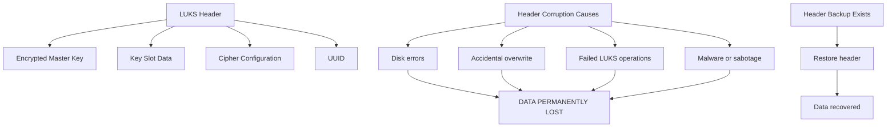

# How to Back Up and Restore LUKS Headers on RHEL

Author: [nawazdhandala](https://www.github.com/nawazdhandala)

Tags: RHEL, LUKS, Header Backup, Data Recovery, Encryption, Linux

Description: Back up and restore LUKS headers on RHEL to protect against header corruption and ensure encrypted data can always be recovered.

---

The LUKS header contains all the information needed to unlock an encrypted device, including the encrypted master key and key slot data. If the header gets corrupted or overwritten, all data on the encrypted volume becomes permanently inaccessible. Backing up LUKS headers is one of the most important maintenance tasks for encrypted systems. This guide shows you how.

## Why LUKS Header Backups Are Critical



Without a header backup, there is no way to recover data from a LUKS device with a corrupted header, even if you know the passphrase.

## Backing Up a LUKS Header

### Basic Header Backup

```bash
# Back up the LUKS header
sudo cryptsetup luksHeaderBackup /dev/sdb \
    --header-backup-file /root/luks-header-sdb.img

# Verify the backup was created
ls -la /root/luks-header-sdb.img

# Check the backup contents
file /root/luks-header-sdb.img
```

### Back Up with Metadata

Create a comprehensive backup with additional information:

```bash
#!/bin/bash
# /usr/local/bin/backup-luks-headers.sh
# Back up LUKS headers with metadata

BACKUP_DIR="/root/luks-backups"
DATE=$(date +%Y%m%d)
mkdir -p "$BACKUP_DIR"

for dev in $(blkid -t TYPE=crypto_LUKS -o device); do
    SAFE_NAME=$(echo "$dev" | tr '/' '_')
    BACKUP_FILE="${BACKUP_DIR}/luks-header${SAFE_NAME}-${DATE}.img"
    INFO_FILE="${BACKUP_DIR}/luks-info${SAFE_NAME}-${DATE}.txt"

    echo "Backing up header for $dev..."

    # Back up the header
    cryptsetup luksHeaderBackup "$dev" \
        --header-backup-file "$BACKUP_FILE"

    # Save device information
    {
        echo "LUKS Header Backup Information"
        echo "=============================="
        echo "Date: $(date)"
        echo "Device: $dev"
        echo "Hostname: $(hostname)"
        echo ""
        echo "--- blkid output ---"
        blkid "$dev"
        echo ""
        echo "--- LUKS Dump ---"
        cryptsetup luksDump "$dev"
        echo ""
        echo "--- lsblk output ---"
        lsblk "$dev"
    } > "$INFO_FILE"

    echo "  Header: $BACKUP_FILE"
    echo "  Info:   $INFO_FILE"
done

echo ""
echo "All LUKS headers backed up to $BACKUP_DIR"
```

### Verify the Backup

```bash
# Verify the backup is valid by dumping its contents
sudo cryptsetup luksDump /root/luks-header-sdb.img

# Compare UUID with the original device
sudo cryptsetup luksDump /dev/sdb | grep UUID
sudo cryptsetup luksDump /root/luks-header-sdb.img | grep UUID
# UUIDs should match
```

## Storing Header Backups Securely

The LUKS header backup contains the encrypted master key. While it still requires a passphrase to use, it should be protected:

```bash
# Encrypt the header backup with GPG
gpg --symmetric --cipher-algo AES256 /root/luks-header-sdb.img

# This creates /root/luks-header-sdb.img.gpg
# Delete the unencrypted copy
shred -u /root/luks-header-sdb.img
```

Store copies in multiple secure locations:
- Encrypted USB drive kept in a safe
- Encrypted cloud storage
- Another encrypted system in a different physical location

## Restoring a LUKS Header

### When to Restore

You need to restore a header when:
- The LUKS device fails to open with a valid passphrase
- `cryptsetup luksDump` shows errors or corrupt data
- The header area was accidentally overwritten

### Restore Procedure

```bash
# If the backup is GPG-encrypted, decrypt it first
gpg --decrypt /root/luks-header-sdb.img.gpg > /tmp/luks-header-sdb.img

# Restore the header
sudo cryptsetup luksHeaderRestore /dev/sdb \
    --header-backup-file /tmp/luks-header-sdb.img

# You will be prompted to confirm (type uppercase YES)

# Clean up the temporary file
shred -u /tmp/luks-header-sdb.img
```

### Verify the Restoration

```bash
# Check the restored header
sudo cryptsetup luksDump /dev/sdb

# Test opening the device
sudo cryptsetup luksOpen --test-passphrase /dev/sdb

# If the test succeeds, open the device
sudo cryptsetup luksOpen /dev/sdb data_encrypted

# Mount and verify data integrity
sudo mount /dev/mapper/data_encrypted /mnt/encrypted-data
ls -la /mnt/encrypted-data
```

## Important Warnings About Header Restoration

1. **Restoring an old header restores old key slots.** If you changed passphrases after the backup was made, the restored header will only accept the passphrases that were active at backup time.

2. **The header UUID must match.** Only restore a header to the same device (or its replacement) that the header was backed up from.

3. **Do not restore to the wrong device.** Restoring a header to a different device will not magically make that device's data accessible. The header is specific to the master key used during initial formatting.

## LUKS2 Header Size

LUKS2 headers are larger than LUKS1:

```bash
# Check the header size
sudo cryptsetup luksDump /dev/sdb | grep "Data segments"

# LUKS2 headers are typically 16 MB by default
# You can check the exact offset
sudo cryptsetup luksDump /dev/sdb | grep offset
```

The backup file will be approximately the same size as the header area.

## Automating Header Backups

Schedule regular header backups:

```bash
# Create a cron job for weekly backups
sudo tee /etc/cron.weekly/luks-header-backup << 'SCRIPT'
#!/bin/bash
# Weekly LUKS header backup

BACKUP_DIR="/root/luks-backups"
DATE=$(date +%Y%m%d)
RETENTION_DAYS=90
mkdir -p "$BACKUP_DIR"

# Back up all LUKS devices
for dev in $(blkid -t TYPE=crypto_LUKS -o device 2>/dev/null); do
    SAFE_NAME=$(echo "$dev" | tr '/' '_')
    BACKUP_FILE="${BACKUP_DIR}/luks-header${SAFE_NAME}-${DATE}.img"

    cryptsetup luksHeaderBackup "$dev" \
        --header-backup-file "$BACKUP_FILE" 2>/dev/null

    if [ $? -eq 0 ]; then
        # Encrypt the backup
        gpg --batch --yes --symmetric --cipher-algo AES256 \
            --passphrase-file /root/.luks-backup-passphrase \
            "$BACKUP_FILE" 2>/dev/null
        shred -u "$BACKUP_FILE"
        logger -t luks-backup "Backed up LUKS header for $dev"
    else
        logger -t luks-backup -p err "Failed to back up LUKS header for $dev"
    fi
done

# Clean up old backups
find "$BACKUP_DIR" -name "luks-header-*.img.gpg" -mtime +${RETENTION_DAYS} -delete

SCRIPT

sudo chmod +x /etc/cron.weekly/luks-header-backup
```

## Summary

LUKS header backups are essential insurance for encrypted systems on RHEL. Use `cryptsetup luksHeaderBackup` to create backups, verify them with `luksDump`, encrypt them with GPG, and store copies in multiple secure locations. If header corruption occurs, `cryptsetup luksHeaderRestore` can restore the header and recover access to your data. Automate the backup process with a cron job and maintain a reasonable retention policy.
