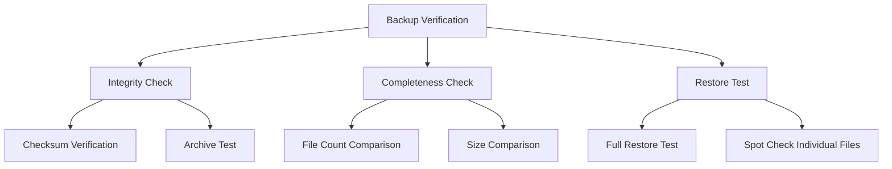

# How to Configure Backup Verification and Integrity Checks on RHEL

Author: [nawazdhandala](https://www.github.com/nawazdhandala)

Tags: RHEL, Backup, Verification, Integrity, Linux

Description: Implement automated backup verification and integrity checking on RHEL to ensure your backups are actually recoverable when you need them.

---

A backup that has never been verified is not a backup. It is a hope. Backup verification confirms that your backup files are intact, complete, and actually restorable. This guide covers practical verification strategies that you can automate on RHEL.

## Verification Strategy



## Verifying tar Archives

```bash
#!/bin/bash
# /usr/local/bin/verify-tar-backup.sh
# Verify tar backup integrity

BACKUP_DIR="/backup"
LOG="/var/log/backup-verify.log"
ERRORS=0

echo "$(date): Starting backup verification" >> "$LOG"

for ARCHIVE in "$BACKUP_DIR"/*.tar.gz; do
    [ -f "$ARCHIVE" ] || continue
    
    echo "Verifying: $ARCHIVE" >> "$LOG"
    
    # Test 1: gzip integrity
    if ! gzip -t "$ARCHIVE" 2>> "$LOG"; then
        echo "FAIL: $ARCHIVE is corrupt (gzip test)" >> "$LOG"
        ERRORS=$((ERRORS + 1))
        continue
    fi
    
    # Test 2: tar can read all file headers
    if ! tar -tzf "$ARCHIVE" > /dev/null 2>> "$LOG"; then
        echo "FAIL: $ARCHIVE is corrupt (tar listing)" >> "$LOG"
        ERRORS=$((ERRORS + 1))
        continue
    fi
    
    # Test 3: Check the file count is reasonable
    FILE_COUNT=$(tar -tzf "$ARCHIVE" | wc -l)
    if [ "$FILE_COUNT" -lt 10 ]; then
        echo "WARNING: $ARCHIVE has only $FILE_COUNT files" >> "$LOG"
    fi
    
    # Test 4: Check the archive size is reasonable
    SIZE=$(stat -c %s "$ARCHIVE")
    if [ "$SIZE" -lt 1024 ]; then
        echo "WARNING: $ARCHIVE is suspiciously small ($SIZE bytes)" >> "$LOG"
    fi
    
    echo "PASS: $ARCHIVE ($FILE_COUNT files, $(du -sh "$ARCHIVE" | cut -f1))" >> "$LOG"
done

if [ $ERRORS -gt 0 ]; then
    echo "$(date): Verification FAILED - $ERRORS errors" >> "$LOG"
    echo "Backup verification failed on $(hostname). $ERRORS corrupt archives found." | \
        mail -s "BACKUP VERIFY FAILED: $(hostname)" admin@example.com
    exit 1
else
    echo "$(date): All backups verified successfully" >> "$LOG"
fi
```

## Checksum Verification

```bash
#!/bin/bash
# /usr/local/bin/backup-checksum.sh
# Generate and verify backup checksums

BACKUP_DIR="/backup/daily"
CHECKSUM_FILE="$BACKUP_DIR/checksums.sha256"
LOG="/var/log/backup-checksum.log"

# Generate checksums after creating a backup
generate_checksums() {
    echo "$(date): Generating checksums" >> "$LOG"
    cd "$BACKUP_DIR" || exit 1
    sha256sum *.tar.gz > "$CHECKSUM_FILE" 2>> "$LOG"
    echo "$(date): Checksums generated" >> "$LOG"
}

# Verify checksums
verify_checksums() {
    echo "$(date): Verifying checksums" >> "$LOG"
    cd "$BACKUP_DIR" || exit 1
    
    if [ ! -f "$CHECKSUM_FILE" ]; then
        echo "ERROR: No checksum file found" >> "$LOG"
        return 1
    fi
    
    if sha256sum --check "$CHECKSUM_FILE" >> "$LOG" 2>&1; then
        echo "$(date): All checksums verified" >> "$LOG"
        return 0
    else
        echo "$(date): CHECKSUM MISMATCH DETECTED" >> "$LOG"
        return 1
    fi
}

case "$1" in
    generate) generate_checksums ;;
    verify)   verify_checksums ;;
    *)        echo "Usage: $0 {generate|verify}" ;;
esac
```

## Automated Restore Test

The gold standard is actually restoring and checking the data:

```bash
#!/bin/bash
# /usr/local/bin/restore-test.sh
# Automated restore test

BACKUP_DIR="/backup/daily"
RESTORE_DIR="/tmp/restore-test"
SOURCE_DIR="/etc"
LOG="/var/log/restore-test.log"

echo "$(date): Starting restore test" >> "$LOG"

# Clean up any previous test
rm -rf "$RESTORE_DIR"
mkdir -p "$RESTORE_DIR"

# Find the latest backup
LATEST=$(ls -t "$BACKUP_DIR"/etc-backup-*.tar.gz 2>/dev/null | head -1)
if [ -z "$LATEST" ]; then
    echo "ERROR: No backup found to test" >> "$LOG"
    exit 1
fi

# Restore the backup
echo "Restoring $LATEST to $RESTORE_DIR" >> "$LOG"
tar -xzf "$LATEST" -C "$RESTORE_DIR" 2>> "$LOG"

# Compare restored files with current system
echo "Comparing restored files with current system" >> "$LOG"

# Check critical files exist in the restore
CRITICAL_FILES=(
    "etc/ssh/sshd_config"
    "etc/fstab"
    "etc/passwd"
    "etc/group"
    "etc/hosts"
)

PASS=true
for FILE in "${CRITICAL_FILES[@]}"; do
    if [ -f "$RESTORE_DIR/$FILE" ]; then
        echo "PASS: $FILE exists in backup" >> "$LOG"
    else
        echo "FAIL: $FILE missing from backup" >> "$LOG"
        PASS=false
    fi
done

# Compare file counts
ORIGINAL_COUNT=$(find "$SOURCE_DIR" -type f | wc -l)
RESTORED_COUNT=$(find "$RESTORE_DIR/etc" -type f 2>/dev/null | wc -l)

echo "Original file count: $ORIGINAL_COUNT" >> "$LOG"
echo "Restored file count: $RESTORED_COUNT" >> "$LOG"

if [ "$RESTORED_COUNT" -lt "$((ORIGINAL_COUNT * 90 / 100))" ]; then
    echo "WARNING: Restored file count is less than 90% of original" >> "$LOG"
    PASS=false
fi

# Clean up
rm -rf "$RESTORE_DIR"

if [ "$PASS" = true ]; then
    echo "$(date): Restore test PASSED" >> "$LOG"
else
    echo "$(date): Restore test FAILED" >> "$LOG"
    echo "Restore test failed on $(hostname). Check $LOG" | \
        mail -s "RESTORE TEST FAILED: $(hostname)" admin@example.com
    exit 1
fi
```

## rsync Backup Verification

```bash
#!/bin/bash
# Verify an rsync backup by comparing checksums
# This does a checksum comparison without transferring data

rsync -avnc \
    --exclude='*.tmp' \
    --exclude='.cache' \
    /etc/ /backup/daily/$(date +%Y-%m-%d)/etc/ \
    > /var/log/rsync-verify.log 2>&1

# Check if there are differences
DIFF_COUNT=$(grep -c "^" /var/log/rsync-verify.log)
echo "Differences found: $DIFF_COUNT"
```

## Scheduling Verification

```bash
# Add verification to crontab
sudo crontab -e
```

```bash
# Run backup at 2 AM
0 2 * * * /usr/local/bin/backup.sh

# Verify backup at 4 AM (after backup completes)
0 4 * * * /usr/local/bin/verify-tar-backup.sh

# Run restore test weekly on Sunday at 5 AM
0 5 * * 0 /usr/local/bin/restore-test.sh
```

## Wrapping Up

Backup verification is not optional. At minimum, check archive integrity (can you read the file?), verify checksums (has the file been corrupted during storage or transfer?), and test restores (can you actually get your data back?). Automate all three checks and alert when they fail. The worst time to discover your backups are corrupt is when you desperately need them.
