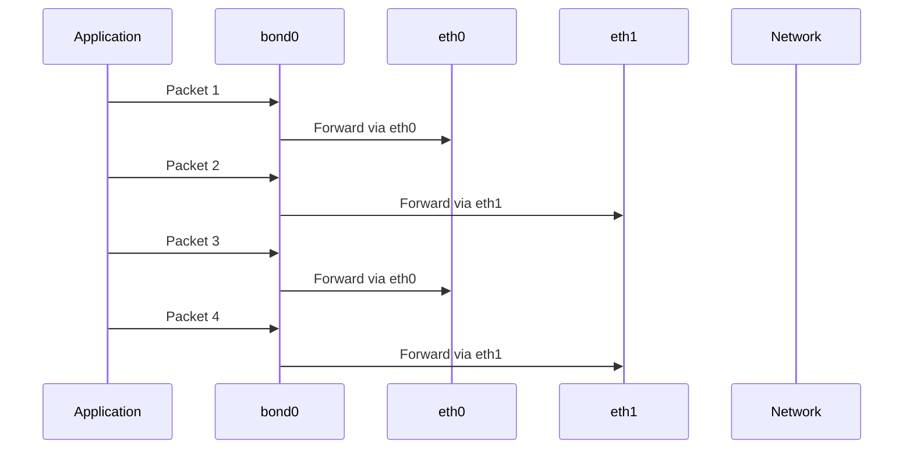

# How to Configure Balance-RR Bonding for Load Balancing on RHEL

Author: [nawazdhandala](https://www.github.com/nawazdhandala)

Tags: RHEL, Balance-RR, Load Balancing, Bonding, Linux

Description: How to set up round-robin (balance-rr) bonding on RHEL for maximum throughput, including its trade-offs, switch requirements, and real-world use cases.

---

Balance-rr (round-robin, mode 0) is the simplest load-balancing bonding mode. It sends each packet out a different slave in sequence. Packet one goes out eth0, packet two goes out eth1, packet three goes out eth0 again, and so on. This gives you the highest raw throughput potential, but it comes with a significant catch: out-of-order packet delivery.

## When to Use Balance-RR

Balance-rr works well for:

- Large file transfers where out-of-order packets are acceptable
- Streaming workloads with UDP
- Environments where you want maximum aggregate bandwidth and can tolerate TCP retransmissions
- Testing and development environments

It does not work well for:

- Latency-sensitive applications
- Standard web server workloads with many small TCP connections
- Any scenario where TCP performance matters (out-of-order packets trigger TCP retransmissions)

## How Round-Robin Distribution Works



## Step 1: Create the Bond

```bash
# Create a balance-rr bond with 100ms link monitoring
nmcli connection add type bond con-name bond0 ifname bond0 \
  bond.options "mode=balance-rr,miimon=100"
```

## Step 2: Add Slave Interfaces

```bash
# Add first slave
nmcli connection add type ethernet con-name bond0-slave1 ifname eth0 master bond0

# Add second slave
nmcli connection add type ethernet con-name bond0-slave2 ifname eth1 master bond0
```

## Step 3: Configure IP and Activate

```bash
# Set static IP
nmcli connection modify bond0 ipv4.addresses 10.0.1.50/24
nmcli connection modify bond0 ipv4.gateway 10.0.1.1
nmcli connection modify bond0 ipv4.dns "10.0.1.1"
nmcli connection modify bond0 ipv4.method manual

# Bring it up
nmcli connection up bond0
```

## Step 4: Verify

```bash
# Check bond status
cat /proc/net/bonding/bond0

# Confirm mode is balance-rr
cat /proc/net/bonding/bond0 | grep "Bonding Mode"
```

## Switch Configuration Requirements

Balance-rr requires that all slave ports on the switch are in the same port-channel or EtherChannel group. Without this, the switch sees frames from the same MAC address arriving on different ports and gets confused, potentially flooding or dropping traffic.

If your switch does not support static port-channel groups, balance-rr is not a good choice. Use active-backup or balance-alb instead.

## The Out-of-Order Packet Problem

The biggest issue with balance-rr is out-of-order delivery. When packets for a single TCP connection arrive at the destination via different paths with different latencies, the receiving side sees them out of order and may request retransmissions.

You can see this with:

```bash
# Check TCP retransmission stats
ss -ti | grep retrans

# Or via netstat
cat /proc/net/snmp | grep -A1 Tcp
```

If you see high retransmission counts, balance-rr might be hurting more than helping.

## Tuning packets_per_slave

RHEL supports the `packets_per_slave` option for balance-rr, which controls how many packets are sent on one slave before switching to the next:

```bash
# Send 1 packet per slave before rotating (default)
nmcli connection modify bond0 bond.options "mode=balance-rr,miimon=100,packets_per_slave=1"

# Send 100 packets per slave before rotating (reduces reordering)
nmcli connection modify bond0 bond.options "mode=balance-rr,miimon=100,packets_per_slave=100"

# Apply changes
nmcli connection down bond0 && nmcli connection up bond0
```

Setting a higher `packets_per_slave` value reduces out-of-order delivery at the cost of less even distribution. This can be a good middle ground for TCP traffic.

## Testing Throughput

Use iperf3 to measure the aggregate throughput:

```bash
# Install iperf3
dnf install -y iperf3

# Run a multi-stream test to exercise both slaves
iperf3 -c 10.0.1.100 -t 30 -P 8
```

Compare the result to a single-interface test to see if you actually gained bandwidth:

```bash
# Single-stream test (will only use one slave effectively for TCP)
iperf3 -c 10.0.1.100 -t 30

# Multi-stream test (should show higher aggregate throughput)
iperf3 -c 10.0.1.100 -t 30 -P 4
```

## Monitoring Traffic Distribution

Verify that traffic is actually spread across slaves:

```bash
# Watch per-slave counters
watch -n 1 'echo "=== eth0 ===" && ip -s link show eth0 | grep -A1 TX && echo "=== eth1 ===" && ip -s link show eth1 | grep -A1 TX'
```

With balance-rr, you should see TX counters incrementing roughly equally on both slaves.

## When to Use 802.3ad Instead

If your switch supports LACP, 802.3ad (mode 4) is almost always a better choice than balance-rr. LACP provides:

- Negotiated link aggregation (safer)
- Hash-based distribution (no out-of-order packets for single connections)
- Better TCP performance

The main scenario where balance-rr beats 802.3ad is when you need a single connection to span multiple slaves for maximum bandwidth, which 802.3ad cannot do because it hashes per-flow.

## Failover Behavior

Balance-rr provides fault tolerance in addition to load balancing. If one slave goes down, the bond continues operating with the remaining slaves:

```bash
# Simulate a failure
nmcli device disconnect eth0

# Verify the bond still works
ping -c 4 10.0.1.1
cat /proc/net/bonding/bond0
```

## Summary

Balance-rr gives you the simplest possible load balancing with per-packet distribution across slaves. It requires switch-side port-channel configuration and causes out-of-order packet delivery that can hurt TCP performance. For most production workloads, 802.3ad or active-backup are better choices. But if you need raw aggregate bandwidth and can handle TCP retransmissions, or if your workload is mostly UDP, balance-rr delivers the goods. Tune `packets_per_slave` to find the sweet spot between distribution and packet ordering.
