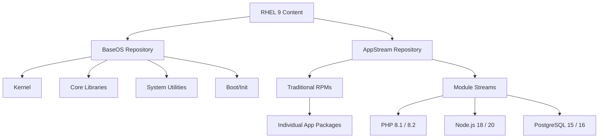

# How to Understand the BaseOS and AppStream Repository Structure on RHEL 9

Author: [nawazdhandala](https://www.github.com/nawazdhandala)

Tags: RHEL, BaseOS, AppStream, Repositories, Linux

Description: Learn how RHEL 9 splits its content between BaseOS and AppStream repositories, what goes where, and why this structure matters for system administration.

---

RHEL 9 ships its packages across two main repositories: BaseOS and AppStream. If you have worked with RHEL 7 or earlier, this split might feel unfamiliar. It was introduced in RHEL 8 and carries forward into RHEL 9 with the same logic. Understanding the difference between these two repos is not just academic, it affects how you plan updates, manage application lifecycles, and troubleshoot package availability.

## Why Two Repositories?

In older RHEL releases, everything lived in a single monolithic repository. The problem was that core OS components (kernel, glibc, systemd) and user-space applications (PHP, Node.js, PostgreSQL) all followed the same 10-year support lifecycle. That meant you were stuck with whatever version of PHP or Python shipped with the OS for the entire support period.

Red Hat split the content to decouple the OS lifecycle from application lifecycles. BaseOS provides the foundation, while AppStream delivers applications and developer tools that can be updated on different schedules.

## BaseOS Repository

BaseOS contains the core operating system packages. These are the components that provide the foundation of the OS itself.

### What Goes in BaseOS

- Kernel and kernel modules
- Core system libraries (glibc, openssl, zlib)
- Systemd and init infrastructure
- Core utilities (coreutils, bash, sed, awk)
- Package management tools (dnf, rpm)
- Networking fundamentals (NetworkManager, firewalld)
- Filesystems and storage (lvm2, xfsprogs)
- SELinux core components
- Boot infrastructure (grub2, dracut)

### BaseOS Characteristics

- Traditional RPM format only (no modules)
- Full 10-year RHEL support lifecycle
- ABI/API stability guaranteed for the entire major release
- Updates are strictly bug fixes and security patches

Check what is in your BaseOS repo:

```bash
# List all packages available from the BaseOS repository
dnf repo-pkgs rhel-9-for-x86_64-baseos-rpms list available
```

```bash
# Count packages in BaseOS
dnf repo-pkgs rhel-9-for-x86_64-baseos-rpms list available | wc -l
```

## AppStream Repository

AppStream is where things get interesting. It contains user-space applications, programming languages, databases, and web servers. The key innovation here is that AppStream supports module streams, which let you pick between multiple versions of the same software.

### What Goes in AppStream

- Programming languages (Python, Ruby, PHP, Node.js, Go)
- Web servers (httpd, nginx)
- Databases (PostgreSQL, MySQL, MariaDB, Redis)
- Development tools (gcc-toolset, LLVM, Rust)
- Application runtime dependencies
- Container tools (podman, buildah, skopeo)
- Desktop applications and libraries
- Server applications not considered core OS

### AppStream Content Types

AppStream delivers packages in two forms:

1. **Traditional RPMs** - Regular packages, just like BaseOS
2. **Modules** - Collections of packages representing an application or toolset, available in multiple version streams

```bash
# List all packages from AppStream
dnf repo-pkgs rhel-9-for-x86_64-appstream-rpms list available

# List all available modules
dnf module list
```

## The Repository Structure Visualized

Here is how the two repositories relate to each other:



## Module Streams Explained

Module streams are the reason AppStream exists as a separate repository. A module is a set of RPM packages that represent a component, and a stream is a version of that component.

For example, the `nodejs` module might have streams `18` and `20`, letting you choose which major version of Node.js to run.

```bash
# See available streams for the nodejs module
dnf module list nodejs
```

Each stream can have multiple profiles, which are predefined sets of packages for specific use cases:

- **common** - The default set of packages most people need
- **devel** - Additional development headers and tools
- **minimal** - Bare minimum to run the application

```bash
# View profiles for a specific module stream
dnf module info nodejs:20
```

### Default vs Enabled Streams

When you first install RHEL 9, each module has a default stream marked with `[d]`. If you install a module package without specifying a stream, you get the default.

```bash
# Show which streams are default, enabled, or disabled
dnf module list --enabled
dnf module list --disabled
```

## How Updates Work Differently

This is where the BaseOS/AppStream split really matters for planning.

### BaseOS Updates

BaseOS packages follow a strict maintenance model. You get bug fixes and security patches within the same minor version. A package in BaseOS will never jump major versions during the RHEL 9 lifecycle.

### AppStream Updates

AppStream is more flexible:

- Traditional RPMs in AppStream follow a similar maintenance model to BaseOS
- Module streams, however, can have different lifecycles
- Some streams are supported for the full RHEL lifecycle, while others are supported for shorter periods
- New module streams can be added in minor RHEL releases

```bash
# Check the lifecycle information for a module
dnf module info php:8.2
```

## Practical Implications

### When Installing Software

Always check which repo a package comes from:

```bash
# See which repository provides a package
dnf info httpd
```

The `Repository` field tells you whether it is in BaseOS or AppStream.

### When Planning Upgrades

If you are running a module stream with a shorter support window, you need to plan for stream switches before the old stream goes EOL:

```bash
# Switch from one module stream to another
sudo dnf module reset php
sudo dnf module enable php:8.2
sudo dnf distro-sync
```

### When Building Minimal Systems

If you are building a minimal server and want to keep the footprint small, knowing what is in BaseOS versus AppStream helps you decide what to include. BaseOS gives you a bootable, functional OS. AppStream adds the application layer on top.

### When Troubleshooting Missing Packages

If a package you expect is not found, check that AppStream is enabled:

```bash
# Verify both repos are enabled
dnf repolist
```

You should see both `rhel-9-for-x86_64-baseos-rpms` and `rhel-9-for-x86_64-appstream-rpms` in the output.

## Repository Configuration Files

The repo definitions live in `/etc/yum.repos.d/`. On a registered RHEL 9 system:

```bash
# View the BaseOS repo configuration
cat /etc/yum.repos.d/redhat.repo | grep -A 10 "baseos"
```

Both repos are managed by the subscription-manager and should be enabled by default after registration. If one is missing:

```bash
# Re-enable a repo through subscription-manager
sudo subscription-manager repos --enable=rhel-9-for-x86_64-appstream-rpms
```

## Summary

The BaseOS/AppStream split is not just Red Hat being complicated for the sake of it. It solves a real problem: letting the OS foundation stay stable for 10 years while giving you the flexibility to run newer versions of application software. Once you understand that BaseOS is the floor and AppStream is everything you build on top of it, the system makes sense.

Key takeaways:

- BaseOS is for core OS components with a full 10-year lifecycle
- AppStream is for applications and tools, with support for multiple versions via module streams
- Both repos must be enabled for a functional RHEL 9 system
- Module streams in AppStream let you pick between different versions of software
- Different streams can have different support lifecycles, so plan accordingly
