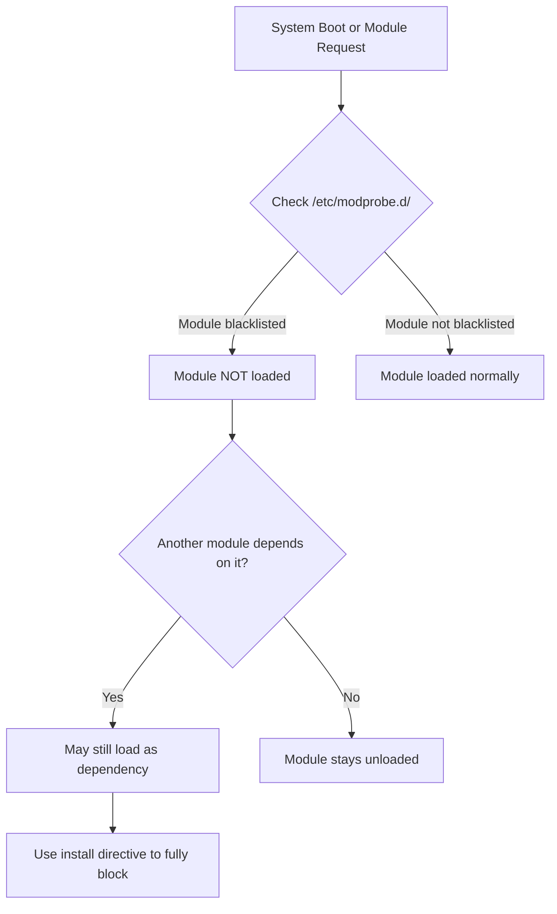

# How to Blacklist a Kernel Module on RHEL

Author: [nawazdhandala](https://www.github.com/nawazdhandala)

Tags: RHEL, Kernel Modules, Blacklist, Linux

Description: Learn how to permanently blacklist kernel modules on RHEL to prevent them from loading, covering modprobe blacklisting, initramfs updates, and common use cases like disabling USB storage or Nouveau.

---

## Why Blacklist a Kernel Module?

Sometimes you need to prevent a kernel module from loading. Common reasons include:

- Disabling USB storage on servers for security compliance
- Preventing the Nouveau driver from loading when using NVIDIA proprietary drivers
- Blocking IPv6 on systems that do not need it
- Disabling unused wireless or Bluetooth modules on servers
- Preventing a buggy driver from causing system instability

RHEL provides a clean mechanism for this through modprobe blacklisting.

## How Module Blacklisting Works



A simple `blacklist` directive prevents automatic loading, but a module can still be loaded manually or as a dependency. For a complete block, you also need an `install` directive that redirects the load to `/bin/true` or `/bin/false`.

## Basic Blacklisting

Create a configuration file in `/etc/modprobe.d/` with the blacklist directive.

```bash
# Blacklist the Nouveau open-source NVIDIA driver
sudo tee /etc/modprobe.d/blacklist-nouveau.conf <<EOF
# Prevent Nouveau from loading (required for NVIDIA proprietary driver)
blacklist nouveau
EOF
```

```bash
# Blacklist USB storage for security
sudo tee /etc/modprobe.d/blacklist-usbstorage.conf <<EOF
# Disable USB mass storage for security compliance
blacklist usb-storage
EOF
```

## Complete Module Blocking

The `blacklist` directive alone does not prevent a module from loading as a dependency or via direct `modprobe` calls. For a complete block, combine it with an `install` directive.

```bash
# Completely prevent a module from ever loading
sudo tee /etc/modprobe.d/blacklist-nouveau.conf <<EOF
blacklist nouveau
install nouveau /bin/false
EOF
```

```bash
# Block multiple related modules
sudo tee /etc/modprobe.d/blacklist-bluetooth.conf <<EOF
# Disable Bluetooth on servers
blacklist bluetooth
blacklist btusb
blacklist btrtl
blacklist btbcm
blacklist btintel
install bluetooth /bin/false
install btusb /bin/false
EOF
```

The `install` directive tells the kernel to run `/bin/false` instead of actually loading the module, which effectively makes it impossible to load.

## Updating the initramfs

If the module you are blacklisting is loaded during early boot (before the root filesystem is mounted), you must rebuild the initramfs image for the blacklist to take effect.

```bash
# Rebuild the initramfs for the current kernel
sudo dracut --force

# Rebuild for all installed kernels
sudo dracut --regenerate-all --force

# Verify the blacklist is included in the initramfs
lsinitrd /boot/initramfs-$(uname -r).img | grep modprobe
```

## Common Blacklisting Scenarios

### Blacklisting Nouveau for NVIDIA Drivers

```bash
sudo tee /etc/modprobe.d/blacklist-nouveau.conf <<EOF
blacklist nouveau
options nouveau modeset=0
install nouveau /bin/false
EOF

# Rebuild initramfs since Nouveau loads during early boot
sudo dracut --force

# Reboot to apply
sudo systemctl reboot
```

### Disabling IPv6 via Module Blacklisting

```bash
# Note: On RHEL, IPv6 is built into the kernel, so blacklisting
# the module alone is not sufficient. Use sysctl instead.
sudo tee /etc/sysctl.d/90-disable-ipv6.conf <<EOF
net.ipv6.conf.all.disable_ipv6 = 1
net.ipv6.conf.default.disable_ipv6 = 1
EOF

sudo sysctl --system
```

### Disabling USB Storage

```bash
sudo tee /etc/modprobe.d/blacklist-usbstorage.conf <<EOF
blacklist usb-storage
blacklist uas
install usb-storage /bin/false
install uas /bin/false
EOF

# If USB storage is currently loaded, unload it
sudo modprobe -r usb-storage 2>/dev/null
sudo modprobe -r uas 2>/dev/null
```

### Disabling Wireless and Bluetooth on Servers

```bash
sudo tee /etc/modprobe.d/blacklist-wireless.conf <<EOF
# No need for wireless on a rack server
blacklist iwlwifi
blacklist iwlmvm
blacklist cfg80211
install iwlwifi /bin/false
install cfg80211 /bin/false
EOF

sudo tee /etc/modprobe.d/blacklist-bluetooth.conf <<EOF
blacklist bluetooth
blacklist btusb
install bluetooth /bin/false
install btusb /bin/false
EOF
```

### Disabling Floppy and Legacy Drivers

```bash
sudo tee /etc/modprobe.d/blacklist-legacy.conf <<EOF
# Nobody needs a floppy driver in 2026
blacklist floppy
blacklist pcspkr
install floppy /bin/false
install pcspkr /bin/false
EOF
```

## Blacklisting via the Kernel Command Line

For modules that load very early in the boot process, you can blacklist them from the GRUB kernel command line.

```bash
# Add a module blacklist to kernel command line
sudo grubby --update-kernel=ALL --args="modprobe.blacklist=nouveau"

# Blacklist multiple modules
sudo grubby --update-kernel=ALL --args="modprobe.blacklist=nouveau,pcspkr,floppy"

# Verify the change
sudo grubby --info=ALL | grep modprobe
```

## Verifying a Module Is Blacklisted

```bash
# Check if a module is loaded (should return nothing if blacklisted)
lsmod | grep nouveau

# Check modprobe configuration for the module
modprobe -c | grep nouveau

# Try to load it (should fail silently or show blocked)
sudo modprobe nouveau
echo $?  # Non-zero exit code means it was blocked

# Check the journal for module loading attempts
sudo journalctl -b | grep nouveau
```

## Removing a Blacklist

To reverse a blacklist, simply remove the configuration file and rebuild the initramfs.

```bash
# Remove the blacklist configuration
sudo rm /etc/modprobe.d/blacklist-nouveau.conf

# Rebuild initramfs
sudo dracut --force

# Reboot or manually load the module
sudo modprobe nouveau
```

## Listing All Blacklisted Modules

```bash
# Find all blacklisted modules across all config files
grep -r "^blacklist" /etc/modprobe.d/ /usr/lib/modprobe.d/ 2>/dev/null

# Check for install overrides too
grep -r "^install.*\/bin\/false\|^install.*\/bin\/true" /etc/modprobe.d/ /usr/lib/modprobe.d/ 2>/dev/null
```

## Wrapping Up

Module blacklisting on RHEL is a two-step process: add the `blacklist` and `install` directives to a file in `/etc/modprobe.d/`, then rebuild the initramfs with `dracut --force` if the module loads during early boot. For security-related blacklisting like USB storage, always use both directives to prevent the module from loading under any circumstances. And remember to test on a non-production system first, because blacklisting the wrong module can leave you with a system that will not boot properly.
