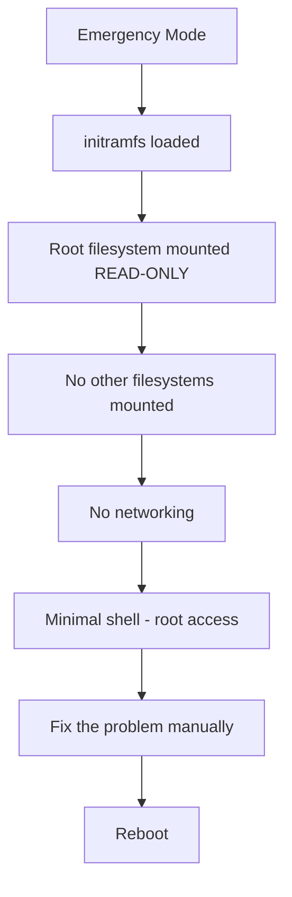

# How to Boot RHEL into Emergency Mode for Advanced Troubleshooting

Author: [nawazdhandala](https://www.github.com/nawazdhandala)

Tags: RHEL, Emergency Mode, Troubleshooting, Linux

Description: Learn how to boot RHEL into emergency mode for advanced troubleshooting when rescue mode is not enough, covering root filesystem repair, broken mounts, and recovery from severe system damage.

---

## When to Use Emergency Mode

Emergency mode is the last resort before reaching for installation media. It is more restrictive than rescue mode: the root filesystem is mounted read-only, no other filesystems are mounted, networking is not started, and only the most essential system services run.

You need emergency mode when:

- Rescue mode itself fails to boot
- The root filesystem is corrupt and needs fsck
- A bad `/etc/fstab` entry prevents filesystem mounting
- systemd cannot start enough services for rescue mode
- You need to repair the system at the most basic level

## How Emergency Mode Works



## Booting into Emergency Mode

### From the GRUB Menu

1. Reboot the system
2. At the GRUB menu, highlight the kernel entry
3. Press `e` to edit
4. Find the line starting with `linux` or `linuxefi`
5. Append `systemd.unit=emergency.target` at the end
6. Press `Ctrl+X` or `F10` to boot

### From a Running System

```bash
# Switch to emergency mode (all services will stop)
sudo systemctl emergency
```

## What You Get in Emergency Mode

Once in emergency mode, you have:

- A root shell
- Root filesystem mounted read-only
- No other filesystems
- No network
- No logging service

The first thing you usually need to do is remount root as read-write:

```bash
# Remount root filesystem read-write
mount -o remount,rw /
```

## Common Emergency Mode Recovery Tasks

### Repairing a Corrupted Root Filesystem

If the root filesystem has errors, you may need to run fsck. Since the filesystem is mounted read-only in emergency mode, you need to unmount it first or run fsck on it while read-only.

```bash
# For XFS (default on RHEL), check and repair
xfs_repair /dev/mapper/rhel-root

# If the filesystem is mounted, you may need to boot from
# installation media to unmount it completely

# For ext4 filesystems
fsck.ext4 -y /dev/sda2
```

### Fixing a Bad /etc/fstab

A common cause of boot failure is an incorrect entry in `/etc/fstab`.

```bash
# Remount root read-write first
mount -o remount,rw /

# Edit fstab
vi /etc/fstab

# Comment out or fix the problematic line
# Look for entries with wrong UUIDs, missing devices, or bad options

# Test the changes
mount -a

# If mount -a succeeds without errors, reboot
systemctl reboot
```

### Fixing SELinux Context Issues

If SELinux is preventing the system from booting:

```bash
# Remount root read-write
mount -o remount,rw /

# Create the autorelabel file to fix contexts on next boot
touch /.autorelabel

# Reboot - the system will relabel all files (this takes time)
systemctl reboot
```

### Resetting the Root Password in Emergency Mode

```bash
# Remount root read-write
mount -o remount,rw /

# Change the root password
passwd root

# If SELinux is enforcing, relabel on next boot
touch /.autorelabel

# Reboot
systemctl reboot
```

### Rebuilding a Broken initramfs

```bash
# Remount root read-write
mount -o remount,rw /

# Mount /boot if it is a separate partition
mount /boot

# Rebuild the initramfs for the current kernel
dracut --force /boot/initramfs-$(uname -r).img $(uname -r)

# Reboot
systemctl reboot
```

### Disabling a Broken Service

```bash
# Remount root read-write
mount -o remount,rw /

# Find and disable the problematic service
systemctl disable broken-service.service

# Or mask it to completely prevent it from starting
systemctl mask broken-service.service

# Reboot
systemctl reboot
```

## Mounting Additional Filesystems

If you need access to other filesystems for recovery:

```bash
# Remount root read-write
mount -o remount,rw /

# Mount /boot
mount /boot

# Mount /home if it is a separate partition
mount /home

# Or mount everything from fstab
mount -a
```

## Getting Network Access

If you need to download packages or access remote resources:

```bash
# Remount root read-write
mount -o remount,rw /

# Start networking manually
ip link set eth0 up
dhclient eth0

# Or configure a static IP
ip addr add 192.168.1.100/24 dev eth0
ip route add default via 192.168.1.1

# Set DNS
echo "nameserver 8.8.8.8" > /etc/resolv.conf

# Test connectivity
ping -c 3 8.8.8.8
```

## Differences Between Recovery Modes

| Feature | Rescue Mode | Emergency Mode |
|---------|------------|----------------|
| Root filesystem | Read-write | Read-only |
| Other filesystems | Mounted | Not mounted |
| Networking | Can be started | Manual setup needed |
| systemd services | Basic set running | Almost none |
| When to use | Service/config issues | Filesystem/mount issues |

## Exiting Emergency Mode

```bash
# After fixing the issue, reboot
systemctl reboot

# Or try switching to the default target
systemctl default
```

## Wrapping Up

Emergency mode is the tool you reach for when the system is too broken for rescue mode. The key steps are always the same: remount root read-write, fix the problem, and reboot. Know the difference between rescue and emergency modes so you pick the right one. And if even emergency mode does not work, it is time to boot from the RHEL installation media and use its rescue environment instead.
