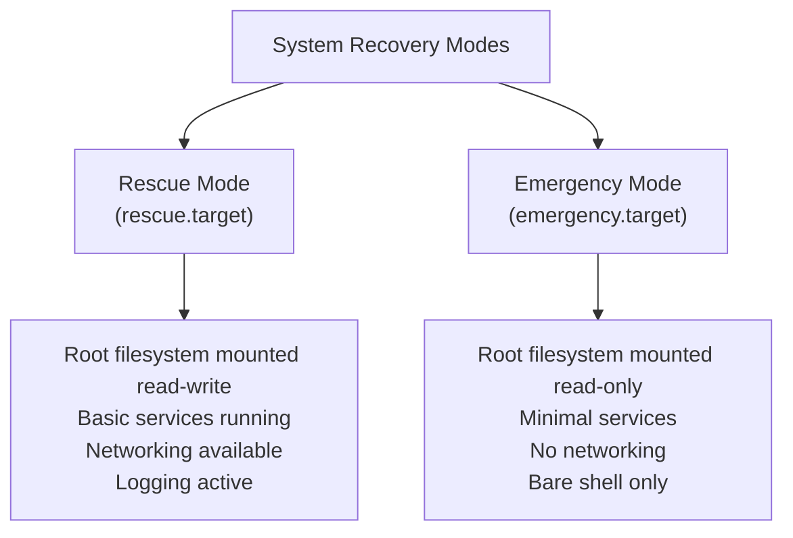

# How to Boot RHEL 9 into Rescue Mode for System Recovery

Author: [nawazdhandala](https://www.github.com/nawazdhandala)

Tags: RHEL, Rescue Mode, Recovery, Linux

Description: A step-by-step guide to booting RHEL 9 into rescue mode (single-user mode) for system recovery, covering how to access it from the GRUB menu, what services are available, and common recovery tasks.

---

## What Is Rescue Mode?

Rescue mode on RHEL 9 is a minimal boot target (systemd's rescue.target) that starts a single-user shell with basic system services. The root filesystem is mounted read-write, networking is available if needed, and you get a root shell to fix whatever went wrong.

This is the mode you reach for when the system boots but something is broken: a misconfigured service, a bad fstab entry, a full disk, or a locked-out user account.

## How Rescue Mode Differs from Emergency Mode



Use rescue mode when you can, and emergency mode when rescue mode itself fails.

## Booting into Rescue Mode from GRUB

1. Reboot the system (or power it on)
2. When the GRUB menu appears, highlight the kernel entry you want to boot
3. Press `e` to edit the boot entry
4. Find the line starting with `linux` or `linuxefi`
5. Append `systemd.unit=rescue.target` at the end of that line
6. Press `Ctrl+X` or `F10` to boot

```bash
# The kernel line will look something like:
linuxefi /vmlinuz-5.14.0-362.el9.x86_64 root=/dev/mapper/rhel-root ro crashkernel=256M ... systemd.unit=rescue.target
```

## Booting into Rescue Mode with systemctl

If the system is still running and accessible:

```bash
# Switch to rescue mode from a running system
sudo systemctl rescue
```

This immediately drops you to a rescue shell. All non-essential services are stopped.

## What You Get in Rescue Mode

When you enter rescue mode, you get:

- A root shell (password required unless booting from GRUB edit)
- The root filesystem mounted read-write
- Local filesystems mounted (from /etc/fstab)
- Basic system logging
- No network services by default (but you can start them)
- No multi-user services

```bash
# Once in rescue mode, check filesystem mounts
mount | column -t

# Check disk usage
df -h

# View recent system logs
journalctl -xb --no-pager | tail -50
```

## Common Recovery Tasks in Rescue Mode

### Fixing a Full Disk

```bash
# Find what is using the most space
du -sh /* 2>/dev/null | sort -rh | head -10

# Check for large log files
du -sh /var/log/* | sort -rh | head -10

# Clean up old journal logs
journalctl --vacuum-size=100M

# Remove old package caches
dnf clean all
```

### Fixing a Broken Service

```bash
# Check which service is failing
systemctl --failed

# View logs for the failing service
journalctl -u failing-service.service --no-pager

# Disable the service to let the system boot normally
systemctl disable failing-service.service

# Fix the configuration and re-enable
systemctl enable failing-service.service
```

### Resetting a Root Password

```bash
# Simply set a new password
passwd root
```

### Fixing fstab Issues

```bash
# Edit fstab to fix mount problems
vi /etc/fstab

# If the root filesystem is read-only, remount it
mount -o remount,rw /

# Test the fstab changes
mount -a
```

### Reinstalling a Package

```bash
# Start networking if needed
systemctl start NetworkManager
systemctl start network

# Reinstall a broken package
dnf reinstall <package-name>
```

## Starting Networking in Rescue Mode

By default, rescue mode does not start network services. If you need network access:

```bash
# Start NetworkManager
systemctl start NetworkManager

# Check network connectivity
ip addr show
ping -c 3 8.8.8.8

# If DNS is not working
echo "nameserver 8.8.8.8" > /etc/resolv.conf
```

## Exiting Rescue Mode

```bash
# Return to normal multi-user mode
systemctl default

# Or reboot
systemctl reboot
```

## Wrapping Up

Rescue mode on RHEL 9 is your first-line recovery tool. It gives you a working system with enough services to diagnose and fix most problems. The workflow is simple: boot into rescue mode from GRUB, diagnose the issue, fix it, and reboot into normal operation. Keep the process in your mental toolkit so that when a 3 AM page comes in about a server that will not boot properly, you already know what to do.
