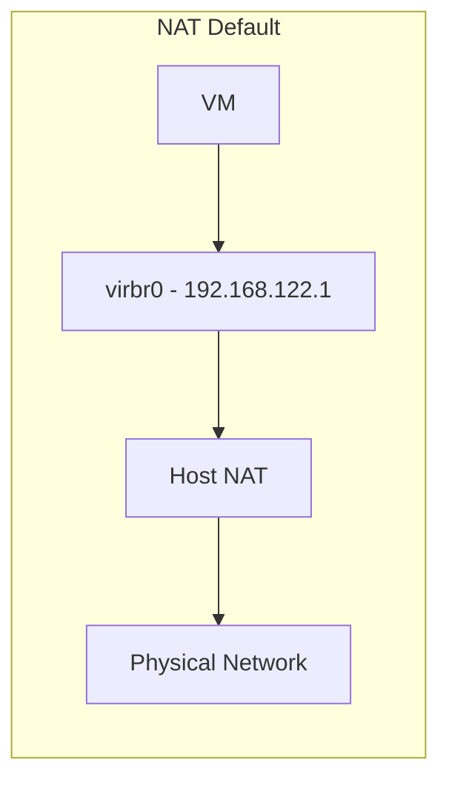
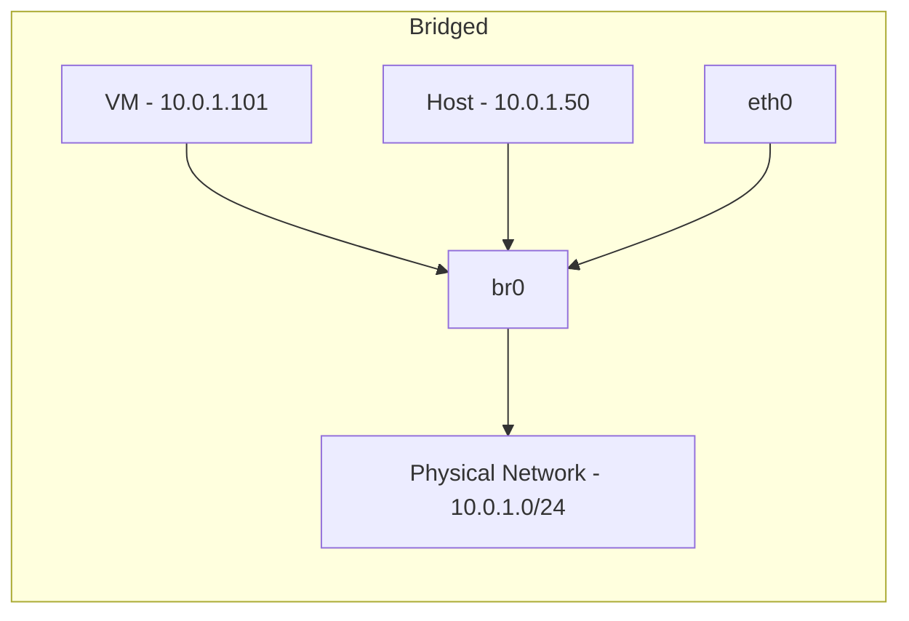

# How to Set Up Bridged Networking with libvirt on RHEL

Author: [nawazdhandala](https://www.github.com/nawazdhandala)

Tags: RHEL, libvirt, Bridge, KVM, Linux

Description: Configure libvirt to use bridged networking on RHEL so KVM virtual machines get direct access to your physical network with routable IP addresses.

---

libvirt comes with a default NAT network (virbr0) that works out of the box, but NAT means your VMs are hidden behind the host's IP. For production workloads, database servers, web servers, or anything that needs to be reachable from the rest of your network, you need bridged networking. This guide covers setting up libvirt to use a host bridge so VMs sit directly on your physical network.

## Default vs Bridged Networking





With NAT, VMs use a private 192.168.122.0/24 range and the host translates. With bridging, VMs get addresses on the same network as the host.

## Prerequisites

```bash
# Install virtualization packages if not already present
dnf install -y qemu-kvm libvirt virt-install bridge-utils

# Start and enable libvirtd
systemctl enable --now libvirtd
```

## Step 1: Create the Host Bridge

First, create a bridge on the host using nmcli:

```bash
# Create the bridge
nmcli connection add type bridge con-name br0 ifname br0

# Disable STP for faster port activation
nmcli connection modify br0 bridge.stp no

# Set the host IP on the bridge
nmcli connection modify br0 ipv4.addresses 10.0.1.50/24
nmcli connection modify br0 ipv4.gateway 10.0.1.1
nmcli connection modify br0 ipv4.dns "10.0.1.1 8.8.8.8"
nmcli connection modify br0 ipv4.method manual

# Add physical NIC as a bridge port
nmcli connection add type ethernet con-name br0-port ifname eth0 master br0

# Remove the old connection on eth0 if it exists
nmcli connection delete "Wired connection 1" 2>/dev/null

# Activate the bridge (brief network interruption here)
nmcli connection up br0
```

## Step 2: Define a libvirt Network for the Bridge

Create an XML file defining the bridged network:

```bash
# Write the network definition
cat > /tmp/br0-net.xml << 'EOF'
<network>
  <name>bridged</name>
  <forward mode="bridge"/>
  <bridge name="br0"/>
</network>
EOF
```

Register it with libvirt:

```bash
# Define the network
virsh net-define /tmp/br0-net.xml

# Start the network
virsh net-start bridged

# Set it to auto-start
virsh net-autostart bridged

# Verify it shows up
virsh net-list --all
```

## Step 3: Create VMs Using the Bridge

### Using virt-install

```bash
# Install a new VM with bridged networking
virt-install \
  --name webserver01 \
  --ram 4096 \
  --vcpus 2 \
  --disk path=/var/lib/libvirt/images/webserver01.qcow2,size=40 \
  --os-variant rhel9.0 \
  --network network=bridged \
  --location /var/lib/libvirt/images/rhel-9.iso \
  --graphics vnc \
  --extra-args "console=ttyS0" \
  --noautoconsole
```

You can also specify the bridge directly without defining a libvirt network:

```bash
# Use the bridge directly
virt-install \
  --name webserver02 \
  --ram 4096 \
  --vcpus 2 \
  --disk path=/var/lib/libvirt/images/webserver02.qcow2,size=40 \
  --os-variant rhel9.0 \
  --network bridge=br0,model=virtio \
  --location /var/lib/libvirt/images/rhel-9.iso \
  --graphics vnc \
  --noautoconsole
```

### Modifying an Existing VM

```bash
# Shut down the VM first
virsh shutdown webserver01

# Edit the VM configuration
virsh edit webserver01
```

Find the `<interface>` section and change it to:

```xml
<interface type='bridge'>
  <source bridge='br0'/>
  <model type='virtio'/>
</interface>
```

Start the VM:

```bash
virsh start webserver01
```

## Step 4: Verify VM Connectivity

```bash
# Check that VM tap interfaces appear on the bridge
bridge link show

# From the host, check the VM is reachable
# (after the VM gets an IP via DHCP or static config)
ping -c 4 10.0.1.101
```

Inside the VM:

```bash
# Check the VM's IP assignment
ip addr show

# Test outbound connectivity
ping -c 4 10.0.1.1
ping -c 4 8.8.8.8
```

## Using macvtap as an Alternative

If you do not want to create a full bridge, macvtap is a lighter option that connects VMs directly to the physical NIC:

```bash
# Create a VM using macvtap
virt-install \
  --name testvm \
  --ram 2048 \
  --vcpus 1 \
  --disk path=/var/lib/libvirt/images/testvm.qcow2,size=20 \
  --os-variant rhel9.0 \
  --network type=direct,source=eth0,source_mode=bridge,model=virtio \
  --location /var/lib/libvirt/images/rhel-9.iso \
  --noautoconsole
```

The catch with macvtap: the host and VM cannot communicate directly with each other over the macvtap interface. If host-to-VM communication is required, use a full bridge instead.

## Firewall Considerations

Firewalld may filter bridge traffic. If VMs cannot reach the network:

```bash
# Option 1: Add bridge to trusted zone
firewall-cmd --zone=trusted --change-interface=br0 --permanent
firewall-cmd --reload

# Option 2: Allow forwarding in the public zone
firewall-cmd --zone=public --add-forward --permanent
firewall-cmd --reload
```

Also check if kernel bridge filtering is enabled:

```bash
# Check bridge netfilter settings
sysctl net.bridge.bridge-nf-call-iptables

# If set to 1 and causing issues, disable it
echo "net.bridge.bridge-nf-call-iptables = 0" > /etc/sysctl.d/bridge.conf
sysctl -p /etc/sysctl.d/bridge.conf
```

## Multiple Bridges for Network Isolation

You can create separate bridges for different networks:

```bash
# Production network bridge
nmcli connection add type bridge con-name br-prod ifname br-prod
nmcli connection modify br-prod ipv4.addresses 10.0.1.50/24
nmcli connection modify br-prod ipv4.method manual
nmcli connection add type ethernet con-name br-prod-port ifname eth0 master br-prod

# Management network bridge
nmcli connection add type bridge con-name br-mgmt ifname br-mgmt
nmcli connection modify br-mgmt ipv4.addresses 172.16.0.50/24
nmcli connection modify br-mgmt ipv4.method manual
nmcli connection add type ethernet con-name br-mgmt-port ifname eth1 master br-mgmt
```

Then assign VMs to the appropriate bridge based on their role.

## Summary

Bridged networking with libvirt gives your KVM VMs direct presence on the physical network. Create a host bridge with nmcli, define it as a libvirt network (or reference it directly in VM configs), and your VMs can get IPs from the same pool as physical servers. Remember to handle firewall rules and bridge netfilter settings if traffic is not flowing. For host-to-VM communication, use a full bridge rather than macvtap.
