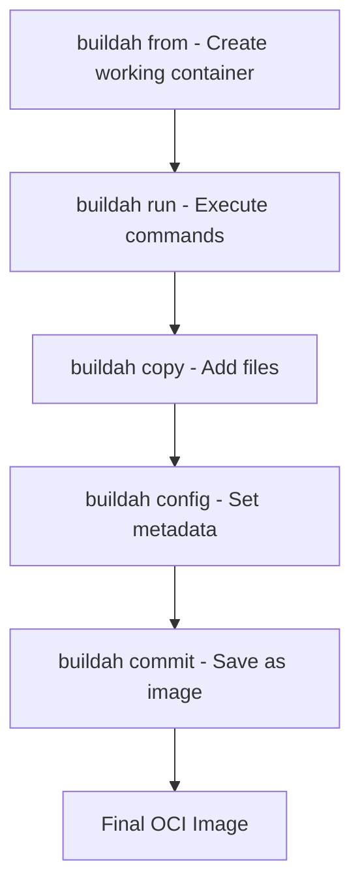

# How to Build Container Images with Buildah on RHEL 9

Author: [nawazdhandala](https://www.github.com/nawazdhandala)

Tags: RHEL, Buildah, Container Images, Linux

Description: A practical guide to building OCI-compliant container images using Buildah on RHEL 9, covering scripted builds, layer management, and image optimization.

---

Buildah is Red Hat's tool for building OCI and Docker-compatible container images. Unlike Docker's build process, Buildah does not require a daemon and gives you fine-grained control over every layer. You can build images using a Containerfile (Dockerfile equivalent) or script the entire build process interactively.

I find Buildah especially useful when I need to create minimal images without all the overhead that comes from a standard base image.

## Installing Buildah

If you installed the `container-tools` module, Buildah is already there. Otherwise:

# Install buildah
```bash
sudo dnf install -y buildah
```

# Verify installation
```bash
buildah --version
```

## Building Images Interactively (No Containerfile Needed)

This is where Buildah really shines. You can script image builds step by step:

# Create a new container from the UBI base image
```bash
container=$(buildah from registry.access.redhat.com/ubi9/ubi-minimal)
```

# Run commands inside the container
```bash
buildah run $container -- microdnf install -y httpd
buildah run $container -- microdnf clean all
```

# Copy files into the container
```bash
buildah copy $container ./index.html /var/www/html/index.html
```

# Set the entrypoint
```bash
buildah config --entrypoint '["/usr/sbin/httpd", "-D", "FOREGROUND"]' $container
```

# Set exposed port
```bash
buildah config --port 80 $container
```

# Add labels
```bash
buildah config --label maintainer="admin@example.com" $container
```

# Commit the container to an image
```bash
buildah commit $container my-httpd:latest
```

# Clean up the working container
```bash
buildah rm $container
```

## Understanding the Build Flow



## Building from a Containerfile

If you prefer the Dockerfile approach, Buildah handles that too:

# Create a simple Containerfile
```bash
cat > Containerfile << 'EOF'
FROM registry.access.redhat.com/ubi9/ubi-minimal
RUN microdnf install -y httpd && microdnf clean all
COPY index.html /var/www/html/index.html
EXPOSE 80
ENTRYPOINT ["/usr/sbin/httpd", "-D", "FOREGROUND"]
EOF
```

# Build the image using the Containerfile
```bash
buildah build -t my-httpd:v2 .
```

# Build with a specific Containerfile name
```bash
buildah build -f MyContainerfile -t my-app:latest .
```

## Building Minimal Images from Scratch

One of Buildah's best features is building from `scratch`, an empty image with nothing in it:

# Start from an empty image
```bash
container=$(buildah from scratch)
```

# Mount the container filesystem
```bash
mountpoint=$(buildah mount $container)
```

# Install packages directly into the mount point using the host's dnf
```bash
sudo dnf install --installroot $mountpoint --releasever 9 --setopt install_weak_deps=false -y coreutils-single
```

# Unmount and commit
```bash
buildah unmount $container
buildah commit $container minimal-tools:latest
```

This creates an incredibly small image with just the packages you need.

## Managing Build Layers

Buildah gives you control over how layers are created:

# Build with a single layer (squash all layers into one)
```bash
buildah build --layers=false -t my-app:squashed .
```

# Build with layer caching enabled (default)
```bash
buildah build --layers=true -t my-app:layered .
```

# Remove intermediate images left over from builds
```bash
buildah images --filter dangling=true
buildah rmi --prune
```

## Working with Build Arguments

Pass build-time variables to customize images:

```bash
cat > Containerfile << 'EOF'
FROM registry.access.redhat.com/ubi9/ubi-minimal
ARG APP_VERSION=1.0
LABEL version=${APP_VERSION}
RUN echo "Version: ${APP_VERSION}" > /version.txt
EOF
```

# Build with a custom argument
```bash
buildah build --build-arg APP_VERSION=2.5 -t my-app:2.5 .
```

## Multi-Stage Builds

Keep your final images small by using multi-stage builds:

```bash
cat > Containerfile << 'EOF'
# Build stage
FROM registry.access.redhat.com/ubi9/ubi as builder
RUN dnf install -y gcc make
COPY app.c /src/app.c
RUN gcc -o /src/app /src/app.c -static

# Runtime stage - only the compiled binary
FROM registry.access.redhat.com/ubi9/ubi-minimal
COPY --from=builder /src/app /usr/local/bin/app
ENTRYPOINT ["/usr/local/bin/app"]
EOF
```

# Build the multi-stage image
```bash
buildah build -t my-app:compiled .
```

## Inspecting Built Images

After building, inspect what you created:

# List all local images
```bash
buildah images
```

# Inspect image metadata
```bash
buildah inspect --type image my-httpd:latest
```

# Check image size
```bash
podman image ls my-httpd
```

## Pushing Images to a Registry

Once built, push your images to a registry:

# Tag for your registry
```bash
buildah tag my-httpd:latest registry.example.com/myteam/httpd:latest
```

# Push to a private registry
```bash
buildah push registry.example.com/myteam/httpd:latest
```

# Push to Docker Hub
```bash
buildah push my-httpd:latest docker://docker.io/myuser/httpd:latest
```

## Image Optimization Tips

After years of building container images, here are the practices that matter:

1. **Chain RUN commands** to reduce layers:
```bash
RUN microdnf install -y httpd && microdnf clean all
```

2. **Use ubi-minimal** instead of ubi for smaller base images.

3. **Clean package caches** in the same RUN statement that installs packages.

4. **Use multi-stage builds** for compiled applications.

5. **Order Containerfile instructions** from least-changing to most-changing for better cache hits.

## Rootless Buildah

Buildah works in rootless mode just like Podman:

# Build images without root (as regular user)
```bash
buildah build -t my-app:latest .
```

# List images owned by your user
```bash
buildah images
```

The only limitation is that building from `scratch` with `--installroot` requires root for the `dnf` install step.

## Summary

Buildah gives you full control over the container image build process on RHEL 9. Whether you prefer scripted builds or Containerfiles, Buildah produces standard OCI images that run anywhere. Pair it with Podman for running and Skopeo for moving images between registries, and you have a complete container toolkit without Docker.
