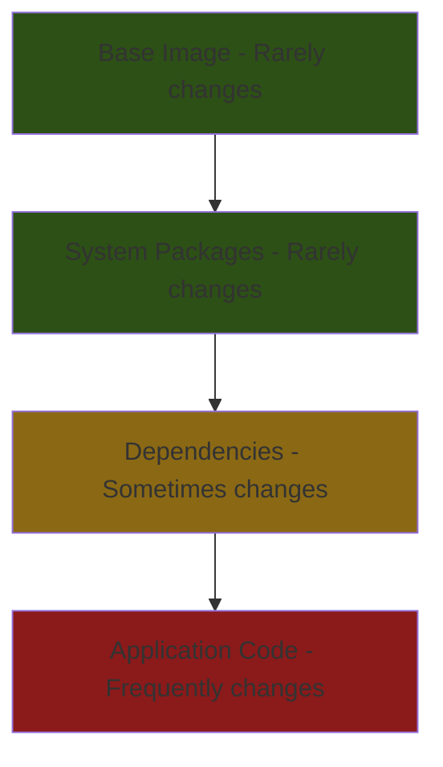

# How to Build Container Images Using Containerfiles with Podman on RHEL 9

Author: [nawazdhandala](https://www.github.com/nawazdhandala)

Tags: RHEL, Podman, Containerfile, Build, Linux

Description: Learn how to write Containerfiles and build production-ready container images with Podman on RHEL 9, including multi-stage builds and optimization techniques.

---

If you have written Dockerfiles before, you already know how to write Containerfiles. They use the exact same syntax. The only difference is the name - Red Hat prefers "Containerfile" because it is not tied to any specific tool. Podman supports both names out of the box.

This guide covers writing effective Containerfiles and building images with `podman build`.

## Basic Containerfile Structure

A Containerfile is a text file with instructions that describe how to assemble an image:

```bash
cat > Containerfile << 'EOF'
# Start from the UBI 9 minimal base image
FROM registry.access.redhat.com/ubi9/ubi-minimal

# Set maintainer label
LABEL maintainer="admin@example.com"

# Install required packages
RUN microdnf install -y nginx && microdnf clean all

# Copy application files
COPY html/ /usr/share/nginx/html/

# Expose the service port
EXPOSE 80

# Set the default command
CMD ["nginx", "-g", "daemon off;"]
EOF
```

# Build the image
```bash
podman build -t my-nginx:latest .
```

## Understanding Containerfile Instructions

Here is what each instruction does:

| Instruction | Purpose |
|------------|---------|
| FROM | Sets the base image |
| RUN | Executes a command during build |
| COPY | Copies files from build context |
| ADD | Like COPY but handles URLs and tar extraction |
| ENV | Sets environment variables |
| ARG | Defines build-time variables |
| EXPOSE | Documents which ports the container uses |
| CMD | Default command when container starts |
| ENTRYPOINT | Main executable for the container |
| WORKDIR | Sets the working directory |
| USER | Sets the user for subsequent instructions |
| VOLUME | Creates a mount point |
| LABEL | Adds metadata to the image |

## Writing Efficient Containerfiles

Order matters. Put instructions that change rarely at the top and frequently-changing content at the bottom for better layer caching:

```bash
cat > Containerfile << 'EOF'
FROM registry.access.redhat.com/ubi9/ubi-minimal

# These rarely change - good cache hits
RUN microdnf install -y python3 python3-pip && microdnf clean all
WORKDIR /app

# Dependencies change occasionally
COPY requirements.txt .
RUN pip3 install --no-cache-dir -r requirements.txt

# Application code changes frequently - put last
COPY app/ ./app/
COPY config/ ./config/

EXPOSE 8000
CMD ["python3", "-m", "uvicorn", "app.main:app", "--host", "0.0.0.0"]
EOF
```



## Multi-Stage Builds

Keep your production images small by using build stages:

```bash
cat > Containerfile << 'EOF'
# Stage 1: Build the Go application
FROM registry.access.redhat.com/ubi9/go-toolset as builder
WORKDIR /opt/app
COPY go.mod go.sum ./
RUN go mod download
COPY . .
RUN go build -o server .

# Stage 2: Create the runtime image
FROM registry.access.redhat.com/ubi9/ubi-minimal
COPY --from=builder /opt/app/server /usr/local/bin/server
EXPOSE 8080
USER 1001
ENTRYPOINT ["/usr/local/bin/server"]
EOF
```

# Build the multi-stage image
```bash
podman build -t my-go-app:latest .
```

The final image only contains the compiled binary and the minimal base, not the entire Go toolchain.

## Using Build Arguments

Make your Containerfiles flexible with ARG:

```bash
cat > Containerfile << 'EOF'
ARG BASE_IMAGE=registry.access.redhat.com/ubi9/ubi-minimal
FROM ${BASE_IMAGE}

ARG APP_VERSION=1.0.0
ARG BUILD_DATE

LABEL version="${APP_VERSION}" \
      build-date="${BUILD_DATE}"

RUN microdnf install -y httpd && microdnf clean all
CMD ["/usr/sbin/httpd", "-D", "FOREGROUND"]
EOF
```

# Pass arguments at build time
```bash
podman build \
  --build-arg APP_VERSION=2.1.0 \
  --build-arg BUILD_DATE=$(date -u +%Y-%m-%dT%H:%M:%SZ) \
  -t my-app:2.1.0 .
```

## ENTRYPOINT vs CMD

This trips people up constantly. Here is the difference:

```bash
# ENTRYPOINT defines the main executable
# CMD provides default arguments that can be overridden
cat > Containerfile << 'EOF'
FROM registry.access.redhat.com/ubi9/ubi-minimal
ENTRYPOINT ["/usr/bin/python3"]
CMD ["--version"]
EOF
```

```bash
# Runs: python3 --version
podman run my-python

# Runs: python3 script.py (CMD is overridden)
podman run my-python script.py
```

## Using .containerignore

Prevent unnecessary files from being sent to the build context:

```bash
cat > .containerignore << 'EOF'
.git
.gitignore
*.md
tests/
docs/
node_modules/
__pycache__/
*.pyc
.env
EOF
```

This speeds up builds and prevents sensitive files from ending up in your images.

## Health Checks

Add health checks so orchestrators know when your container is healthy:

```bash
cat > Containerfile << 'EOF'
FROM registry.access.redhat.com/ubi9/ubi-minimal
RUN microdnf install -y nginx curl && microdnf clean all
COPY html/ /usr/share/nginx/html/
EXPOSE 80
HEALTHCHECK --interval=30s --timeout=5s --retries=3 \
  CMD curl -f http://localhost/ || exit 1
CMD ["nginx", "-g", "daemon off;"]
EOF
```

# Check health status after running
```bash
podman run -d --name healthy-web my-nginx:latest
podman inspect --format '{{.State.Health.Status}}' healthy-web
```

## Build Options You Should Know

```bash
# Build without using cache (clean rebuild)
podman build --no-cache -t my-app:latest .

# Build and squash all layers into one
podman build --squash -t my-app:squashed .

# Build for a specific platform
podman build --platform linux/amd64 -t my-app:amd64 .

# Use a different Containerfile name
podman build -f Containerfile.production -t my-app:prod .

# Tag with multiple tags in one build
podman build -t my-app:latest -t my-app:1.0 .

# Build with resource limits
podman build --memory 2g --cpus 2 -t my-app:latest .
```

## Debugging Failed Builds

When a build fails, Podman leaves intermediate layers you can inspect:

# List intermediate images from failed builds
```bash
podman images --filter dangling=true
```

# Run a shell in the last successful layer to debug
```bash
podman run -it <last-successful-layer-id> /bin/bash
```

# View build output with more verbosity
```bash
podman build --log-level debug -t my-app:latest .
```

## Security Best Practices

1. **Run as non-root inside the container:**
```
RUN useradd -r -u 1001 appuser
USER 1001
```

2. **Do not store secrets in Containerfiles.** Use `--secret` flag instead:
```bash
podman build --secret id=mykey,src=./secret.key -t my-app:latest .
```

3. **Pin your base image versions** instead of using `latest`:
```
FROM registry.access.redhat.com/ubi9/ubi-minimal:9.3
```

4. **Scan your images** after building:
```bash
podman image scan my-app:latest
```

## Summary

Building container images with Podman and Containerfiles on RHEL 9 uses the same syntax you already know from Docker. Focus on layer ordering for cache efficiency, multi-stage builds for small images, and non-root users for security. The result is OCI-compliant images that run on any container runtime.
