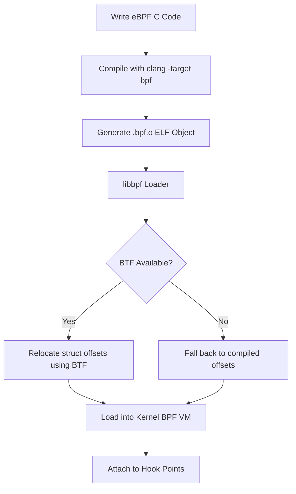

# How to Build eBPF Programs with libbpf and CO-RE on RHEL

Author: [nawazdhandala](https://www.github.com/nawazdhandala)

Tags: RHEL, eBPF, Libbpf, CO-RE, Kernel, Linux

Description: A hands-on guide to building portable eBPF programs using libbpf and CO-RE (Compile Once, Run Everywhere) on RHEL, from setup to deployment.

---

Building eBPF programs used to mean compiling them on every target machine because kernel data structures change between versions. CO-RE (Compile Once, Run Everywhere) fixes this by using BTF (BPF Type Format) information to automatically adjust your program to the running kernel. On RHEL, CO-RE works out of the box because the kernel ships with BTF enabled.

## How CO-RE Works



The key insight is that your compiled eBPF object file contains relocation records. When libbpf loads the program, it reads the running kernel's BTF data and patches the correct struct field offsets into your code.

## Setting Up the Build Environment

```bash
# Install all required development packages
sudo dnf install -y \
    clang \
    llvm \
    libbpf-devel \
    bpftool \
    kernel-devel \
    kernel-headers \
    elfutils-libelf-devel \
    make \
    gcc

# Verify BTF is available on the running kernel
ls -la /sys/kernel/btf/vmlinux
# This file must exist for CO-RE to work

# Generate the vmlinux.h header from the running kernel's BTF
# This header contains all kernel type definitions
bpftool btf dump file /sys/kernel/btf/vmlinux format c > vmlinux.h
```

## Writing Your First CO-RE eBPF Program

Create a simple program that traces process execution. Start with the BPF-side code:

```c
/* execsnoop.bpf.c - Trace process execution using CO-RE */

/* vmlinux.h contains all kernel type definitions from BTF */
#include "vmlinux.h"

/* libbpf helper macros */
#include <bpf/bpf_helpers.h>
#include <bpf/bpf_tracing.h>
#include <bpf/bpf_core_read.h>

/* Define the event structure shared between kernel and userspace */
struct event {
    __u32 pid;
    __u32 uid;
    char comm[16];
    char filename[256];
};

/* Ring buffer for sending events to userspace */
struct {
    __uint(type, BPF_MAP_TYPE_RINGBUF);
    __uint(max_entries, 256 * 1024);  /* 256 KB ring buffer */
} events SEC(".maps");

/* Attach to the sys_enter_execve tracepoint */
SEC("tracepoint/syscalls/sys_enter_execve")
int tracepoint__syscalls__sys_enter_execve(
    struct trace_event_raw_sys_enter *ctx)
{
    struct event *e;
    __u64 pid_tgid;

    /* Reserve space in the ring buffer */
    e = bpf_ringbuf_reserve(&events, sizeof(*e), 0);
    if (!e)
        return 0;

    /* Get PID and UID using helper functions */
    pid_tgid = bpf_get_current_pid_tgid();
    e->pid = pid_tgid >> 32;
    e->uid = bpf_get_current_uid_gid() & 0xFFFFFFFF;

    /* Read the command name */
    bpf_get_current_comm(&e->comm, sizeof(e->comm));

    /* Read the filename argument using CO-RE-safe read
     * BPF_CORE_READ handles struct offset relocation automatically */
    const char *filename_ptr = (const char *)ctx->args[0];
    bpf_probe_read_user_str(&e->filename, sizeof(e->filename), filename_ptr);

    /* Submit the event to userspace */
    bpf_ringbuf_submit(e, 0);

    return 0;
}

/* License must be GPL for most BPF helpers */
char LICENSE[] SEC("license") = "GPL";
```

## Writing the Userspace Loader

```c
/* execsnoop.c - Userspace component that loads and reads the eBPF program */

#include <stdio.h>
#include <stdlib.h>
#include <signal.h>
#include <unistd.h>
#include <bpf/libbpf.h>
#include "execsnoop.skel.h"  /* Auto-generated skeleton header */

/* Flag for clean shutdown */
static volatile bool running = true;

static void sig_handler(int sig)
{
    running = false;
}

/* Callback for processing events from the ring buffer */
static int handle_event(void *ctx, void *data, size_t data_sz)
{
    struct event {
        unsigned int pid;
        unsigned int uid;
        char comm[16];
        char filename[256];
    } *e = data;

    printf("%-8d %-8d %-16s %s\n", e->pid, e->uid, e->comm, e->filename);
    return 0;
}

int main(int argc, char **argv)
{
    struct execsnoop_bpf *skel;
    struct ring_buffer *rb;
    int err;

    /* Set up signal handling for graceful shutdown */
    signal(SIGINT, sig_handler);
    signal(SIGTERM, sig_handler);

    /* Open the BPF skeleton - this parses the embedded ELF object */
    skel = execsnoop_bpf__open();
    if (!skel) {
        fprintf(stderr, "Failed to open BPF skeleton\n");
        return 1;
    }

    /* Load the BPF program into the kernel
     * CO-RE relocations happen here - libbpf adjusts struct offsets */
    err = execsnoop_bpf__load(skel);
    if (err) {
        fprintf(stderr, "Failed to load BPF program: %d\n", err);
        goto cleanup;
    }

    /* Attach the BPF program to its hook point */
    err = execsnoop_bpf__attach(skel);
    if (err) {
        fprintf(stderr, "Failed to attach BPF program: %d\n", err);
        goto cleanup;
    }

    /* Set up the ring buffer consumer */
    rb = ring_buffer__new(bpf_map__fd(skel->maps.events),
                          handle_event, NULL, NULL);
    if (!rb) {
        fprintf(stderr, "Failed to create ring buffer\n");
        err = 1;
        goto cleanup;
    }

    printf("%-8s %-8s %-16s %s\n", "PID", "UID", "COMM", "FILENAME");

    /* Poll for events until interrupted */
    while (running) {
        err = ring_buffer__poll(rb, 100);  /* 100ms timeout */
        if (err == -EINTR) {
            break;
        }
        if (err < 0) {
            fprintf(stderr, "Error polling ring buffer: %d\n", err);
            break;
        }
    }

cleanup:
    ring_buffer__free(rb);
    execsnoop_bpf__destroy(skel);
    return err < 0 ? 1 : 0;
}
```

## Building with the Skeleton Header

The build process uses `bpftool` to generate a skeleton header that embeds the compiled BPF object:

```makefile
# Makefile for CO-RE eBPF program

CLANG := clang
BPFTOOL := bpftool
CC := gcc

# Compiler flags for the BPF program
BPF_CFLAGS := -g -O2 -target bpf -D__TARGET_ARCH_x86

# Compiler flags for the userspace program
CFLAGS := -g -O2 -Wall
LDFLAGS := -lbpf -lelf -lz

.PHONY: all clean

all: execsnoop

# Step 1: Generate vmlinux.h from kernel BTF
vmlinux.h:
	$(BPFTOOL) btf dump file /sys/kernel/btf/vmlinux format c > $@

# Step 2: Compile the BPF program to an ELF object
execsnoop.bpf.o: execsnoop.bpf.c vmlinux.h
	$(CLANG) $(BPF_CFLAGS) -c $< -o $@

# Step 3: Generate the skeleton header from the compiled BPF object
execsnoop.skel.h: execsnoop.bpf.o
	$(BPFTOOL) gen skeleton $< > $@

# Step 4: Compile the userspace program with the embedded skeleton
execsnoop: execsnoop.c execsnoop.skel.h
	$(CC) $(CFLAGS) $< -o $@ $(LDFLAGS)

clean:
	rm -f vmlinux.h execsnoop.bpf.o execsnoop.skel.h execsnoop
```

```bash
# Build the complete program
make all

# Run it (requires root for BPF)
sudo ./execsnoop
```

## Using BPF_CORE_READ for Portable Struct Access

The most important CO-RE feature is `BPF_CORE_READ`, which generates relocatable struct field accesses:

```c
/* Instead of directly accessing struct fields (which breaks across kernels): */
/* BAD: pid_t pid = task->pid; */

/* Use BPF_CORE_READ for single-level access: */
pid_t pid = BPF_CORE_READ(task, pid);

/* For nested struct access (following pointers): */
/* This reads task->mm->arg_start safely */
unsigned long arg_start = BPF_CORE_READ(task, mm, arg_start);

/* For checking if a field exists in the current kernel: */
if (bpf_core_field_exists(task->loginuid)) {
    /* This field only exists in some kernel configs */
    uid_t loginuid = BPF_CORE_READ(task, loginuid.val);
}
```

## Debugging CO-RE Programs

When things go wrong, these debugging steps help:

```bash
# Check if your BPF object has proper CO-RE relocations
bpftool btf dump file execsnoop.bpf.o

# Verify the kernel's BTF data is readable
bpftool btf dump file /sys/kernel/btf/vmlinux | head -50

# Enable libbpf debug output in your program by adding before open():
# libbpf_set_print(my_print_fn);

# Check verifier logs for rejected programs
# The skeleton load function captures verifier output on failure

# List all currently loaded BPF programs
sudo bpftool prog list

# Show details of a specific loaded program
sudo bpftool prog show id <PROG_ID> --pretty
```

## Conclusion

Building eBPF programs with libbpf and CO-RE on RHEL gives you the best of both worlds: the power of kernel-level instrumentation with the portability of compiling once and running on any RHEL kernel version. The workflow of BPF C code, skeleton generation, and userspace loader is the standard pattern used by all modern eBPF projects. Start with simple tracepoint programs and work your way up to more advanced kprobe and XDP programs as your needs grow.
